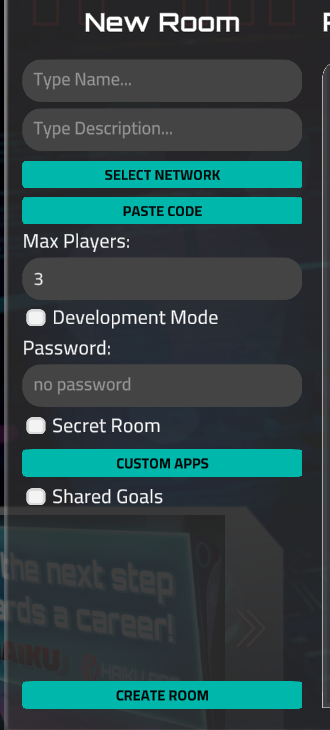

# Multiplayer

Multiplayer is a special game mode that allows several players to complete dojo-like missions simultaneously. This mode is implemented with the REST API, so it isn't 100% real-time. New file states and player actions are synchronized with a delay of approximately 5 seconds. Keep this in mind when creating a mission for multiplayer. **You should set important story files as Immutable and create them in the network or during room initialization to avoid gameplay from getting stuck.**

# Creating and Modifying a Room

## Creating

To create a room, you will need a prepared network and story script (more on that later). The room can be created from the Main Menu → Multiplayer → Create Room panel.

- Screeshot
    
    
    
- **Name** – The room name displayed in the room list, up to 12 characters.
- **Description** – Displayed in the game toolbar, as well as in complete and restart popups as the mission objective, up to 255 characters.
- **Development Mode** – The Forge Preview console will be shown, used for story script creation. Such rooms are visible only to their author but can be accessed with a URL.
- **Password** – Required when any player tries to enter the room. Leave it empty to skip this step.
- **Secret Room** – This room is displayed in the list only for its author but can be accessed with a URL.
- **Custom Application** – A room can contain [custom applications created with Miniscript](Story%20Creation%20with%20Miniscript%20fe056bb1c7d94b0ba14478cda66fa467.md). To add them, you need to create a mission in the Forge where these applications are stored. Select this mission in the popup that appears after clicking the CUSTOM APPS button. These applications will be added to the room.
*Pay attention*: sometimes apps require assets stored in the Network, so ensure that the room's network also contains these resources.
- **Shared Goals** – If enabled, each goal can be completed by only one player. The game ends when all goals are completed, and the winner is the player who completed the most goals (**a tie is possible**). If disabled (default), goal states aren't shared between players, and the winner is the player who completes all their goals first (**a tie is not possible**).

The author has to enter the room immediately after creation; however, this process is automatic. When the author is connected to the room, initial synchronization happens – the key point of this step is explained in the [Mission Lifecycle](Multiplayer%201a5806cbc25280f68a0cec1d05a02b1b.md) section.

## Modification

Some properties that do not affect gameplay can be modified. Altering the room is available only to its author. Also, this popup is used for **sharing the room** via URL and creating a room duplicate. The most common scenario for **duplicating a room** is when the mission is completed, but the author wants to replay it.

- Screenshots
    
    
    
    
    

# Network and Mission Script for the Room

## Introduction

All assets for multiplayer rooms are created in the Forge. So, you should be familiar with [creating custom missions](Story%20Creation%20with%20Miniscript%20fe056bb1c7d94b0ba14478cda66fa467.md) before creating your multiplayer missions. The main difference between single-player and multiplayer missions is room state saving and restoring. Currently, regular missions do not support this, and there are no external events, like capturing the goal by another player. Also, story step-based missions can't be used for multiplayer. There are no differences between networks for single-player and networks for rooms.

Networks can be selected from your Forge assets or imported from a file previously exported from the Forge. Miniscript code can only be pasted in the appropriate popup, so it's recommended to store your script in a file on your PC.

## Mission Lifecycle

The mission script can be separated into three parts:

- network/room initialization
- gameplay sequences setup
- checking the completion of the sequences

The descriptions below use the code from the Nmap Dojo Short Example. You can also create the room and see how it works in the real world.

### Network/Room Initialzation

Sometimes you need to set a port list for some devices, create story files, or perform other actions related to network changes (device properties or file system modifications). **These actions must be invoked only once.** Therefore, these steps are located at the top of the script and are performed only by the room author. This is the reason why the Initial Sync waiting screen appears when entering the room for the first time.

To ensure an action is performed only once, the pair of functions [get_session_data_value](Multiplayer%201a5806cbc25280f68a0cec1d05a02b1b.md) and [set_session_data_value](Multiplayer%201a5806cbc25280f68a0cec1d05a02b1b.md) is used. These functions give you access to a set of data that is shared between all users. Here is the code that will be executed only by the author during the Initial Synchronization step (if this code is placed at the top of the script):

```lua
if get_session_data_value("network_init") == null then
	println("This message will be seen only by the author during the very first entry to the room")

	set_session_data_value("network_init", "1")
end if
```

What is happening here is this: if the `network_init` key has not been set yet, the message is shown and the value `1` is immediately set. When the author or other players enter the room next time, this code will not be executed because the check for `if “network_init” == null` will not pass.

A real usage example can be seen in the [example](Multiplayer%201a5806cbc25280f68a0cec1d05a02b1b.md).

### Gameplay sequences setup

Here, the commands should be unlocked, the set_flag_details function should be called (if your mission is dojo-like), and the [SequenceStep](Story%20Creation%20with%20Miniscript%20fe056bb1c7d94b0ba14478cda66fa467.md) should be configured. However, sometimes you need to perform an action **only once for this player**. A very common scenario, which exists in almost every mission, is showing the start nitro message. So, a similar check as in the Network Initialization step is used.

Unlike [get_session_data_value](Multiplayer%201a5806cbc25280f68a0cec1d05a02b1b.md), [get_mission_dictionary_value](Multiplayer%201a5806cbc25280f68a0cec1d05a02b1b.md) returns values by key only for this player, not for all players. This means that if the player leaves the room and returns, the values in this storage will be saved, but only for this player. Other players have their own storages. Here is an example where the message is shown once **for every player** who just connected to the room.

```lua
if get_mission_dictionary_value("first_inky_message") == null then
	set_mission_dictionary_value("first_inky_message", "1")
	nitroApp("DojoCharacter", "Hello!")
end if
```

**Saving the progress in the middle of the sequence**

Sometimes more complicated behavior is required. For instance, when you need to have a long chain of messages, and the player can leave the room in the middle of this chain without completing the sequence. For this, the `serializedId` member of [CommandWaiting](Story%20Creation%20with%20Miniscript%20fe056bb1c7d94b0ba14478cda66fa467.md) exists.

If the value is set, the game will remember if the command has been performed. This means that the next time the player enters the room, the game will skip all previously completed `CommandWaiting` steps in the sequence and will wait for the completion of the unfinished step, as if the player hadn't left the room.

Remember that **only** the last `CommandWaiting` in the sequence needs to be performed; other commands could be skipped. So, if there is a sequence with steps `A`, `B`, `C`, `D`, `E`, the user can skip completing any step except `E`. They can complete step `E`, and the sequence will be counted as completed, or complete `C`  first (`A`, `B` automatically mark as completed) and then `E`. In this case, the game will save all previous steps as completed as well.

In short, you need to set a **unique** `serializedId` value for every command in the sequence to avoid duplicating messages and actions if a player exits the room and returns after some time. [Here is an example](Multiplayer%201a5806cbc25280f68a0cec1d05a02b1b.md) with the implementation of the full Nmap Dojo (tutorial sequence):

### Checking the completion of the sequences

The main component here is the `while` loop, which checks if the sequences have been performed. Everything here is almost the same as in single-player missions, but some additional checks are needed – checking if the sequences weren't completed during the previous entry to the room (if the player left the room).

If your sequence is not important to the story (optional goal), you do not need any additional checks to see if [serializedId](Multiplayer%201a5806cbc25280f68a0cec1d05a02b1b.md) was used during sequence setup. Otherwise, you need to add the [get_mission_dictionary_value](Multiplayer%201a5806cbc25280f68a0cec1d05a02b1b.md) – [set_mission_dictionary_value](Multiplayer%201a5806cbc25280f68a0cec1d05a02b1b.md) pair, where [set_mission_dictionary_value](Multiplayer%201a5806cbc25280f68a0cec1d05a02b1b.md) is invoked in the last `SequenceStep` of the sequence, and the isPerformed function is invoked only if the unique key value hasn't been set yet.

```lua
sequence = new Sequence
sequence.steps = [ ]

sequenceStep = new SequenceStep
sequenceStep.commandWaiting = getCommandWaiting("cd", "", "/Home")
sequenceStep.action = function()
	set_mission_dictionary_value("not_important_step", 1)
end function
sequence.steps.push(sequenceStep)

while 1
	if get_mission_dictionary_value("not_important_step") == null then
		sequence.isPerformed()
	end if

	wait(0.1)
end while
```

You should always check the result of [is_goal_completed](Story%20Creation%20with%20Miniscript%20fe056bb1c7d94b0ba14478cda66fa467.md) before calling `isPerformed` for the sequence or command that invokes [setGoalAsCompleted](Story%20Creation%20with%20Miniscript%20fe056bb1c7d94b0ba14478cda66fa467.md). Otherwise, the game may return `0` for such steps, and the while loop will get stuck, even though the goal is shown as completed.

```lua
goalSequence = new Sequence
goalSequence.steps = [ ]

sequenceStep = new SequenceStep
sequenceStep.commandWaiting = getCommandWaiting("cd", "", "/Home")
sequenceStep.action = function()
	setGoalAsCompleted("Visit Home Directory")
end function
goalSequence.steps.push(sequenceStep)

while 1
	if is_goal_completed("Visit Home Directory") == 1 or goalSequence.isPerformed() then
		break
	end if

	wait(0.1)
end while
```

## Mission Finishing

There are several ways a mission can finish. It depends on the game mode and additional conditions.

### Non-Shared Goals

The mission is finished when the [set_multiplayer_mission_complete](Multiplayer%201a5806cbc25280f68a0cec1d05a02b1b.md) function is invoked. It is common to place this function at the very end of the mission; however, other scenarios are possible. The winner is the first player who invokes this function (more precisely, the one who performs the action that calls this function).

### Shared Goals

If a player completes a goal, it can no longer be completed by other players. The mission is completed when all goals are captured. The winner is the player who captured the most goals. A tie is possible if the first place is shared between two or more players.

### Failure by Event (Personal Fail)

When a player performs an action that invokes the `[multiplayer_fail_mission](Multiplayer%201a5806cbc25280f68a0cec1d05a02b1b.md)(0)` function, the mission is failed for that player. All players receive a notification about this player's failure. This player can no longer enter the room.

### Failure by Event (Entire Room Fail)

When one of the players performs an action that invokes [`multiplayer_fail_mission](Multiplayer%201a5806cbc25280f68a0cec1d05a02b1b.md)(1)`, all players receive a mission failed event, and no one is allowed to enter the room anymore.

### Failure by Countdown (Personal Fail)

If more time passes than set in [`multiplayer_start_countdown](Multiplayer%201a5806cbc25280f68a0cec1d05a02b1b.md)(0)` before [`multiplayer_stop_countdown`](Multiplayer%201a5806cbc25280f68a0cec1d05a02b1b.md) is invoked, the mission is failed for this player. All players receive a notification about this action, and this player can no longer enter the room.

### Failure by Countdown (Entire Room Fail)

If more time passes than set in [`multiplayer_start_countdown](Multiplayer%201a5806cbc25280f68a0cec1d05a02b1b.md)(1)` before at least one player invokes [`multiplayer_stop_countdown`](Multiplayer%201a5806cbc25280f68a0cec1d05a02b1b.md), the mission fails for everyone. All players are no longer allowed to enter the room.

# Miniscript Functions

- set_session_data_value
    
    Saves the value with the specified key. The source is shared between players, so if player A sets this value, player B can retrieve it if they know the key.
    
    **Arguments:**
    
    | key | string |
    | --- | --- |
    | value | string |
- get_session_data_value
    
    Returns the value by key. If the key is unknown, it returns `null`. The source is shared between players, so if player A sets this value, player B can retrieve it if they know the key.
    
    **Arguments:**
    
    | key | string |
    | --- | --- |
- set_multiplayer_mission_complete
    
    Sends the event to everyone that the mission is completed. The winner is the player who first calls this function. It doesn't perform any actions if the `Shared Goals` checkbox was selected when the room was created.
    
- set_flag_details
    
    Set additional information for the goal in the `flags` command output.
    
    | goalId | string, goal name, exact the same value as set in [setGoalAsCompleted](Story%20Creation%20with%20Miniscript%20fe056bb1c7d94b0ba14478cda66fa467.md) |
    | --- | --- |
    | value | string, flag description |
- multiplayer_start_countdown
    
    Starts the mission failure countdown. It checks if the countdown has already started, so a second invocation does nothing.
    
    | for_everyone | boolean, 0 or 1. [See the difference](Multiplayer%201a5806cbc25280f68a0cec1d05a02b1b.md) |
    | --- | --- |
    | time | number, seconds left before failure. |
- multiplayer_stop_countdown
    
    Stops any previously started countdown.
    
- multiplayer_fail_mission
    
    Sets the mission as failed.
    
    | for_everyone | boolean, 0 or 1. [See the difference](Multiplayer%201a5806cbc25280f68a0cec1d05a02b1b.md) |
    | --- | --- |
    | fail_reason | string |
    
- get_mission_dictionary_value
    
    Returns the value by key. If the key is unknown, it returns `null`. The source is unique for each player.
    
    | key | string |
    | --- | --- |
    | value | string |
- set_mission_dictionary_value
    
    Saves the value with the specified unique key. The source is unique for each player.
    
    | key | string |
    | --- | --- |

# Examples

## Simplified Nmap Dojo without tutorial states

[Nmap 4C dojo short.zip](Multiplayer/Nmap_4C_dojo_short.zip)

## Full copy of Nmap Dojo with tutorial states

[Nmap Dojo Full.zip](Multiplayer/Nmap_Dojo_Full.zip)