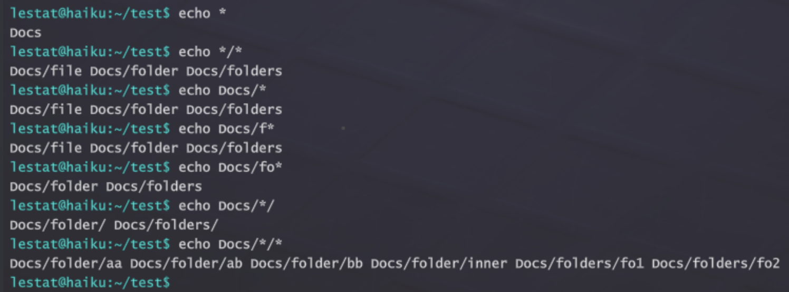
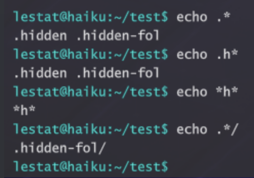

# Haiku Commands

## **File System**

### cd

✅ Linux

cd

✅ Windows

cd

```markdown
Change the directory

Parameters:
cd /
Go to root directory.

cd ..
Go up a directory (parent directory).

cd directory path
Navigate to specified directory.

Example:
cd docs/users
cd "my folder"
```

### pwd/chdir

✅ Linux

pwd

✅ Windows

chdir

```markdown
(print working directory) - Display the current directory path

Example:
pwd
```

### cat/type

✅ Linux

cat

✅ Windows

type

```html
Short for "concatenate", this command displays file contents in the terminal.

Usage:
cat [option]... file...

Example:
cat myDocument.txt
cat "my document.txt" - quotes must be used when the filename contains a space.
cat file1 file2 file3
```

### ls/dir

✅ Linux

ls

✅ Windows

dir

```markdown
List all the current files and folders in the current working directory or a specified path.

Options:
-l
    use a long listing format 
-h, --human-readable
    with -l, print file sizes like 1K, 234M, 2G, etc
-a, --all
    do not ignore entries starting with .

Example:
ls
ls path
ls -lah path
ls -a -l path
```

### rm/del

✅ Linux

rm

✅ Windows

del

```markdown
Short for 'remove'. Deletes a file or directory.

Parameters
-r
Delete a directory and all its contents.

Usage:
rm -r directory name
rm file name
rm file… 

Example:
rm -r myDirectory
rm myFile.txt
rm myFile.txt myfile2.txt
```

### cp/copy

✅ Linux

cp

✅ Windows

copy

```markdown
Copy a file or directory to another destination file or destination directory.

Usage:
cp source_file dest_file | dest_directory
cp -r source_directory target_directory

Example:
cp passwords.txt docs/myPasswords.txt
cp pass.txt pass2.txt
cp -r myFiles docs

cp "my password.txt" mypass.txt*
*Note if a file or path has spaces in the name it must be surrounded in quotes.
```

### mv/move

✅ Linux

mv

✅ Windows

move

```markdown
Move a file or folder to a new path location or change the name of a file or directory. 

Usage: `mv file newfile`

e.g.
Changing a file name:
`mv file.txt newfile.txt` 

Moving a file to a new location:

`mv file1.txt /home/user1`

Moving a directory

`mv /home/users/files/ /home/users/user1/files/
```

### file

✅ Linux

file

❌ Windows

```markdown
Used to determine file type. Multiple files can be passed to file at once including the * wildcard symbol to run against all files in the current directory.

Parameters
-z or -Z attempts to look inside an archive or compressed file, if successful returns file type and compression details

Usage
file "file_name"
file "file1" "file2" "file3"
file *

Examples
file myDocument.txt
file "my application.bin"
file *

Notes
Quotes must be used for filenames containing spaces. File does not look at the file extension to determine file type but instead looks at the actual file attributes to see what it is.
```

### mkdir/md

✅ Linux

mkdir

✅ Windows

md

```markdown
Short for 'make directory'. Makes the directory(ies) if they do not already exist.

Usage:
mkdir [option]... directory...

Example:
mkdir newDirectory1 newDirectory2
mkdir existingDirectory/newDirectory
mkdir -p hierarchy/of/new/directories
```

### du/dust

✅ Linux

du/dust

❌ Windows

```markdown
du is a gnu utility that measures disk usage of a single directory or file. 
Inspired by the dust program (du written in rust), the app aggregates the size,
or disk usage, of all file system objects found underneath its entry point based
on our disk usage metrics.

disk usage metrics for different types of game files:
text files: the raw content of the file is read, every character counts as 1 byte of text, we pretend they are all UTF8 ASCII.

binary files: we hash the file name and generate a random number with that as a
seed, then use it to create a deterministic random disk usage between 1KB and 8KB.

zipped archives: it shows the archive as a single file which has a disk usage of 
all of the files it contains (recursively, allowing for zip inception) reduced by 75%, which is more or less the average compression of real-world 7-zip 
(nested zip files don't reduce it further).

wordlists: depending on the relative size of the passwords it's supposed to
contain, the wordlist size is either 100%, 40%, 27.5%, 17.5%, or 10% of the real-world rockyou wordlist, which has a storage size of 139 MB.

Usage:
dust [-d number] [folder] 

-d Specify a custom depth to the recursive algorithm.

Example:
dust
dust my-folder/ -d 4
du
du my-folder/ -d 4
```

### touch

✅ Linux

touch

❌ Windows

```markdown
Create a file if none exists.

Usage:
touch [file]

Example:
touch myFile
```

### lsblk

✅ Linux

lsblk

❌ Windows

```markdown
List information about block devices.

Usage:
lsblk

Example:
lsblk
```

### strings

✅ Linux

strings

✅ Windows

strings

```markdown
Find the printable strings in an object or other binary file.

Usage:
strings [options] [file]

-n [number]
Specify the minimum string length where the number argument is a positive decimal integer. The default is 4.

Example:
strings -n 3 myFile.txt
```

### realpath

✅ Linux

realpath

❌ Windows

```markdown
Usage: realpath [OPTION]... FILE..."
Print the resolved absolute file name all but the last component must exist
-e, --canonicalize-existing all components of the path must exist
-m, --canonicalize-missing no path components need exist or be a directory
```

### grep

✅ Linux

grep

❌ Windows

```markdown
grep - print lines matching a pattern

grep [OPTIONS] PATTERN [FILE...]
grep [OPTIONS] [-e PATTERN | -f FILE] [FILE...]

grep searches the named input FILEs for lines containing a match to the given PATTERN.

Currently implemented characters:
^ matches the start of the line
$ matches the end of the line
. matches any character
* extends the match of the previous character to be none or any amount of them
abcde and every other text character matches itself
```

### head/more

✅ Linux

head

✅ Windows

more

```markdown
Shows first N lines of the text file. 
Arguments: -n <number_of_lines> (optional, default value is 10).
Examples:
head /test.txt
head -n 5 /test.txt
```

### tail

✅ Linux

tail

❌ Windows

```markdown
Shows last N lines of the text file. 
Arguments: -n <number_of_lines> (optional, default value is 10).
Examples:
tail /test.txt
tail -n 5 /test.txt
```

### less

✅ Linux

less

❌ Windows

```markdown
Shows a file content page by page, where the page length is 15 lines.
Example:
    less <filename.txt>

Control Keys:
    Close the file: Ctrl+C
    Go to the next page: Space or Enter (return)
    Go to the previous page: Up arrow

Arguments:
    -N - line numbering
```

## **Network/Hacking**

### ping

✅ Linux

ping

✅ Windows

ping

```markdown
Transmits and receives Internet Control Message Protocol (ICMP) packets, issuing a statistical summary on cancellation (press CTRL+C).

Statistical Summary:
    * Packet loss
    * Avg/Min/Max/Standard Deviation of message response time

Usage:
ping hostname/IP

Example:
ping gcorp.com
ping 192.168.1.2
```

### curl

✅ Linux

curl

✅ Windows

curl

```markdown
Transfer data from a URL. Returns data as a string in the terminal.

Usage:
curl [options] [URL]

Example:
curl gcorp.com
curl http://gcorp.com

-O
Download file to current directory.

Example:
curl -O http://gcorp.com
```

### nmap

✅ Linux

nmap

✅ Windows

nmap

```markdown
Scans a device or hostname for ports. You can add parameters to change how the tool discovers the ports, and what information it will return.

Parameters:
-sV
Attempts to discover the software version a service is running.

-Pn
Skip host discovery (no ping). Nmap will ping a range of IPs, a method called ping sweeps, to determine what devices are active; this is the “host discovery” phase, and it is initiated first. Some firewalls might prevent ping sweeps; the -Pn parameter will tell Nmap to skip the host discovery phase and treat all IPs as active.

-O
Attempts to discover the operating system a service is running on.

-p
Only scan specified ports. Nmap -p port numbers hostname/IP

Port States:
open
Port is both accessible and accepting connections.

closed
Port is accessible, but no device is actively listening on it.

filtered
The port filters packets, likely from a firewall, or router rules. SMTP (Simple Mail Transfer Protocol), or a mail server, are usually filtered, as accessing them might require credentials or whitelisted IPs.

Example:
Nmap -sV -O -Pn -p 22 hostname.com
```

### ssh

✅ Linux

ssh

✅ Windows

ssh

```markdown
Remotely tunnel into a machine. A username of the target machine and its password are required.

Usage:
ssh [-p [port]] [[user@]host]

Example:
ssh -p 22 topdog@gcorp.com
ssh topdog@gcorp.com
ssh topdog@192.168.1.2
ssh gcorp.com -p 22
```

### scp

✅ Linux

scp

❌ Windows

```markdown
Copy the specified file or directory to a target directory on another machine.

Usage:
scp [source file] [target computer’s username]@[target system’s IP]/[target directory]/
scp source file target computer’s username@target system’s IP/target directory

Example:
scp passwordfile root@192.168.1.2/docs/stolenContent
```

### hydra

✅ Linux

hydra

✅ Windows

hydra

```markdown
A very fast network logon brute-forcer, supporting multiple service protocols. Currently World of Haiku only supports SSH brute forcing. 

Usage:
hydra [[  [-l USERNAME | -L /path/to/username_file] [-p password | -P /path/to/pass_FILE ] ]] service

Parameters:
-l
Provide a specific single username to use
Example - hydra 10.1.2.4 -l admin 

-L
Provide a file path to a username wordlist
Example - hydra 10.1.2.4 -L /home/userlist.txt

-p
Provide a specific single password to use
Example - hydra 10.1.2.4 -l admin -p password

-P
Provide a file path to a password wordlist
Example - hydra 10.1.2.4 -l admin -P /home/passlist.txt

service
non-optional service input to hydra. Must be used to tell hydra what service protocol we are brute forcing against. 
Example - we’re brute forcing against ssh on the standard port of 22
hydra 10.1.6.3 -l admin -p pass ssh

Examples:
hydra ssh://192.168.1.1 -L /path/to/users.txt -P /path/to/pass.txt
hydra 10.1.2.4 -l root -P path/to/pass.txt ssh
```

### dirb

✅ Linux

dirb

✅ Windows

dirb

```markdown
DIRB is a Web Content Scanner. It looks for
existing (and/or hidden) Web Objects. It works by
launching a dictionary-based attack against a web
server and analyzing the response.

Synopsis:
    dirb <url_base> <url_base> [<wordlist_file(s)>] [options]

Parameters:
-v
    Show Also Not Existent Pages.

-x <extensions_file>
    Amplify search with the extensions on this file.

-X <extensions>
    Amplify search with this extensions.
```

### sqlmap

✅ Linux

sqlmap

✅ Windows

sqlmap

```markdown
Usage:sqlmap [options]

Options:
    -h                  Show help message and exit
    --version           Show program's version number and exit

Target:
    At least one of these options has to be provided to define the
    target(s)
    -u URL              Target URL (e.g. ""http://www.site.com/vuln.php?id=1"")
    -d DIRECT           Connection string for direct database connection
                        Example:
                        ""S=IP/HostName;DB=DBName;CR=UserName:password""
    -c CONFIGFILE       Load command parameters from file

Request:
    These options can be used to specify how to connect to the target URL

    --cookie=COOKIE     HTTP Cookie header value (e.g. ""PHPSESSID=a8d127e..;SOME=fd32k"")
    --auth-cred=AUTH..  HTTP authentication credentials (name:password name:password)

Enumeration:
    These options can be used to enumerate the back-end database management system information, structure and data contained in the tables

    -a, --all           Retrieve everything
    --current-user      Retrieve DBMS current user
    --current-db        Retrieve DBMS current database
    --hostname          Retrieve DBMS server hostname
    --users             Enumerate DBMS users
    --passwords         Enumerate DBMS users password hashes
    --dbs               Enumerate DBMS databases
    --tables            Enumerate DBMS database tables
    --columns           Enumerate DBMS database table columns
    --dump              Dump DBMS database table entries
    --search            Search column(s), table(s) and/or database name(s)
    -D DB               DBMS database to enumerate
    -T TBL              DBMS database table(s) to enumerate
    -C COL              DBMS database table column(s) to enumerate
```

### tshark

✅ Linux

tshark

✅ Windows

tshark

```markdown
Network protocol analyzer and packet capture tool (terminal-based Wireshark).

Parameters:
-i
    Network interface to capture on (default: eth0).

-w
    Write captured packets to a dump file.

-r
    Read packets from a dump file.

-z
    Display the contents of a TCP stream between two nodes.

Capture is stopped by pressing Ctrl+C.

Usage:
tshark [-i interface] [-w file] [-r file] [-z]

Example:
tshark
tshark -i eth0
tshark -r /tmp/capture.pcapng
tshark -r /tmp/capture.pcapng -z
```

### iptables

✅ Linux

iptables

❌ Windows

```markdown
The Linux firewall command performing IPv4 packet filtering and NAT rules. Used to set up, maintain, and inspect the IP packet filter rules on a Linux computer. 

Firewall rules contain either built-in or user-defined chains, a list of firewall rules specifying what to do with a packet that matches a given criteria. If the packet does not match the criteria, the next rule in the chain is examined; if it does match, the action taken on the packet can be either:

ACCEPT - let the packet through
DROP - block processing of packet

Three default Firewall Chains:
INPUT
OUTPUT
FORWARD

The order of firewall rules matters in that as 

Parameters:
-L
List all the iptables rules. 
-L [Chain]
optional to filter on a specific chain. 
-A [CHAIN_name] 
add a firewall rule to a specific chain (INPUT, OUTPUT, FORWARD)
-s [IP Address]
add a specific ip address to block for the chain rule. 
iptables -A INPUT -s 22.22.22.22
-j [ACTION]
DROP or ACCEPT

iptables -A  INPUT -s 22.22.22.22 -j DROP
```

### aircrack

✅ Linux

aircrack

❌ Windows

```markdown
aircrack-ng is a 802.11 WEP / WPA-PSK key cracker. It implements the so-called Fluhrer - Mantin - Shamir (FMS) attack, along with some new attacks by a talented hacker named KoreK.

  usage: aircrack-ng [options] <input file(s)>

  WEP and WPA-PSK cracking options:

      -w <words> : path to wordlist filename

  Other options:

      --help     : Displays this usage screen
```

### aireplay

✅ Linux

aireplay

❌ Windows

```markdown
aireplay-ng is used to inject frames.

  usage: aireplay-ng <options> <replay interface>

  Replay options:
      -a bssid  : set Access Point MAC address
      -c dmac   : set Destination  MAC address

  Attack modes (numbers can still be used):

      --deauth      count : deauthenticate station (-0)

      --help              : Displays this usage screen
```

### airodump

✅ Linux

airodump

❌ Windows

```markdown
airodump-ng is a packet capture tool for aircrack-ng. It allows dumping packets directly from WLAN interface and saving them to a pcap or IVs file.

  usage: airodump-ng <options> <interface>

  Options:
      --write      <prefix> : Dump file prefix
      -w                    : Same as --write
      --endwrite            : Stop write dump file
      -e                    : Same as --endwrite

  Filter options:
      --bssid     <bssid>   : Filter APs by BSSID
      -d          <bssid>   : Same as --bssid
      --essid     <essid>   : Filter APs by ESSID
      -a                    : Filter clients

  By default, airodump-ng hops on 2.4GHz channels.
  You can make it capture on other/specific channel(s)
  by using:
      --channel <channels>  : Capture on specific channels
      -c        <channels>  : Same as --channel

      --help                : Displays this usage screen
```

### nmcli

✅ Linux

nmcli

❌ Windows

```markdown
Can connect to and disconnect from WiFi networks
  
  Usage:
  nmcli OBJECT { COMMAND }

  device     : Device object (dev or d)
  connection : Connections object (con or c)

  Device object
  Use for device configuration

  List available WiFi access points:
  wifi list

  Establish connection with access point: 
  wifi connect network-ssid [password " + "\"network-password\"]"+
  @"
  password is optional
  

  Connection object

  Disconnect:
  nmcli c/con/connection down
```

## **Local/Hacking**

### ifconfig/ipconfig

✅ Linux

ifconfig

✅ Windows

ipconfig

```markdown
Description:
Display and manage network interface configurations. Sho
ws the user the IP address, subnet mask, gateway(router)
 ip address and mac address. 

Example:
ifconfig

To enable or disable network interfaces by name, use:
ifconfig <interface_name> up
ifconfig <interface_name> down

Example:
ifconfig eth0 up
```

### iwconfig

✅ Linux

iwconfig

❌ Windows

```markdown
Show and configure a wireless network interface
```

### netstat

✅ Linux

netstat

✅ Windows

netstat

```markdown
Provides information about network interfaces, connections, listening ports, and network usage statistics. When used in defense, it identifies ports that are open and listening or network connections that have been established which might represent suspicious activity.";
```

### john

✅ Linux

john

✅ Windows

john

```markdown
Crack passwords using wordlists.

The most basic operation of John The Ripper is called single crack mode; it takes information from the files and applies mangling rules to them.

Usage:
john file name
john --wordlist=myWordlist.lst myHash.txt

Example:
john myHash.txt
```

### ps/tasklist

✅ Linux

ps

✅ Windows

tasklist

```markdown
Displays all information about running processes.

Usage:
ps

Example:
ps
```

### sudo

✅ Linux

sudo

❌ Windows

```markdown
Run any command as admin (if you have access).
```

### kill

✅ Linux

kill

✅ Windows

taskkill

```markdown
kill: kill [sig] [pid | name]
Ends a process by sending it a signal.The default signal is SIGTERM (-15) (ask politely for program termination). There's also SIGKILL (-9) (force program termination)
```

### telnet

✅ Linux

telnet

 ✅ Windows

telnet

```markdown
Usage: telnet[OPTION...][HOST[PORT]]
Login to remote system HOST(optionally, on service port PORT)

 General options:

 -l, --user     attempt automatic login as USER

Other options:

  -?, --help, or no options  give this help list
```

## **Utility**

### whoami

✅ Linux

whoami

✅ Windows

whoami

```markdown
Whoami literally means 'Who am I?' This command returns the username of the current user.

Example:
whoami
```

### dd

✅ Linux

dd

❌ Windows

dd

```markdown
Creates and restores dumps of hard drive devices.

**To create the dump:**
*dd if=DEVICE_NAME of=/PATH_TO_NEW_DUMP*
Example:
*dd if=/dev/sdd of=/dump.dd*

Arguments:
*conv=noerror* - ignore read errors during the dump creation.
*-b* copy the dump to the system copy buffer (for mission development purposes).
*bs=* block size (example: 1M for 1 megabyte).

**To restore the dump:**
*dd if=/PATH_TO_DUMP of=DEVICE_NAME*
Example:
*dd if=/dump.dd of=/dev/sdd*
```

### unzip

✅ Linux

unzip

❌ Windows

```markdown
List and extract compressed files in a ZIP archive
*unzip* will list or extract files from a ZIP archive, commonly found on MS-DOS systems. The default behavior (with no options) is to extract all files from the specified ZIP archive into the current directory (and subdirectories below it). A companion program, **zip**, creates ZIP archives.

Options
-l
list archive files (short format).
-d
unzip archive to given directory. If directory doesn't exist, unzip will create it.

Examples
unzip -d archive archive.zip
unzip /Documents/Archive.zip
```

### clear

✅ Linux

clear

✅ Windows

cls

### exit

✅ Linux

exit

✅ Windows

exit

### echo

✅ Linux

echo

✅ Windows

echo

```markdown
Displays a string given as an argument. echo hello world will output “hello world” in the terminal. Instead of displaying the given string in the terminal, echo can write it to a file.

Usage:
echo response
echo file content > file name

Example:
echo hello world
echo hello world > helloWorld.txt
```

### md5sum/certutil

✅ Linux

md5sum

✅ Windows

certutil

```markdown
Compute and check MD5 message digest

Usage:
md5sum file...

Example:
md5sum password.txt
md5sum p1.lst p2.lst p3.lst
```

### man/ /?

✅ Linux

man

✅ Windows

/?

```markdown
Short for “manual,” it displays the help content for an installed command or 
tool. 

Usage:
man [command/tool]

Example:
man ping
```

### cowsay

✅ Linux

cowsay

❌ Windows

```markdown
cowsay/cowthink - configurable speaking/thinking cow
(and a bit more)

cowsay [-h] [-l] [-bdgpstwy] [-f cowfile]
       [-e eye_string] [-T tongue_string] [-W columns] 

There are several provided modes which change the
appearance of the cow depending on its particular
emotional/physical state. The -b option initiates Borg
mode; -d causes the cow to appear dead; -g invokes
greedy mode; -p causes a state of paranoia to come over
the cow; -s makes the cow appear thoroughly stoned; -t
yields a tired cow; -w is somewhat the opposite of
-t, and initiates wired mode; -y brings on the cow's
youthful appearance.

The user may specify the -e option to select the
appearance of the cow's eyes, in which case the first
one or two characters of the argument string eye_string
will be used. The default eyes are 'oo'. The tongue is
similarly configurable through -T and tongue_string;
the tongue does not appear by default.
However, it does appear in the 'dead' and 'stoned'
modes. Any configuration done by -e and -T will be lost
if one of the provided modes is used.

The -f option specifies a particular cow character to
be used instead of the default cow.
To list all available cowfile characters on the current
machine, invoke cowsay with the -l switch.
```

### movewindow

✅ Linux

movewindow

✅ Windows

movewindow

```markdown
Moves a game window to a normalized screen position. Coordinates should be in the 0..1 range.

Usage:
movewindow windowName x y [pivotX pivotY]

Example:
movewindow terminal 0.5 0.5
movewindow terminal 0.25 0.75 0.0 1.0
```

### focuswindow

✅ Linux

focuswindow

✅ Windows

focuswindow

```markdown
Brings a specified game window to the front.

Usage:
focuswindow windowName

Example:
focuswindow terminal
```

## Scripting

### mini

✅ Linux

mini

✅ Windows

mini

```markdown
Miniscript is a simple scripting language added into the game for players to build their scripts and exploits.

Scripting documentation: see Miniscript Anvil Scripting Language page

Usage:
mini [file]
```

[Miniscript Anvil Scripting Language](miniscript-anvil-scripting-language.md)

## **World of Haiku**

zion
flag
flags
./loic
./roninnitro
map
goals

flag

```markdown
Capture the flag (singular) for dojo missions. Input without parameters is for flagged files. Example:
flag flag_file_name.ext

Parameters
-sV
Capture the service version. Use quotes if the version contains whitespaces. Example:
flag -sV ""1.0.2 LTS""

-u
Capture the user name of device. Use quotes if the user name contains whitespaces. Example:
flag -u ""john_nichols_96""

-oV
Capture the operating system version. Use quotes if version contains whitespaces. Example:
flag -oV ""22.04 LTS""

-sL
Capture the services list. Use quotes if service name contains whitespaces. Divide services name by whitespaces. Example:
flag -sL ""TFTP"" SSH ""DHCP""

-rS
Capture the random String flag. Use quotes if the string contains whitespaces. Example:
flag -rS ""Hello world""
flag -rS MyFlag
```

flags

```markdown
Display all mission goals/flags as a checklist with completion status. In multiplayer shared-goals mode, a shared goals header is displayed.

Usage:
flags

Example:
flags
```

## **User Windows Openers**

explorer
editor [file]
browser [URL]
nitro
notes
manual
tracing
tracing

```markdown
Opens the Packet Tracing application. Optionally accepts a file path to open directly in the packet tracer.

Usage:
tracing [file]

Example:
tracing
tracing /tmp/capture.pcapng
```

terminalSize

```markdown
Sets or closes the game terminal. Arguments: 0 - panel view (default), 1 - maximized view, 2 - hidden view. If the terminal is closed (hidden) and the method is invoked with a 0 or 1 argument - the terminal will be open.

Usage:
terminalSize [0 | 1 | 2]
```

## Aliases

| Alias | Command |
| --- | --- |
| ll | ls -l |
| dir | ls |
| cls | clear |
| printf | echo |
| du | dust |
| logout | exit |
| killall | kill -15 -1 |
| nautilus | explorer |
| thunar | explorer |
| ed | editor |
| vi | editor |
| vim | editor |
| emacs | editor |
| nano | editor |
| code | editor |
| notepad | editor |
| cowthink | cowsay |

## Terminal Behavior

### Pattern Matching

```markdown
txt matches a file named "txt"

* matches anything or even nothing

*txt matches anything followed by "txt" (ends with "txt")

file* matches "file," followed by anything (needs to start with "file")

*some* matches anything, followed by "some", Followed by anything (needs 'some' somewhere in the middle)

? matches a single character (needs a character, any character)

j? matches something that starts with "j" and is followed by any character

*.?s would then match both "index.js", "main.rs", ".ps", but wouldn't match "gui.jsx"

[abc] matches anything that has one character and it is either a, b or c

*.[jr]s would match anything that ends with ".js" or ".rs"

[a-z] matches a single character, from ASCII "a" to "z" (can include weird characters of ASCII there)

file[0-9] then would match anything that starts with "file" and is followed by a single-digit

file[ab0-9cd] matches "file" followed by a single digit or either a, b, c, d

[!s] or [^s] a '!' or '^' at the start of the brackets negates all inside, so here it matches all except for "s"

*[!s] would then match "anything that does not end in an "s"
```

### Pathname Expansion

```markdown
Pattern matching is used for pathname expansion, which expands parts of the path using pattern matching to look for files by their path; this allows for supplying complex hierarchies of directories to a command.

Each part of the path generates a machine that tries matching.
For instance, > echo */Do*/Fo* will make a machine of *, then match, then make a machine Do*, match again, and so on.

If any machines fail, there is no need to go further, and no more machines will be built. The input won't be expanded at all. In this example, it will remain literally echo.

Hidden files must be matched explicitly by prepending any of the patterns with a dot, for example: *. Regular * does not grab them.

EXAMPLE
mkdir test
cd test
mkdir -p .hidden-fol/../Docs/folder/inner/../../folders/fo{1,2}
touch .hidden .hidden-fol/inner Docs/folder/{aa,ab,bb,inner/cc} Docs/file
```





### Brace Expansion

Brace expansion generates multiple text strings from a pattern containing braces. Items inside curly braces are separated by commas.

```markdown
echo {a,b,c}
expands to: echo a b c

mkdir dir{1,2,3}
expands to: mkdir dir1 dir2 dir3

touch file_{alpha,beta,gamma}.txt
expands to: touch file_alpha.txt file_beta.txt file_gamma.txt

mkdir -p .hidden-fol/../Docs/folder/inner/../../folders/fo{1,2}
expands to two paths: folders/fo1 and folders/fo2
```

### Parameter Expansion

The shell expands `$VARIABLE` by substituting its value. This works in unquoted and double-quoted contexts. Available environment variables:

```markdown
$PWD     - current working directory path
$OLDPWD  - previous working directory path
$COLUMNS - terminal column width
$?       - exit status of the last command (0 = success)

Example:
echo $PWD
echo "Current dir: $PWD"
echo $?
```

### Output Redirection

You can redirect the output of any command to a file using `>` (overwrite) or `>>` (append).

```markdown
> overwrites the file (creates it if it doesn't exist)
>> appends to the file (creates it if it doesn't exist)

Example:
echo hello > greeting.txt
echo world >> greeting.txt
ls > filelist.txt
```

### Quoting

These are three of the most well-known forms of quoting.

- Backslash quoting
    - Escapes the next character after a unquoted `\`, for instance, `\$var` translates 
    literally to `$var,` making `$` lose its meaning
- Single quoting
    - Escapes every character inside of `'..'`, including backslashes
- Double quoting
    - Escapes every character inside of `".."`, with the exception of `$,` ```, `\` and `"` 
    
    It makes so characters inside double quotes are not word split, this is useful when we want to read a multi-word variable without breaking it into different arguments.
    
    Example `> echo "$PWD"` won't split the result of $PWD variable if there's a space in the path, `> echo $PWD` will