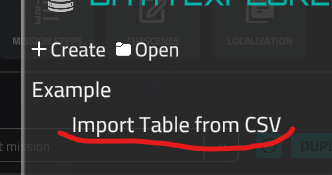
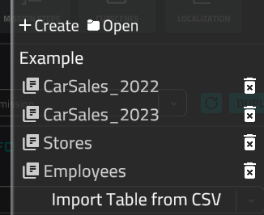
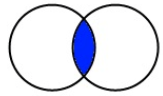
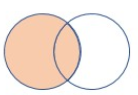
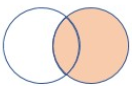
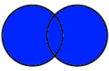

# Kusto Query Language (KQL)

*(all outputs are based on Example database)*

## Importing Example database

- Sources
    
    [Stores.csv](kusto-query-language/stores.csv)
    
    [Employees.csv](kusto-query-language/employees.csv)
    
    [CarSales_2022.csv](kusto-query-language/carsales_2022.csv)
    
    [CarSales_2023.csv](kusto-query-language/carsales_2023.csv)
    
    [Kql example.xlsx](kusto-query-language/kql_example.xlsx)
    

Download the csv sources

Go to the Forge, open or create the mission with the network.

Open Data Explorer application


Create a new database with the name `Example`, set the asset name `db_example`


Import the first csv, for example, `Stores`. Pay attention, the table name must be the same as the file name (without extension). This is important for correct example query outcomes.



Your result should look like this. Don't forget to save the database to the network asset storage by clicking `Apply Changes` button.



## search

Add a row to the result table if any cell in this row contains the defined value (case-insensitive search is used). This can be the first element in the pipeline. If it is the first element, all tables will be checked (the query will be executed against the entire database).

If the query is executed against the entire database, the result table will include the matched column, as well as any column that is present in all tables.

**Example**

*Table1*: columns A, B, C 

*Table2*: columns C, D, E

If a match is found in column A, the result table will include columns A and C (since C exists in all tables).

If the query is processed against a single table (as the second element in the pipeline), all columns will be added to the result.

**Query Example:**

```lua
search "Davis"
```

- Output
    
    ```
    +----+----------+
    | Id | LastName |
    +----+----------+
    | 4  | Davis    |
    +----+----------+
    ```
    

```lua
Employees | search "Davis"
```

- Output
    
    ```
    +----+------------------+-------------+-----------+----------+
    | Id | HireDate         | SalaryMonth | FirstName | LastName |
    +----+------------------+-------------+-----------+----------+
    | 4  | 10/10/2019 00:00 | 5300        | Maria     | Davis    |
    +----+------------------+-------------+-----------+----------+
    ```
    

You can also specify which columns you want to search for the value in.

**Query Example:**

```lua
search in(FirstName, LastName) "Davis"
```

Column names support wildcard matching with `*`. For example, to search only in columns whose names start with "Sale":

```lua
search in(Sale*) "2022"
```

### Regex Search

Instead of a plain string, you can use a regular expression by wrapping the pattern in forward slashes `/`:

```lua
search "/^J.*son$/"
```

This will match any cell whose value starts with "J" and ends with "son" (e.g., "Johnson", "Jackson").

## *Piping*

Piping is performed using the '|' character. It separates the results of the query. The output of the previous operation will be processed in the next part of the pipeline. This means that the table resulting from the previous pipe action will be passed to the next part.

**Query Example:**

```lua
CarSales_2022 | search "Toyota" | search in(StoreId) "1"
```

For better understanding, you can split this query into three stages and run each separately. This will give you an example of how the result is refined.

Stage 1

```lua
CarSales_2022 
```

Stage 2

```lua
CarSales_2022 | search "Toyota"
```

Stage 3

```lua
CarSales_2022 | search "Toyota" | search in(StoreId) "1"
```

## *Table Name*

To process a specific table, you should define its name. This action can only be the first in the pipeline.

**Query Example:**

```lua
CarSales_2022 | search "Toyota"
```

*(CarSales_2022 is the table name)*

## where

Filter the table by a boolean condition. This operation cannot be the first in the pipeline.

**Query Example:**

```lua
CarSales_2022 | where StoreId == 1
```

Expressions can be complex. They can contain brackets (for setting order), methods, and operators (see bellow).

## Operators and methods

### Comparisons for numbers, dates, and strings

```lua
==, <=, >=, <, >, !=
```

### Arithmetic operators

Arithmetic operations can be used in `where`, `extend`, and `project` expressions:

```lua
+, -, *, /, %
```

**Query Example:**

```lua
Employees | extend AnnualSalary = SalaryMonth * 12
```

### Order (brackets), and, or

```lua
CarSales_2022 | where (StoreId == 1 or StoreId == 3) and Brand == "Toyota"
```

- Output
    
    ```
    +----+------------------+--------+------------------+---------+------------+
    | Id | SaleDate         | Brand  | VinCode          | StoreId | EmployeeId |
    +----+------------------+--------+------------------+---------+------------+
    | 1  | 05/01/2022 00:00 | Toyota | JTDBL40E79902001 | 1       | 1          |
    | 16 | 15/12/2022 00:00 | Toyota | JTDBL40E79902016 | 3       | 1          |
    +----+------------------+--------+------------------+---------+------------+
    ```
    

### ago

Returns a timestamp. This is the current date minus the time defined in the arguments. You can specify days, hours, minutes, and seconds. It is useful only for databases that are constantly being updated with fresh records.

Possible arguments:

```lua
ago(1d), ago(50m), ago(2h), ago(300s)
```

**Query Example:**

```lua
CarSales_2023 | where SaleDate >= ago(30d)
```

*Only records that were created within the last 30 days will be returned. However, this depends on the values in the SaleDate column, so you need to ensure that the dates in that column are set correctly.*

### todatetime

Parses a string into a datetime. Useful for exact date and time comparisons and checking intervals. Here are the possible time formats for the arguments:

```
yyyy-MM-dd HH:mm:ss
yyyy-MM-dd
yyyy-MM-ddTHH:mm:ssZ
yyyy-MM-ddTHH:mm:ss
yyyyMMdd
HH:mm:ss - will be used current date and parsed time
unix time (number)
```

**Checking interval query example:**

```lua
Employees | where HireDate >= todatetime("2017-01-01") and HireDate <= todatetime("2018-12-31")
```

### contains

```lua
VinCode contains "jtd"
```

Returns true if current EntityName column cell contains a string, defined in the right part (case-insensitive).

**Query Example:**

```lua
CarSales_2022 | where VinCode contains "jtd" or VinCode contains "2017"
```

- Output
    
    ```
    +----+------------------+--------+------------------+---------+------------+
    | Id | SaleDate         | Brand  | VinCode          | StoreId | EmployeeId |
    +----+------------------+--------+------------------+---------+------------+
    | 1  | 05/01/2022 00:00 | Toyota | JTDBL40E79902001 | 1       | 1          |
    | 16 | 15/12/2022 00:00 | Toyota | JTDBL40E79902016 | 3       | 1          |
    | 17 | 20/12/2022 00:00 | Ford   | 1FTRX17L6VNA2017 | 1       | 2          |
    +----+------------------+--------+------------------+---------+------------+
    ```
    

### startwith

Returns true if the current column value starts with the specified string on the right side (case-insensitive).

**Query Example:**

```lua
Employees | where FirstName startwith "j" or LastName startwith "j"
```

### endwith

Returns true if the current column value ends with the specified string on the right side (case-insensitive).

**Query Example:**

```lua
CarSales_2023 | where Brand endwith "a"
```

### strcat

String concatenation *(up to 16 parameters)*:

```lua
strcat("Hello", " ", "World", "!")
```

Result:

```
"Hello World!"
```

### has

Returns `true` if the received string contains part of the specified value. Unlike the `contains` operator, an [indexed term](https://learn.microsoft.com/en-us/kusto/query/datatypes-string-operators?view=microsoft-fabric#what-is-a-term) is used. For example, this query will return no results:

```lua
Stores | where Address has "lon"
```

```
+----+---------+---------+----------+-----------+
| Id | Country | Address | OpenDate | CloseDate |
+----+---------+---------+----------+-----------+
+----+---------+---------+----------+-----------+
```

However, this query will return a set of data:

```
Stores | where Address has "london"
```

```
+----+---------+------------------------+------------------+------------------+
| Id | Country | Address                | OpenDate         | CloseDate        |
+----+---------+------------------------+------------------+------------------+
| 3  | UK      | 789 King's Way, London | 30/09/2018 00:00 | 31/08/2023 00:00 |
+----+---------+------------------------+------------------+------------------+
```

### =~

The same as == (for string comparison), however, the case will be ignored.

**Query Example:**

```nasm
CarSales_2022 | where Brand =~ "toyota"
```

**Result:**

```
+----+------------------+--------+------------------+---------+------------+
| Id | SaleDate         | Brand  | VinCode          | StoreId | EmployeeId |
+----+------------------+--------+------------------+---------+------------+
| 1  | 05/01/2022 00:00 | Toyota | JTDBL40E79902001 | 1       | 1          |
| 16 | 15/12/2022 00:00 | Toyota | JTDBL40E79902016 | 3       | 1          |
+----+------------------+--------+------------------+---------+------------+
```

## extend

Adds a new column or changes the value of an existing column in the result table.

**Query Example:**

```lua
Employees
| extend Name = strcat(FirstName, " ", LastName)
```

The result table will include a new column, "Name" with the concatenation of the "FirstName" and "LastName" columns, for example: Alice Johnson.

## order by

Changes the table order based on column values. The default sorting order is descending. It supports nested sorting, which means that when a user defines multiple columns separated by commas, all columns will be combined into groups, then sorting will be performed within each group and again for each defined column.

**Explanation of nested sorting:**

```lua
 "Alice", 30, 90, //Name, Age, Score
 "Bob", 25, 85,
 "Alice", 25, 95,
 "Charlie", 30, 85,
 "Bob", 30, 95
```

**Result (ascending sorting by name then age):**

```lua
"Alice", 25, 95,
"Alice", 30, 90,
"Bob", 25, 85
"Bob", 39, 95
"Charlie", 30, 85
```

**KQL Query Example:**

```lua
CarSales_2022 |
order by StoreId asc
```

```lua
CarSales_2022 |
order by StoreId asc, SaleDate
```

## summarize

Group rows by column values. All rows will be grouped by the values of the column specified after the "by" keyword.

```lua
CarSales_2022
| summarize by Brand, StoreId
```

**Result:**

```
+------------+---------+
| Brand      | StoreId |
+------------+---------+
| Toyota     | 1       |
| Ford       | 1       |
| BMW        | 2       |
| Honda      | 2       |
| Audi       | 3       |
| Mercedes   | 1       |
| Nissan     | 2       |
| Hyundai    | 3       |
| Kia        | 3       |
| Volkswagen | 1       |
| Volvo      | 2       |
| Lexus      | 2       |
| Subaru     | 3       |
| Mazda      | 1       |
| Chevrolet  | 2       |
| Toyota     | 3       |
+------------+---------+
```

To retrieve additional data, various aggregation methods can be applied before the "by" keyword.

```lua
CarSales_2022
| summarize count(), brandCount = dcount(Brand) by StoreId
```

**Result:**

```
+---------+--------+-------------+
| StoreId | count_ | brandCount  |
+---------+--------+-------------+
| 1       | 6      | 5           |
| 2       | 8      | 6           |
| 3       | 6      | 5           |
+---------+--------+-------------+
```

Here is a list of aggregation and filter methods:

### count

Return count of rows in current group. Can receive argument, where argument is a column name (optional).

### dcount

Returns the count of unique records in the specified column for the current group. Requires an argument (column name).

### sum

Sum of all cells in the group. Column name must be set in the arguments. Its type must be a number.

```lua
Employees
| summarize sum(SalaryMonth)
```

**Result:**

```
+-----------------+
| sum_SalaryMonth |
+-----------------+
| 26100           |
+-----------------+
```

### avg

Average of all values in the group. A column name must be provided as an argument, and its data type must be numeric.

```lua
Employees
| where FireDate == null 
| summarize avg(SalaryMonth)
```

**Result:**

```
+------------------+
| avg_SalaryMonth  |
+------------------+
| 5266.66666666667 |
+------------------+
```

### min

Returns the minimum value from all cells in the group. A column name must be provided as an argument, and its data type must be numeric.

```lua
Employees
| where FireDate == null 
| summarize min(SalaryMonth)
```

**Result:**

```
+-----------------+
| min_SalaryMonth |
+-----------------+
| 5000            |
+-----------------+
```

### max

Returns the maximum value from all cells in the group. A column name must be provided as an argument, and its data type must be numeric.

```lua
Employees
| where FireDate == null 
| summarize max(SalaryMonth)
```

**Result:**

```
+-----------------+
| max_SalaryMonth |
+-----------------+
| 5500            |
+-----------------+
```

### percentile

Returns a percentile value from all cells in the group. A column name must be provided as the first argument, along with a second parameter specifying the percentile (0...100). The column's data type must be numeric.

```lua
Employees
| where FireDate == null 
| summarize percentile(SalaryMonth, 10)
```

### avg_max

This is a filtering method that returns the row or column with the maximum value in the column specified as the first parameter. The second parameter defines what to return — either the column name or the entire row (*).

The data type of the first column argument can be any. If it is a number or a date, the highest or latest row will be selected. For strings, alphabetical sorting is applied.

**Example 1:**

```lua
CarSales_2022
| summarize arg_max(SaleDate, *)
```

```
+----+------------------+-------+-----------------+---------+------------+
| Id | SaleDate         | Brand | VinCode         | StoreId | EmployeeId |
+----+------------------+-------+-----------------+---------+------------+
| 20 | 31/12/2022 00:00 | Audi  | WAULC68E84A5020 | 3       | 5          |
+----+------------------+-------+-----------------+---------+------------+
```

**Example 2:**

```lua
CarSales_2022
| summarize arg_max(SaleDate, SaleDate) by StoreId
```

```
+---------+------------------+
| StoreId | SaleDate         |
+---------+------------------+
| 1       | 20/12/2022 00:00 |
| 2       | 28/12/2022 00:00 |
| 3       | 31/12/2022 00:00 |
+---------+------------------+
```

### avg_min

This is a filtering method that returns the row or column with the minimum value in the column specified as the first parameter. The second parameter defines what to return — either the column name or the entire row (*).

The data type of the first column argument can be any. If it is a number or a date, the highest or latest row will be selected. For strings, alphabetical sorting is applied.

```lua
CarSales_2023
| summarize firstSale = arg_min(SaleDate, SaleDate) by StoreId
```

```
+---------+------------------+
| StoreId | firstSale        |
+---------+------------------+
| 1       | 10/01/2023 00:00 |
| 2       | 15/01/2023 00:00 |
| 3       | 05/02/2023 00:00 |
+---------+------------------+
```

## project

Adds only the specified columns to the result of the request. It cannot be the first step. The columns can be existing ones with original values, modified columns (name or values), or entirely new columns. This can be used to reduce the number of columns, which improves performance in subsequent pipeline queries.

**Example:**

```lua
CarSales_2023
| project SaleDate, Car = strcat(Brand, ": ", VinCode), newColumn = 2 * 6, JohnSmith = EmployeeId == 1
```

**Result:**

```
+------------------+-----------------------------+-----------+-----------+
| SaleDate         | Car                         | newColumn | JohnSmith |
+------------------+-----------------------------+-----------+-----------+
| 10/01/2023 00:00 | Mercedes: WDDGF8AB5DA6021   | 12        | 1         |
| 15/01/2023 00:00 | Nissan: 1N4AL11D75C7022     | 12        | 0         |
| 05/02/2023 00:00 | Hyundai: KMHDU46DXAU8023    | 12        | 0         |
| 18/02/2023 00:00 | Kia: KNDJT2A5XB90024        | 12        | 0         |
| 20/03/2023 00:00 | Volkswagen: 3VWB17AJ5HM0025 | 12        | 1         |
| 10/04/2023 00:00 | Volvo: YV1CZ59H64110026     | 12        | 0         |
| 15/04/2023 00:00 | Lexus: JTHBJ46G29220027     | 12        | 0         |
| 05/05/2023 00:00 | Subaru: 4S3BL61638730028    | 12        | 0         |
| 14/05/2023 00:00 | Mazda: JM1BK323X8150029     | 12        | 1         |
| 01/06/2023 00:00 | Chevrolet: 2G1WT58KX9110030 | 12        | 0         |
| 10/06/2023 00:00 | Toyota: JTDBL40E79902031    | 12        | 0         |
| 05/07/2023 00:00 | Ford: 1FTRX17L6VNA2032      | 12        | 1         |
| 15/07/2023 00:00 | BMW: WBA3B3C56FPD3033       | 12        | 0         |
| 20/08/2023 00:00 | Honda: 2HGFA16578H4034      | 12        | 0         |
| 25/08/2023 00:00 | Audi: WAULC68E84A5035       | 12        | 0         |
+------------------+-----------------------------+-----------+-----------+
```

## limit

Reduces the row count in the query result by the number specified in the expression.

**Example:**

```lua
CarSales_2022
| limit 5
```

**Result:**

```
+----+------------------+--------+------------------+---------+------------+
| Id | SaleDate         | Brand  | VinCode          | StoreId | EmployeeId |
+----+------------------+--------+------------------+---------+------------+
| 1  | 05/01/2022 00:00 | Toyota | JTDBL40E79902001 | 1       | 1          |
| 2  | 15/01/2022 00:00 | Ford   | 1FTRX17L6VNA2002 | 1       | 2          |
| 3  | 20/02/2022 00:00 | BMW    | WBA3B3C56FPD3003 | 2       | 3          |
| 4  | 18/03/2022 00:00 | Honda  | 2HGFA16578H4004  | 2       | 4          |
| 5  | 22/04/2022 00:00 | Audi   | WAULC68E84A5005  | 3       | 5          |
+----+------------------+--------+------------------+---------+------------+
```

## union

The `union` operator is used to create a new table from several tables. This query type can be the first in the pipeline, and then the union will be performed using the specified expressions. If this query is not the first in the pipeline, the result of the previous query will be used as the first table to be united with the following expressions.

This query supports both nested queries (within brackets) and simple table names as expressions. By default (`kind=outer`), all rows from the tables will be combined into the new table, regardless of whether the schemas of the tables are the same or not. If the schemas differ, all cell values will be "null" in columns that were not present in the original table.

### kind=outer (default)

In this example, the first 5 rows from three tables will be combined. The first two tables (`CarSales_2022` and `CarSales_2023`) have the same schema, so none of the cells will have null values. However, the schema of the third table differs, which will result in null values in the columns from the `CarSales_X` tables in the last 5 rows, as well as nulls in the 3 rows for the columns from the third table.

```lua
union 
	(CarSales_2022 | limit 5), 
	(CarSales_2023 | limit 5), 
	(Stores)
```

```
+----+------------------+------------+------------------+---------+------------+---------+------------------------+------------------+------------------+
| Id | SaleDate         | Brand      | VinCode          | StoreId | EmployeeId | Country | Address                | OpenDate         | CloseDate        |
+----+------------------+------------+------------------+---------+------------+---------+------------------------+------------------+------------------+
| 1  | 05/01/2022 00:00 | Toyota     | JTDBL40E79902001 | 1       | 1          | null    | null                   | null             | null             |
| 2  | 15/01/2022 00:00 | Ford       | 1FTRX17L6VNA2002 | 1       | 2          | null    | null                   | null             | null             |
| 3  | 20/02/2022 00:00 | BMW        | WBA3B3C56FPD3003 | 2       | 3          | null    | null                   | null             | null             |
| 4  | 18/03/2022 00:00 | Honda      | 2HGFA16578H4004  | 2       | 4          | null    | null                   | null             | null             |
| 5  | 22/04/2022 00:00 | Audi       | WAULC68E84A5005  | 3       | 5          | null    | null                   | null             | null             |
| 1  | 10/01/2023 00:00 | Mercedes   | WDDGF8AB5DA6021  | 1       | 1          | null    | null                   | null             | null             |
| 2  | 15/01/2023 00:00 | Nissan     | 1N4AL11D75C7022  | 2       | 2          | null    | null                   | null             | null             |
| 3  | 05/02/2023 00:00 | Hyundai    | KMHDU46DXAU8023  | 3       | 4          | null    | null                   | null             | null             |
| 4  | 18/02/2023 00:00 | Kia        | KNDJT2A5XB90024  | 3       | 5          | null    | null                   | null             | null             |
| 5  | 20/03/2023 00:00 | Volkswagen | 3VWB17AJ5HM0025  | 1       | 1          | null    | null                   | null             | null             |
| 1  | null             | null       | null             | null    | null       | USA     | 123 Main St, New York  | 01/03/2015 00:00 | null             |
| 2  | null             | null       | null             | null    | null       | Canada  | 456 Maple Rd, Toronto  | 15/06/2017 00:00 | null             |
| 3  | null             | null       | null             | null    | null       | UK      | 789 King's Way, London | 30/09/2018 00:00 | 31/08/2023 00:00 |
+----+------------------+------------+------------------+---------+------------+---------+------------------------+------------------+------------------+
```

### kind=inner

The `kind=inner` union type works differently. First, it must be explicitly set. In the result, only the rows that have matching columns and identical values across all tables will be included.

In this example, two tables with completely different schemas will be combined using the `kind=inner` union type. Even though these tables have different sets of columns, some values in `CarSales_2022.StoreId` and `Stores.Id` are the same. By using the `project` query, the name of this column can be aligned to perform the union query with some results.

```lua
union kind=inner 
	(CarSales_2022 | project StoreIdUnion = StoreId, SaleDate), 
	(Stores | project StoreIdUnion = Id, Country, Address)
```

```
+--------------+------------------+---------+------------------------+
| StoreIdUnion | SaleDate         | Country | Address                |
+--------------+------------------+---------+------------------------+
| 1            | 05/01/2022 00:00 | USA     | 123 Main St, New York  |
| 1            | 15/01/2022 00:00 | USA     | 123 Main St, New York  |
| 2            | 20/02/2022 00:00 | Canada  | 456 Maple Rd, Toronto  |
| 2            | 18/03/2022 00:00 | Canada  | 456 Maple Rd, Toronto  |
| 3            | 22/04/2022 00:00 | UK      | 789 King's Way, London |
| 1            | 30/05/2022 00:00 | USA     | 123 Main St, New York  |
| 2            | 15/06/2022 00:00 | Canada  | 456 Maple Rd, Toronto  |
| 3            | 07/07/2022 00:00 | UK      | 789 King's Way, London |
| 3            | 20/08/2022 00:00 | UK      | 789 King's Way, London |
| 1            | 10/09/2022 00:00 | USA     | 123 Main St, New York  |
| 2            | 15/09/2022 00:00 | Canada  | 456 Maple Rd, Toronto  |
| 2            | 05/10/2022 00:00 | Canada  | 456 Maple Rd, Toronto  |
| 3            | 20/10/2022 00:00 | UK      | 789 King's Way, London |
| 1            | 25/11/2022 00:00 | USA     | 123 Main St, New York  |
| 2            | 10/12/2022 00:00 | Canada  | 456 Maple Rd, Toronto  |
| 3            | 15/12/2022 00:00 | UK      | 789 King's Way, London |
| 1            | 20/12/2022 00:00 | USA     | 123 Main St, New York  |
| 2            | 25/12/2022 00:00 | Canada  | 456 Maple Rd, Toronto  |
| 2            | 28/12/2022 00:00 | Canada  | 456 Maple Rd, Toronto  |
| 3            | 31/12/2022 00:00 | UK      | 789 King's Way, London |
+--------------+------------------+---------+------------------------+
```

## join

Joins two tables by common columns. This operation cannot be the first one. The first table is the result of a previous execution, and the second is defined as an expression. There are several types of joins, with the inner join being the default. If there is no column defined as common between the two tables, an error will be returned.

**Syntax:**

```
T1 | join kind=<kind> (T2) on <column1>, <column2>
```

**Example:**

```lua
Stores
| extend StoreIdJoin = Id 
| join (CarSales_2022 | extend StoreIdJoin = StoreId | extend SaleId = Id) on StoreIdJoin
| project SaleId, StoreId = StoreIdJoin, Country, Address, SaleDate
```

**Result:**

```
+--------+---------+---------+------------------------+------------------+
| SaleId | StoreId | Country | Address                | SaleDate         |
+--------+---------+---------+------------------------+------------------+
| 1      | 1       | USA     | 123 Main St, New York  | 05/01/2022 00:00 |
| 2      | 1       | USA     | 123 Main St, New York  | 15/01/2022 00:00 |
| 6      | 1       | USA     | 123 Main St, New York  | 30/05/2022 00:00 |
| 10     | 1       | USA     | 123 Main St, New York  | 10/09/2022 00:00 |
| 14     | 1       | USA     | 123 Main St, New York  | 25/11/2022 00:00 |
| 17     | 1       | USA     | 123 Main St, New York  | 20/12/2022 00:00 |
| 3      | 2       | Canada  | 456 Maple Rd, Toronto  | 20/02/2022 00:00 |
| 4      | 2       | Canada  | 456 Maple Rd, Toronto  | 18/03/2022 00:00 |
| 7      | 2       | Canada  | 456 Maple Rd, Toronto  | 15/06/2022 00:00 |
| 11     | 2       | Canada  | 456 Maple Rd, Toronto  | 15/09/2022 00:00 |
| 12     | 2       | Canada  | 456 Maple Rd, Toronto  | 05/10/2022 00:00 |
| 15     | 2       | Canada  | 456 Maple Rd, Toronto  | 10/12/2022 00:00 |
| 18     | 2       | Canada  | 456 Maple Rd, Toronto  | 25/12/2022 00:00 |
| 19     | 2       | Canada  | 456 Maple Rd, Toronto  | 28/12/2022 00:00 |
| 5      | 3       | UK      | 789 King's Way, London | 22/04/2022 00:00 |
| 8      | 3       | UK      | 789 King's Way, London | 07/07/2022 00:00 |
| 9      | 3       | UK      | 789 King's Way, London | 20/08/2022 00:00 |
| 13     | 3       | UK      | 789 King's Way, London | 20/10/2022 00:00 |
| 16     | 3       | UK      | 789 King's Way, London | 15/12/2022 00:00 |
| 20     | 3       | UK      | 789 King's Way, London | 31/12/2022 00:00 |
+--------+---------+---------+------------------------+------------------+
```

**Supported Kinds**

### kind=inner



### kind=leftouter



### kind=rightouter



### kind=fullouter

