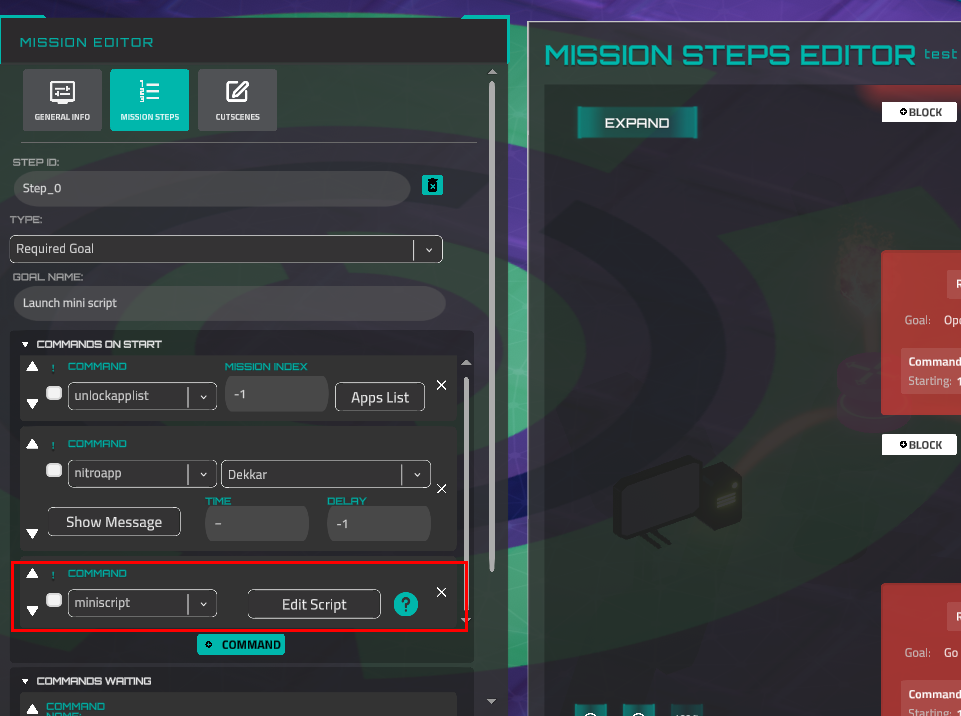

# Miniscript Anvil Scripting Language

Anvil is a simple scripting language added into the game for players to build their own scripts and exploits. Based on the open-source scripting language by Joe Strout (https://github.com/JoeStrout/miniscript)

# Launch a Script

A script can be launched in three ways: as a player-created script via terminal (however, not all methods can be launched)

```lua
mini FILE_NAME
```

Or as a [story script](story-creation-with-miniscript.md) that manages an entire mission, or launched by a story step.

# Control Flow

### if, else if, else, end if

```jsx
if 2+2 == 4 then
	print "math works!"
else if pi > 3 then
	print "pi is tasty"
else if "a" < "b" then
	print "I can sort"
else
	print "last chance"
end if
```

### while, end while

```jsx
s = "Spam"
while s.len < 50
	s = s + ", spam"
end while
print s + " and spam!"
```

### for, end for

```jsx
for i in range(10, 1)
	print i + "..."
end for
print "Liftoff!"
```

### break & continue

The `break` statement jumps out of a while or for loop. The `continue` statement jumps to the top of the loop, skipping the rest of the current iteration.

# Data Types

All numbers are stored in full-precision format. Numbers also represent true (1) and false (0). Operators:

| +, -, *, / | standard math |
| --- | --- |
| % | mod (remainder) |
| ^ | power |
| and, or, not | logical operators |
| ==, !=, >, >=, <, <= | comparison |

# Strings

Text is stored in strings of Unicode characters. Write strings by surrounding them with quotes. If you need to include a quotation mark in the string, type it twice. Use println instead of print if you want a line break.

| + | string concatenation |
| --- | --- |
| - | string subtraction (chop) |
| *, / | replication, division |
| ==, !=, >, >=, <, <= | comparison |
| [i] | get character i |
| [i:j] | get slice from i up to j |

### escapeURL

A lot of functions require an encoded URL string. But sometimes you need to use values generated at runtime, so you don't know what value you should encode. For this reason, the method *escapeURL* exists. It returns exactly the same output as *UnityWebRequest.EscapeURL()* does.

**Arguments**

| value | string, original (not encoded) |
| --- | --- |

**Example**

```lua
//console will show "Hello+World" message
println(escapeURL("Hello World"))
```

### unescapeURL

Receives an encoded version of a string (either from the `escapeURL` function or other tools) and returns a 'normal' string. This is the same as **`UnityWebRequest.UnEscapeUrl()`.**

**Arguments**

| encodedValue | string, encoded |
| --- | --- |

**Example**

```lua
println(unescapeURL("Hello%20world")) //the line "Hello World" will be shown
println(unescapeURL("Hello+world")) //exact the same line will be show as well
```

# Type Conversion

| to_number(string) | Converts the input string to a number data type. If the string can't be converted, returns `null`. |
| --- | --- |
| *conversion from numbers to strings* | Conversion from numbers to strings is an automatic process when you add any string to a number. So, to convert a number to a string data type, add an empty string to the number. 
Examples:
`213 + ""`
Or:
`213 + "23"`
The result will be 21323 |

# Lists

Write a list in square brackets. Iterate over the list with for, or pull out individual items with a 0-based index in square brackets. A negative index counts from the end. Get a slice (subset) of a list with two indices, separated by a colon.

```jsx
x = [2, 4, 6, 8]
x[0] // 2
x[-1] // 8
x[1:3] // [4, 6]
x[2]=5 // x now [2,4,5,8]
```

| + | list concatenation |
| --- | --- |
| *, / | replication, division |
| [i] | get/set element i |
| [i:j] | get slice from i up to j |

# Maps

A map is a set of values associated with unique keys. Create a map with curly braces; get or set a single value with square brackets. Keys and values may be any type.

```jsx
m = {1:"one", 2:"two"}
m[1] // "one"
m[2] = "dos"
```

| + | map concatenation |
| --- | --- |
| [k] | get/set value with key k |
| .indent | get/set value by identifier |

## JSONs

JSON is a popular format for serializing data into a string. It is supported by Miniscript, so if you convert any `Map` or `List` to a string (print it to the terminal or save it to a file), these data structures will be displayed as JSON.

To convert strings to `Map` or `List`, there is the `from_json` function. It accepts a string that is a valid JSON and returns a `Map` or `List` if the conversion is successful; otherwise, it returns `null`.

**Character substitutions**

The double quote character is substituted by `""` or `\"`. However, the `""` version is not a valid true JSON combination, and other parsers may fail to parse such JSON (only `\"` is valid). Therefore, it is highly recommended to use the encoded versions of strings (see `escapeURL` above).

Here is an example of setting JSON inside a string and parsing it using the `from_json` function. Then, some parsed values will be printed to the console.

```lua
json = "{""objects"":[{""object1"": ""value1""},{""object2"": ""va""""lue2""},{""object3"":3}]}"

parsedJson = from_json(json)
println(parsedJson)
println(parsedJson["objects"])
println(parsedJson["objects"][1])
println(parsedJson["objects"][1]["object2"])
```

**Output**

```
{"objects": [{"object1": "value1"}, {"object2": "va""lue2"}, {"object3": 3}]}
[{"object1": "value1"}, {"object2": "va""lue2"}, {"object3": 3}]
{"object2": "va""lue2"}
va"lue
```

**Special values (values without quotation marks):**

| null |  |
| --- | --- |
| true | will be converted to number 1 |
| false | will be converted to number 0 |

# Functions

Create a function with function(), including parameters with optional default values. Assign the result to a variable. Invoke by using that variable. User @ to reference a function without invoking.

```jsx
triple = function(n=1)
	return n*3
end function
print triple // 3
print triple(5) // 15
f = @triple
print f(5) // also 15
```

# Classes & Objects

```jsx
Shape = {"sides":0}
Square = new Shape
Square.sides = 4
x = new Square
x.sides // 4
```

Functions invoked via dot syntax get a self variable that refers to the object they were invoked on.

```jsx
Shape.degrees = function()
	return 180*(self.sides-2)
end function
x.degrees // 360
```

# Intrinsic Functions

### Haiku (can be launched by the mission editor only)

| admin_connect_user(ip_address) | Connect a user to a device by IP address. |
| --- | --- |
| admin_disconnect_user(ip_address) | Disconnect a user from a device by IP address. |
| save_to_file(content, *file_name*) | Opens the save file dialog for the Steam version and the download file window for the Web. Pay attention, this function doesn't stop like wait or waitForTerminal functions during the player's save action. The next action will be invoked just after this function. So, this function DOESN'T wait for user actions. For the Web platform, the file can be saved (downloaded) without a dialog window, in the default download directory. It depends on the user's browser settings. file_name is optional (but very desired) parameter and it can include file extension. |
| admin_real_http_get(uri) | Performs a real HTTP GET request to an external URI. Returns a response object with the result. The URI must include a protocol (e.g., `https://`). |
| admin_real_http_post(uri, post) | Performs a real HTTP POST request to an external URI. The `post` argument must be a map (object) containing the POST data. Returns a response object with the result. |

### Haiku (can be launched from everywhere)

| focus_device(ip_address) | Focus a camera on a device with a defined IP address. |
| --- | --- |
| ping(ip_address) | Simulates a "ping" terminal command. Returns True if the pinging is successful.  |
| has_port_open(port,ip_address) | Returns True if the device has a defined port. Example: if the device is able to be accessed by SSH, this method returns True if it receives 22 as a port argument. |
| get_open_ports(ip_address) | Returns an array of all open ports for a defined device. |
| wget_device(address or url) | Simulates the *curl* command.
Example:
`println(wget_device("catalyst.com/services.html"))` 
The result will be the same as the "curl catalyst.com/services.html" execution. |
| get_known_ips() | Returns IP addresses of all devices, which are visible on the map. |
| browser(url) | Opens the game web browser. Url is a string, also could be an IP. |
| setTerminalSize(size) | Sets or closes the game terminal. Arguments: 0 - panel view (default), 1 - maximized view, 2 - hidden view. If the terminal is closed (hidden) and the method is invoked with a 0 or 1 argument - the terminal will be open. |
| waitForTerminalInput() | Stops the script (like the "wait" function) until the player inputs something in the terminal. Returns the string that was typed into the terminal. Pay attention: if the player inputs an IP address, the function substitutes it with the device name. Retrieve string value using .val. |
| clear | Clear the terminal |
| run(string) | Executes a terminal command. Returns the exit code (0 = success). Example:
`run("cd /Documents")` |
| move_window(window_name, x, y, *x_piv*, *y_piv*) | Moves a game window to normalized screen coordinates (0..1 range). Pivot defaults to 0.5, 0.5 (center). Example:
`move_window("terminal", 0.25, 0.5)` |
| focus_window(window_name) | Brings a specified game window to the front. Example:
`focus_window("terminal")` |
| print_default_prompt() | Prints the default terminal prompt (the `user@device:path$` line). |
| apply_scripting_settings(settings) | Configures runtime settings for the current script. Accepts a map with the following options:
`run_function_is_silent` (boolean) - if true, the `run()` function won't print command output.
`skip_cutscene` (boolean) - if true, cutscene sequences will be skipped.
Alias: `set_scripting_settings(settings)` |

**get_date_time**

Returns current date and time. 
Pay attention: the values are set when `get_date_time` is invoked, not when its children (hour, minute, etc.) are.

| year | number, returns current year |
| --- | --- |
| month | number, returns current month |
| day | number, returns current day |
| hour | number, returns current hour |
| minute | number, returns  current minute |
| second | number, returns current second |
| millisecond | number, returns current millisecond |
| unix | number, get current [unix time](https://en.wikipedia.org/wiki/Unix_time) (seconds from 1970) |
| date | string, return current month, day, and year. The format depends on current OS settings |
| time | string, returns current hour and minute in a formatted way |

Example

```lua
startTime = get_date_time()
println("Type answer:")
answer = waitForTerminalInput()
endTime = get_date_time()
println("You spent " + (endTime.unix - startTime.unix) + " seconds to your answer")
```

[See the list for mission creation on a separate page.](story-creation-with-miniscript.md)

### Numeric

| abs(x) | acos(x) | asin(x) |
| --- | --- | --- |
| atan(y,x) | ceil(x) | char(i) |
| cos(r) | floor(x) | log(x,b) |
| round(x,d) | rnd
*Generates a pseudorandom number between 0 and 1* | rnd(seed) |
| pi | sign(x)
*Return -1 for negative numbers, 1 for positive numbers, and 0 for zero.* | sin(r) |
| sqrt(x) | str(x)
*Convert any value to a string* | tan(r) |
| bitAnd(i,j)
*Bitwise AND of two integers* | bitOr(i,j)
*Bitwise OR of two integers* | bitXor(i,j)
*Bitwise XOR of two integers* |

### String

| .indexOf(s) | .insert(i,s) | .len |
| --- | --- | --- |
| .val | .code | .remove(s) |
| .lower | .upper | .replace(a,b) |
| .split(d) | slice(seq,from,to)
*Get a substring from index `from` up to `to`* |  |

### List/Map

| .hasIndex(i) | .indexOf(x) | .insert(i,v) |
| --- | --- | --- |
| .join(s) | .push(x) | .pop |
| .pull | .indexes | .values |
| .len | .sum | .sort(*byKey*, *ascending*)
*Sort in place. `byKey` sorts maps by a key. `ascending` defaults to 1.* |
| .shuffle | .remove(i) | .range(from,to,step) |

### Other

| print(s) | println(s) | time |
| --- | --- | --- |
| wait(sec) | locals | globals |
| yield | exit | hash(obj)
*Returns a hash code for any value* |
| refEquals(a,b)
*True if a and b refer to the same object* | version
*Returns the MiniScript version string* | stackTrace
*Returns the current call stack as a string (useful for debugging)* |

# Forge

The Forge Mission Editor has a MiniScript integration. You can run the miniscript at the start of a story step or wait for some result from the user as the CommandWaitingFor.

### Commands On Start



This command launches a miniscript, that is defined in the script editor. To open the editor, click on the "*Edit Script*" button. This is the only place to launch "admin" Haiku methods.

Because of dynamic IP address settings, it doesn't make sense to use direct-IP syntax, like:

```jsx
println(get_open_ports("192.168.1.17"))
```

You should use the `{DeviceIP:<Device_Name>}` syntax everywhere a device IP is requested. The name of the device you can copy from the Device Properties tab. Example of the script, which will print all ports, which some workstation has:

Please note that miniscript execution is a blocking command. So, other commands in the Commands On Start block won't be executed until the script is executed.

Let's imagine a situation. In this example, the script has the `wait(5)` method. It means that the message from Dekkar will start typing in 5 seconds after the step is launched. The terminal input is also blocked during an execution.

```jsx
println(get_open_ports("{DeviceIP:test_network_2_test_network_2_2_Workstation_1}"))
```


### Commands Waiting


You can use miniscript output for building your missions. It means you can wait for the execution of a miniscript with a result from a player. Output is a value of the println or print method. Each line is a separate output. In this screenshot, there are two arguments - we are waiting for the list of open ports and device name as a result of the script.


So, the expected script should look like this:

```jsx
println(get_open_ports("192.168.0.12"))
println("192.168.0.12")
```

*Please note that device IPs are automatically replaced with device names.*

# Script Examples

```jsx
// find which discovered devices have ssh port open
for known_device in get_known_ips
    ports = get_open_ports(known_device)

    if (ports.indexOf("ssh") != null) then
        println "device " + known_device + " has ssh"
        println
    end if

end for
```

```jsx
// go through all devices, search if they have http port open
// if they do, does a get request
for ip in get_known_ips
    println "device " + ip + ":"
    // println get_open_ports(ip)
    if not has_port_open("http", ip) then continue

    println "has http, doing get request "
    res = http_get(ip)
    println "response: " + res
    
end for
```

```jsx
// focus (asynchronously) all known devices
for ip in get_known_ips
        println "focusing device " + ip
        focus_device ip
end for
```

```jsx
// test infinite loop, runs until you cancel it with Ctrl+C
while true; print "smth"; wait 0.1; println;
end while
```

```jsx
// testing error responses (true/false or 1/0) focus_device returns 1 if device is found, 0 otherwise
print "first ip is " + get_known_ips[0]
device_to_zoom = get_known_ips[0];
println

print "trying to zoom ip " + device_to_zoom
res = (focus_device(device_to_zoom))
println

if res then res = "TRUE" else res = "FALSE"
print "  => response: " + res
println

println "trying to zoom ip 0.0.0.0"
if focus_device("0.0.0.0") then
    print "  => could zoom: TRUE"
else
    print "  => could zoom: FALSE"
end if
```

```jsx
// on Network 1, this can break server_basic, workstation 1 and workstation 2
// but not workstaion 3 and server web 1, because their user (bhampton, topdog) is too short
// and username wordlists can only break medium sized usernames ... ?

docs = "/Documents/"; p = "password"; u = "username"
user_lists = [
    u + "Med.txt", u + "TxtMed.txt",
];
pass_lists = [
    p + "Short.txt",  p + "Med.txt", p + "TxtMed.txt", "rockyou.txt",
]

clear

for ip in get_known_ips
    if not has_port_open("ssh", ip) then
        continue
    end if

    padding = 21 + ip.len
    println "#" * padding
    println "#  TRYING TO BREAK " + ip + " #"
    println "#" * padding

    for user in user_lists
        println "=> User wordlist: " + user; println
        has_cracked = false

        for pass in pass_lists
            print "> hydra -L " + user
            println " -P " + pass

            cmd = "hydra -L " + docs + user
            cmd += " -P " + docs + pass
            cmd += " " + ip + " ssh"

            op = run(cmd)
            wait 0.5
            println

            success_op = op == 0
            if success_op then
                has_cracked = true
                break
            end if

        end for

        if has_cracked then break

    end for
    println

end for
```