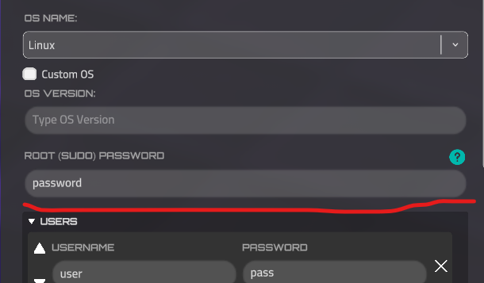
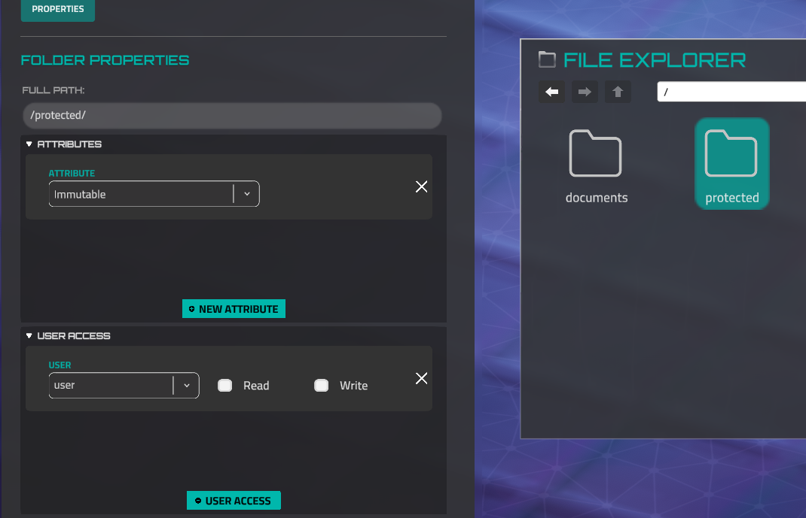
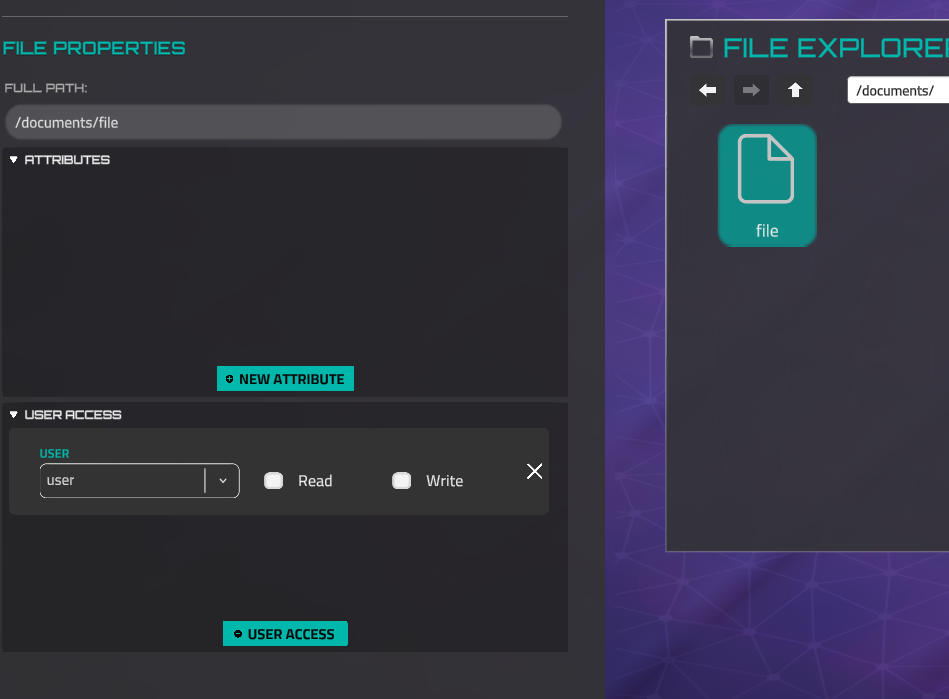

# Service commands, text substitution, and feedbacks of commands

Note. *Encoded* string means that you need to url-encode string before using in json. Service for encoding - [https://www.urlencoder.org](https://www.urlencoder.org)

### Text Substitution

Text substitution phrases are used to show text that is unknown to the mission author. For instance, a username of a player or a device IP address that is regenerated every mission launch. 

These phrases can be used in Nitro messages, text file contents, or internal web browser pages.

??? note "LocalizationKey"

    ```lua
    {LocalizationKey:PASTE_KEY_HERE}
    ```
    
??? note "PlayerName"

    ```jsx
    {PlayerName}
    ```
    
    Replaces with a username that was set by the player when the game was first launched or a Haiku Pro account was created. 
    
    *If the LMS mode is active, the phrase will be replaced with "Student Name."*
    
??? note "DeviceIP"

    ```jsx
    {DeviceIP:DEVICE_NAME}
    ```
    
    Replaces with the actual device IP address by device name. The device name is a stable value that you can get or set in the Device Properties in the Forge Network Builder.
    
    Please note, reading this IP address by a player reveals the device on the map if it was not discovered initially.
    
??? note "Hash"

    ```jsx
    {Hash:ORIGINAL_VALUE}
    ```
    
    Converts the original value to a SHA256 hash and saves it, allowing it to be decoded by the John tool later.
    
??? note "LMS Phrases"

    These phrases are only available if LMS mode is active.
    
    [https://docs.rusticisoftware.com/crossdomain/3.x/API.html](https://docs.rusticisoftware.com/crossdomain/3.x/API.html)
    
    ??? note "StudentName"

        ```jsx
        {StudentName}
        ```
        
        Replaces with a student's name, which was set when a lesson was started.
        
        Gets the value from **GetStudentName()** function.
        
    ??? note "LMS_Bookmark"

        ```jsx
        {LMS_Bookmark}
        ```
        
        Is replaced with the result of the *GetBookmark()* function.
        
    ??? note "LMS_SuspendData"

        ```jsx
        {LMS_SuspendData}
        ```
        
        Is replaced with the result of the *GetSuspendData()* function.
        
    ??? note "LMS_Status"

        ```jsx
        {LMS_Status}
        ```
        
        Is replaced with the result of the *GetStatus()* function.
        
    ??? note "LMS_Score"

        ```jsx
        {LMS_Score}
        ```
        
        Is replaced with the result of the *GetScore()* function.
        

### Service commands (that commands are not allowed to print in the in-game terminal)

??? note "nitroapp"

    **nitroapp** "CHARACTER_NAME" "ENCODED MESSAGE" "TIME" "DELAY" "BOOL-BY USER INPUT"
    
    Example:
    
    ```jsx
    nitroapp Rascal \"Look%2C%20there%E2%80%99s%20the%20Operations%20server%21\" _ 0.5 true
    ```
    
    *"CHARACTER_NAME"* - name of character, who will send a message. Available names list:
    
    ```jsx
    Rascal,
    Gungnir,
    Talaria,
    Eos,
    Sorceress,
    Dekkar,
    DojoCharacter,
    Lugh,
    Spyder,
    Saga,
    Fez,
    DrParks,
    Orel,
    Kona,
    Acan,
    Kunwu,
    BusinessAbaddon,
    BusinessAcan,
    BusinessCerberus,
    BusinessDekkar,
    BusinessEos,
    BusinessGungnir,
    BusinessKunwu,
    BusinessRASCAL,
    BusinessSorceress,
    BusinessSpyder,
    OnlyCutsceneBusinessAgenda,
    OnlyCutsceneBusinessCybermancer,
    OnlyCutsceneBusinessDealer,
    OnlyCutsceneBusinessDrOmen,
    OnlyCutsceneBusinessKacha,
    OnlyCutsceneBusinessRonin,
    OnlyCutsceneBusinessDealerFemale,
    OnlyCutsceneBusinessRoninFemale,
    PrivateSato,
    StaffSergeantVazquez,
    SergeantMajorRiya,
    MasterSergeantMoore,
    SergeantAbernathy,
    SpecialistSoroka,
    CorporalCarter,
    SpecialistDelaCruz,
    Vikram,
    StaffSergeantCollins,
    ColonelWilliams,
    AirmanDavisJr,
    FirstLieutenantThakral
    ```
    
    *"ENCODED MESSAGE"*  - message that will be written.
    
    *"TIME"* - time in format "12:15" to emulate writing messages from the past. Set _ symbol to write a current time.
    
    *"DELAY"* - used to emulate writing message effects. Set a value less than zero to auto calculate delay time, but you can’t get this calculated delay time.
    
    *"BOOL-BY USER INPUT"* - legacy feature, set it true
    
??? note "smdelay"

    **smdelay** NUMBER
    
    This command pauses the commands execution list for some seconds, which you set in arguments. Mostly used together with nitroapp command to wait while message is printing.
    
    Example:
    
    ```jsx
    nitroapp Rascal \"Look%2C%20there%E2%80%99s%20the%20Operations%20server%21\" _ 0.5 true
    smdelay 0.7
    ```
    
??? note "autoconnect"

    **autoconnect** "DEVICE_UNIQUE_NAME"
    
    This command emulates ssh command, it means it connects to a specific device, but you do not need to know device ip and credentials.
    
    Example:
    
    ```jsx
    autoconnect N_5_Workstation_01
    ```
    
??? note "nitrocaption"

    **nitrocaption** OPTION
    
    Shows or hides specific captions in the nitro window. List of options:
    
    0 - hide caption
    
    1 - show “Next Message” caption
    
    2 - show “Complete Mission” caption
    
    Example:
    
    ```jsx
    nitrocaption 0
    nitroapp Rascal \"Look%2C%20there%E2%80%99s%20the%20Operations%20server%21\" _ 0.5 true
    smdelay 0.5
    nitrocaption 1
    ```
    
    Note. You don’t need to show the “Complete Mission” caption, it will be automatically when the last step is reached. It exists only as an option.
    
??? note "starttimer"

    **starttimer** TIME_FOR_EASY TIME_FOR_MEDIUM TIME_FOR_HARD
    
    Starts the game timer. When this timer is finished, the mission will fail. You should set time in seconds. If you do not want to set a timer for a specific difficulty level, set it as zero.
    
    Example:
    
    ```jsx
    !starttimer 0 1800 900
    ```
    
    Note. This command is strictly recommended to use with “!” mark to be sure the timer will be started if the user skips this step.
    
??? note "downloadfile"

    **downloadfile** "ENCODED_JSON" DEVICE_NAME "ENCODED_DESTINATION"
    
    This command creates a single file or directory (overwrite it if this file already exists) in a specific device and destination.
    
    Example:
    
    ```jsx
    downloadfile \"%7B%22Attributes%22%3A%5B%22Normal%22%5D%2C%22Name%22%3A%22readme%22%2C%22Path%22%3A%22%2Freadme.txt%22%2C%22Extension%22%3A%22.txt%22%2C%22Data%22%3A%7B%22Guid%22%3A%22ca0f4603-0dc4-4746-bed2-1b7dcf478d5e%22%7D%2C%22Created%22%3Anull%2C%22UserAccessList%22%3A%7B%7D%2C%22Children%22%3A%5B%5D%7D\" \"Home System\" \"%2FDocuments%2F\"
    ```
    
    The file json has a specific structure. Example:
    
    ```jsx
    {
    	  "Attributes": [
            "Normal"
        ],
    		"Name": "rockyou.txt",
        "Path": "/Documents/rockyou.txt",
        "Data": {
            "SkipCheckGuid": true,
    				"Data": "Hello world!"
        },
        "UserAccessList": {},
        "Children": []
    }
    ```
    
    *Attributes* list is available on the main documentation page.
    
    *Name* **MUST** repeat the file name from global *Path* field.
    
    “*Data*” - text content of the file. For complex content please use url-encoded value.
    
    “*UserAccessList” -* username and read-write enabled value. Example:
    
    ```json
    "UserAccessList": {
    	"sorceress": [ true, true ]
    }
    ```
    
    “*Children*” - list of children file jsons, actual if common json is directory. 
    
    ENCODED_DESTINATION must have the same value as *Path* in the json.
    
??? note "updntp"

    **updntp** MISSION_INDEX ****"ENCODED_TEXT"
    
    Adds mission and message and text from argument if it doesn’t exist in the Rascal notepad section.
    
    Note. It's recommended to launch this command in an initial step. There are no story notes history, each mission should define which notes will be available. For instance, mission 2 should define notes for missions 1 and 2, mission 3 should for 1, 2, and 3.
    
    Use -1 *MISSION_INDEX* value to create note for current running mission (actual for all Forge missions).
    
    Example:
    
    ```jsx
    updntp -1 \"%3Cb%3EAZS%20Security%20Username%3A%3C%2Fb%3E%20kunwu\"
    ```
    
??? note "unlockapp"

    unlockapp COMMAND_NAME
    
    Unlock the terminal application. Example
    
    ```jsx
    !unlockapp ssh
    ```
    
    Strongly recommended to use together “!” symbol.
    
??? note "mnlsetactive"

    **mnlsetactive** COMMAND_NAME
    
    Set active the section of defined command in Manual application. Example:
    
    ```jsx
    !mnlsetactive ls
    ```
    
??? note "appbtnunlock"

    **appbtnunlock** BUTTON_NAME NOTIFICATION
    
    Set as active and highlight the application button in the toolbar. Possible options: OpenManual, OpenExplorer, OpenNotes, OpenSkillTree, OpenWebBrowser. Second argument: 0 - do not show the notification (good for set the list of command at mission start), 1 - show APP UNLOCKED notification.
    
    Example:
    
    ```jsx
    !appbtnunlock OpenExplorer 1
    ```
    
??? note "tmplockapp"

    Temporarily lock window app (only for current mission) with optional nitro feedback. Arguments:
    
    - Application Name - name of app. Possible parameters: File Editor, Explorer, Manual, Nitro, Notes, App *(for settings)*, Skill Tree, Terminal
    - Device Name - lock app if user is only logged in defined device. Set it “-” to ignore device. Then this app will be locked for every device in the current mission.
    - NPC Name to provide feedback. This is optional parameter, do not set it to lock app without feedback.
    - Feedback message - define only with previous parameter. If user tries to open app, this messege shows in Nitro messanger. But only one time.
??? note "tmpunlockapp"

    Unlock previously locked app (see tmplockapp command). Has only one argument - app name.
    
??? note "setfileatt"

    Set file attribute. Arguments:
    
    - Mode - 0 to clear all attributes list, 1 - to append new attribute.
    - Device name where file is located.
    - Full file path
    - Number of attribute in attributes enum. Set it only with *1* mode argument.
??? note "runapp"

    Run the “fake” app, which user could see in the *netstat* list. **Example:
    
    ```jsx
    runapp calc
    ```
    
??? note "rememberhash"

    Add some strings (most often passwords) to the hashes library. Uses for *john* command. Here is the syntax:
    
    ```jsx
    rememberhash *encoded_string_to_hash* 0 *or* 1
    ```
    
    Where 0 is using john wordlists to decode the hash (normal behavior), but 1 - wordlists will be ignored and *string_to_hash* can be received without wordlist. New line symbol is divider for many strings, which can be decoded by john, so if you have spaces or new lines - use url encoded string_to_hash. 
    
??? note "unlockapplist"

    ```json
    unlockapplist ENCODED_LIST MISSION_INDEX
    ```
    
    Unlocks terminal commands by indices of the completed missions.
    
    ENCODED_LIST - Command names, such as cd or rm, are divided by a new line symbol. In a mission json url encoded version should be used. In the Mission Editor, you don't need to encode this.
    
    MISSION_INDEX - Index of the mission, which should be completed to unlock these commands. Set it as -1 to unlock commands without this check.
    
??? note "clear"

    This command doesn’t have arguments. It clears the terminal history and prints welcome text.
    

### Commands Feedbacks

??? note "skip"

    Very specific feedback. When the step, which contains this command in the "waited" list, starts, StoryManager waits for only one frame (a couple of milliseconds) and goes to the next step. A usage example is an initialization step or when you need to create a goal when the player needs to complete several actions, like removing 3 files. Then you will create a block of goals, but all goals are hidden and not optional. After this block of goals, you will create an empty Required Goal step, set the goal name "Remove 3 files" and add "skip" to the "waited from user" commands list. So just after the user removes these 3 files, the goal will be set as completed, because StoryManager moves to this "skip" step and almost instantly move to the next step. When StoryManager moves to the next step from the previous, if the previous has a non-empty Goal Name field, it marks this Goal as completed.
    
??? note "nitrocaption"

    There is **no device** is returned. Possible feedback arguments
    
    1 - user invokes “Next Message” action.
    
    2 - user invokes “Complete Mission” action. (isn’t used in the game)
    
??? note "cat"

    Invokes only if the requested file exists. Returns device name, which is user logged in.
    
    Arguments list:
    
    - Full path to requested file.
    - fb=true - if file is opened via File Explorer; fb=false - via Terminal.
??? note "john"

    Returns current logged device name. Successful arguments:
    
    - Full requested file path.
    - Each hash will be returned as a separated argument.
    - Original (decoded) values.
    
    Failed arguments:
    
    - failed as a separated argument
    - Content of the file
    
    Examples:
    
    ```jsx
    "CommandsWaitingFor": [
            {
              "Name": "john",
              "DeviceName": "N_5_Workstation_05",
              "ArgsWaitingFor": [ "failed" ]
            }
          ]
    ```
    
    ```jsx
    "CommandsWaitingFor": [
            {
              "Name": "john",
              "DeviceName": "",
              "ArgsWaitingFor": [ "ProstoyParol7" ]
            }
          ]
    ```
    
??? note "exit"

    Returns only the name of the device, which is the new current device.
    If the player has exited root mode (sudo), the argument is `root`.
    
??? note "cd, cd.., cd ~, cd /"

    Returns the current device name and has only one argument - current full path of new place **with** slash in the end, where user is.
    
    Example:
    
    ```jsx
    "CommandsWaitingFor": [
            {
              "Name": "cd",
              "DeviceName": "Home System",
              "ArgsWaitingFor": [ "/Documents/" ]
            }
          ]
    ```
    
    There is argument “fb=True” or “fb=False” if this command is invoked via File Browser or not respectively. Example:
    
    ```jsx
    "CommandsWaitingFor": [
            {
              "Name": "cd",
              "DeviceName": "Home System",
    	          "ArgsWaitingFor": [ "/Documents/", "fb=False" ]
            }
          ]
    ```
    
    This command has additional feedbacks. If user types [cd ..], [cd] (without args), [cd ~] or [cd /], two completed commands feedbacks will be returned. For example if you need that user must use only cd / syntax, you can use this json:
    
      
    
    ```jsx
    "CommandsWaitingFor": [
            {
              "Name": "cd /",
              "DeviceName": "Home System",
              "ArgsWaitingFor": [ "/" ]
            }
          ]
    ```
    
    But “cd Home System / fb=false” will be returned too.
    
    Argument `root` if command is launched by root-user (sudo), otherwise - `not_root`
    
??? note "ssh"

    Invokes only if command usage was successful. Returns the new device name. Has no arguments.
    
??? note "zion"

    Invokes only in case of successful usage of command. Device name is the name of current logged in device. Has only one argument - absolute path of horsemen virus file.
    
??? note "man"

    It is for terminal version of manual. Feedback values:
    
    - name of requested app
    - locked=false or locked=true - is app locked to use when it is requested?
??? note "appopen"

    Invokes when user opens *windowed* or toolbar application (file explorer, for example). There is no returned device name. Possible parameters: File Editor, Explorer, Manual, Nitro, Notes, App *(for settings)*, Skill Tree, Terminal, Web Browser
    
??? note "ls"

    Same feedback as cd, but for some reason path **doesn’t contain** ending slash.
    
??? note "pwd"

    Same as cd
    
??? note "whoami"

    Returns current device name and current user name as feedback.
    
??? note "onsshstart"

    Invokes when user starts ssh to device and set only ip of device, but not the password. Device name will be returned.
    
??? note "hydra"

    Returns the device name, username as first argument, password as second.
    
    If hydra was failed, it returns attacked device name and “failed” string as argument.
    
??? note "echo"

    Returns device name, first argument is file content, second - absolute file path. Argument `root` if command is launched by root-user (sudo), otherwise - `not_root`
    
??? note "ping"

    Returns device name which is being pinged. If user terminate command by ctrl+c, will be returned “stop” as feedback argument.
    
??? note "curl"

    Returns device name, which is host of requested resource. Argument is a full path of requested resource, example: “/.www/index.html”.
    
??? note "ifconfig"

    Returns the current logged-in device name. Has no arguments if version without arguments is used.
    
    If correct interface name and up/down status was set as arguments, it returns one argument with such format: `<interface_name>_<status>`.  Example: `eth0_up` or `eth0_down`
    
??? note "nmap or nmap/"

    Returns device which was nmap’ed. For nmap/ there is a feedback argument - bitmask digit after slash.
    
??? note "loic"

    If user invokes loic to certain device and it was successful, will be returned device name only. If user stops loic (via Ctrl+C), will be returned only argument “stop” without device.
    
??? note "loichelp"

    User requests help of loic. Has no arguments or device as feedback. Instance of usage: 
    
    ```jsx
    loic --help
    OR
    loic -h
    ```
    
??? note "failroninnitro"

    Returns when user started roninnitro without arguments. Has no device and arguments.
    
??? note "roninnitro"

    Returned when roninnitro was successfull. Returns only device name.
    
??? note "onsshstart"

    Invokes when a player starts to ssh some device, but doesn't type username or password yet.
    
??? note "rm"

    Returns when user deletes file successfully. Has device name and such arguments:
    
    - Full path to just removed file **without** slash in the end.
    - fb=True if file was removed via file explorer or fb=False for terminal.
    - `root` if command is launched by root-user (sudo), otherwise - `not_root`
??? note "netstat"

    Returns when netstat was successfull. Returns only device name.
    
??? note "helpiptables"

    Returns when user invokes:
    
    ```jsx
    iptables -h
    OR
    iptables --h
    ```
    
    Has no device and arguments.
    
??? note "param_iptables"

    Returns when user successfully invokes iptables commands. Returns device name and list of requested arguments:
    
    ```jsx
    -L
    --list
    -A
    --append
    -s
    --source
    -d
    --destination
    -j
    --jump
    -p
    --protocol
    --source-port
    --sport
    --destination-port
    --dport
    ```
    
??? note "kill"

    Returns if user successfully kills virtual app (see *runapp* command for more context). Returns the name of just killed app. Doesn’t return the device name.
    
??? note "webbrowser_page"

    A player successfully opens a certain page by Web Browser. Returns the device name, which has the requested page and full path of this page in the device file system.
    
??? note "webbrowser_fail"

    Returns only user input in the Web Browser URL field, if the requested device wasn't found. It means, there is no device with the requested hostname or IP.
    
??? note "webbrowser_404"

    Returns the device name and the user input (value of the URL field), when the device with such hostname or IP was found but the requested file on this device is missing.
    
??? note "sshfail"

    Returns requested device, username, and password from the user input if these credentials are incorrect. Is invoked only if a requested IP is valid and exists in the network.
    
??? note "cat_fail"

    Is invoked when a player tries to read a protected file, it means, the player isn't logged in with credentials, which are set in the UsersAccessList of this file. Returns the device, that contains this file, and the full path of the requested file.
    
??? note "sudo"

    When sudo mode is correctly enabled, the device is returned as well. However, this feedback is not provided if sudo mode is enabled only for a single command, such as `sudo cat file`.
    

### Sudo (root) mode

Sudo (root) mode grants full read/write permissions in the game. This mode is unavailable for Windows OS and cannot be accessed if a root password is not set. To set a password, go to the Device Properties (Forge).



To launch the application with root rights, you can run a single command prefixed with `sudo` (enabling root mode only for that command). Alternatively, you can enable sudo mode for all subsequent commands, as well as for the File Editor and File Explorer, by entering `sudo` and providing the correct password. To exit sudo mode, use the `exit` command.

```
sudo rm /documents
```

However, read/write permissions can still be restricted even in sudo mode. If a file or directory has the **Immutable** attribute (**set by default**), general restrictions will apply. This means that if a player is logged in as a user without read/write permissions, they cannot modify the file. If the player has root rights and the file **does not have the Immutable attribute**, they have full control over the file— allowing read, modification, and deletion.

In this example, if the player is logged in as "user," they cannot open or delete the "protected" directory, even with sudo mode enabled.



In this case, if the player is still logged in as "user" without root mode enabled, they **cannot** read or write to this file. However, if the user enables sudo mode, they **can** perform any actions on the file, as it does not have the Immutable attribute.

