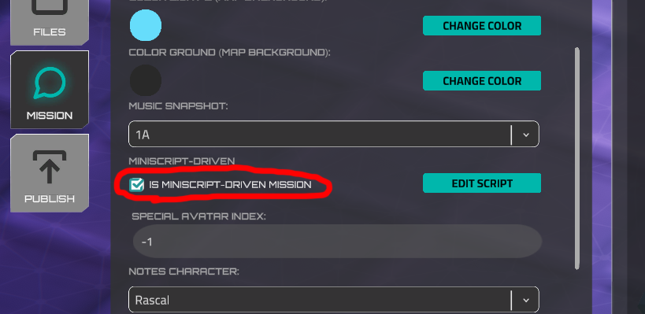
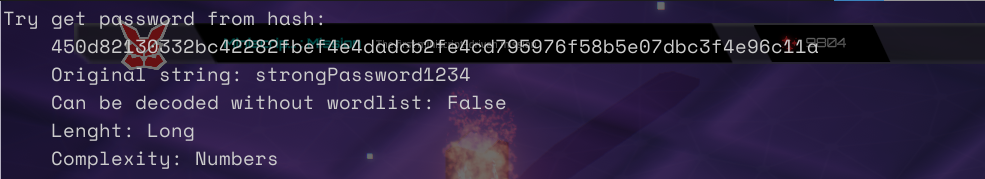
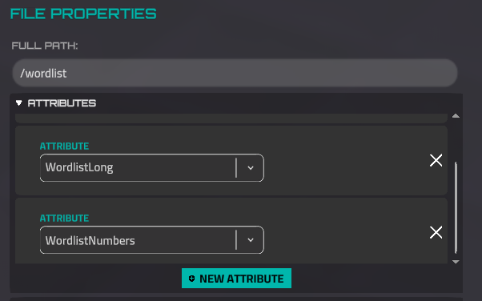
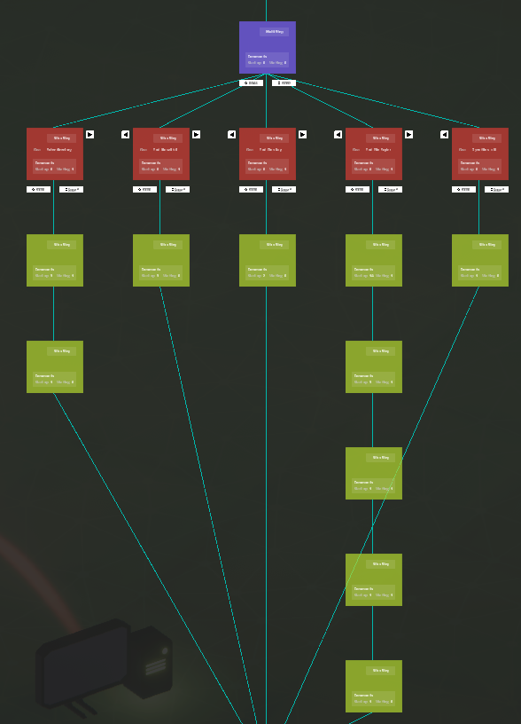
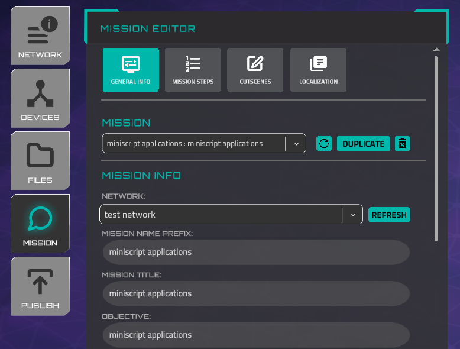
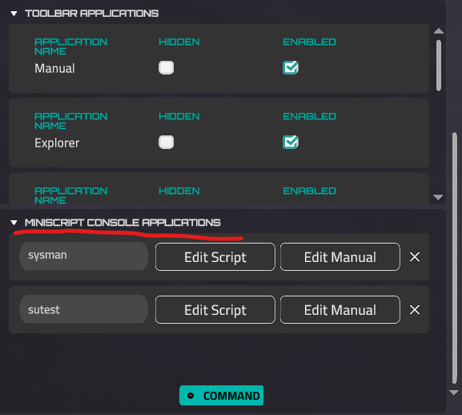
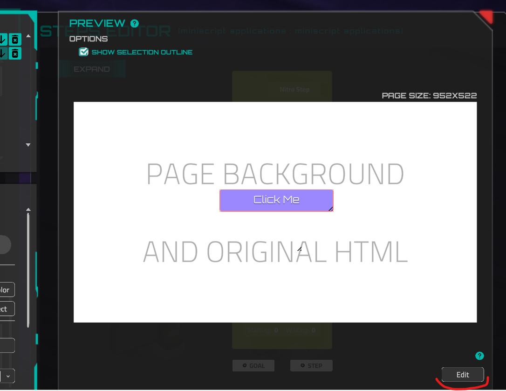

# Story Creation with Miniscript

### Overview

There are two ways to create missions in the Forge: via the Step Editor and Miniscript. The Step Editor is an easier, visual way; it's recommended to start your Forge journey with this tool and create a couple of missions. However, it has restrictions: you can't create non-linear missions or include hints if you use it.

The Miniscript approach uses the [in-built scripting system](https://www.notion.so/Miniscript-Anvil-Scripting-Language-1724ecf8fd794900b0edaa8df834afca?pvs=21). That gives you a boost of flexibility; however, it requires basic coding skills. But don't worry, everything you need to know is the concepts of "`if`" and "`while`". All complicated computations are hidden in the in-built [`CommandWaiting`](story-creation-with-miniscript.md) and [`Sequence`](story-creation-with-miniscript.md) objects.

To use the Miniscript approach instead of steps, go to the "General Info" tab in the Forge, scroll down, and make sure the "is Miniscript-driven mission" toggle is turned on.



The "*Edit Script*" button opens the in-built text editor. Here you can write a small script; however, it's better to use an external text editor and use the in-game editor only for copy/pasting the script. The developer's recommendation is [Notepad++](https://notepad-plus-plus.org/downloads/) with Lua syntax highlighting (*Language > L > Lua*).

Missions are built based on a `while` loop and asynchronous `wait` method. This means we have a loop that constantly checks if some action (or actions) is performed by a player. Inside the loop body, a `wait` method exists to prevent the game from freezing. It's recommended to use a 0.1 delay value.

```jsx

//sequnce setup

while sequence.isPerformed() == 0 // The loop ends when a player performs an early setup step.
	wait(0.1) //It's checking 10 times per second (100 ms delay).
end while	

//next actions or end of the mission
```

You can always explore [examples](story-creation-with-miniscript.md). Let's start with a very simple mission that requires only a couple of actions from a player and has only one goal.

### Functions

- setGoalAsCompleted
    
    Define and set the goal as completed. The place of invocation isn't important to define the goal. The script will be read, and all goals will be defined automatically at the start of the mission.
    
    **Arguments**
    
    | goalName | string |
    | --- | --- |
    
    **Example**
    
    ```jsx
    setGoalAsCompleted("Open the file using ""cat"" command")
    ```
    
- nitroApp
    
    Show the message in the Nitro messenger. This function isn't asynchronous, so the next function will be invoked immediately after this. If you need to wait until the message is written, use the *wait* function.
    
    **Returns** the delay value (set in the `delay` parameter or calculated automatically). This value is often used together with the `wait()` and `nitroCaption()` functions (see [examples](story-creation-with-miniscript.md)).
    
    **Arguments**
    
    | character | string, see the possible values below |
    | --- | --- |
    | message | string, URL-encoded message. You can use any URL encoding tool, for example this one - [https://www.urlencoder.org](https://www.urlencoder.org/) |
    | *time* | *string, optional, the time will be displayed. The default value is '_', which means the current player's time.* |
    | *delay* | *float, optional. Time in seconds to simulate the 'writing' of the message. Default value is -1, which means the time will be calculated automatically.* |
    - Available characters
        
        Rascal
        
        Gungnir
        
        Eos
        
        Sorceress
        
        Dekkar
        
        DojoCharacter
        
        Lugh
        
        Spyder
        
        Saga
        
        Fez
        
        DrParks
        
        Orel
        
        Kona
        
        Acan
        
        Kunwu
        
        BusinessAbaddon
        
        BusinessAcan
        
        BusinessCerberus
        
        BusinessDekkar
        
        BusinessEos
        
        BusinessGungnir
        
        BusinessKunwu
        
        BusinessRASCAL
        
        BusinessSorceress
        
        BusinessSpyder
        
        PrivateSato
        
        StaffSergeantVazquez
        
        SergeantMajorRiya
        
        MasterSergeantMoore
        
        SergeantAbernathy
        
        SpecialistSoroka
        
        CorporalCarter
        
        SpecialistDelaCruz
        
        Vikram
        
        StaffSergeantCollins
        
        ColonelWilliams
        
        AirmanDavisJr
        
        FirstLieutenantThakral
        
    
    **Example**
    
    ```jsx
    nitroApp("Rascal", "Open%20the%20%22personalData.txt%22%20file", "_", 0.5)
    ```
    
- autoConnect
    
    Connect to the device (with an open SSH port) without credentials.
    
    **Arguments**
    
    | deviceName | string, you can see this value in the Device Properties tab (Forge) |
    | --- | --- |
    
    **Example:**
    
    ```jsx
    autoConnect("test_mission_network_workstation_1")
    ```
    
- nitroCaption
    
    Show or hide the "Next Message" caption in the Nitro Messenger. This function is not asynchronous, so it doesn't wait until the player presses the "next message" button.
    
    **Arguments**
    
    | type | int, type of the action. 0 - hide the current button, 1 - show the "Next Message" button. |
    | --- | --- |
    
    **Example**
    
    ```jsx
    nitroCaption(0) //hide the current button
    nitroCaption(1) //show the "Next Message" button
    ```
    
- startTimer
    
    Start the timer based on the current difficulty level. Set the value to '0' to skip the timer for a specific difficulty. If the timer is already running, the function returns 0.
    
    **Arguments**
    
    | easy | int, seconds for easy (beginner) level. |
    | --- | --- |
    | medium | int, seconds for medium (intermediate) level. |
    | hard | int, seconds for medium (expert) level. |
    
    **Example**
    
    ```jsx
    // there will be no timer for beginner level, 
    // 5 minutes for intermediate, and 2 minutes for expert
    startTimer(0, 300, 120) 
    ```
    
- downloadFile
    
    Create a file on any device.
    
    **Arguments**
    
    | encodedContent | string, URL-encoded file content. You can use any URL encoding tool, for example this one - [https://www.urlencoder.org](https://www.urlencoder.org/) |
    | --- | --- |
    | device | string, device name |
    | path | string, the full path of the file including the file name; it should start with the "/" symbol. |
    | attributes | *optional, an array with attributes of the file. The list of attributes is [on this page](https://www.notion.so/Story-Manager-47103252efa745eca9ce7903d695bb23?pvs=21). The default value is [ "Normal" ].* |
    | readAccess | *optional, a map with read access in the format { "userName": "true" }, where "true" indicates read access is allowed, and "false" indicates it is not allowed.* |
    | writeAccess | *optional, a map with write access in the format { "userName": "true" }, where "true" indicates write access is allowed, and "false" indicates it is not allowed.* |
    
    **Examples**
    
    ```jsx
    //Create a file in the root directory of the default device, with read and write permissions for everyone
    downloadFile("This%20file%20contains%0ANew%20line%20character%0AAnd%20%22special%20characters%22%20%26%20%5E%20%40%20%24", "Home System", "/rootFile.txt")
    //Create a file in the Documents directory, but set it to read-only
    downloadFile("This%20file%20contains%0ANew%20line%20character%0AAnd%20%22special%20characters%22%20%26%20%5E%20%40%20%24", "Home System", "/Documents/a", [ "Immutable" ])
    //Create a file with read protection in the Downloads directory using {PlayerName} substitution
    downloadFile("This%20file%20contains%0ANew%20line%20character%0AAnd%20%22special%20characters%22%20%26%20%5E%20%40%20%24", "Home System", "/Downloads/readProtected", [ "Normal" ], { "{PlayerName}" : "false" }, { "{PlayerName}" : "false" })
    ```
    
- updateNotepad
    
    Add the text to the story-character notes in the notepad. You can select 'story-character' in the General Info tab. Please note that these notes won't be saved after mission completion, unlike user-created notes.
    
    **Arguments**
    
    | noteContent | string, URL-encoded note content. You can use any URL encoding tool, for example this one - [https://www.urlencoder.org](https://www.urlencoder.org/) |
    | --- | --- |
- unlockApp
    
    Some terminal commands are locked by default or can be locked by a mission creator using the '*lockApp*' function. This function is used to prevent undesired actions, such as invoking the 'rm' command. The 'unlockApp' function unlocks these commands.
    
    **Arguments**
    
    | commandName | string, terminal command name |
    | --- | --- |
    
    **Example**
    
    ```jsx
    unlockApp("ls")
    ```
    
- lockApp
    
    Lock the terminal command. When the user tries to use this command, they receive a 'Command Locked' message in the terminal.
    
    **Arguments**
    
    | commandName | string, terminal command name |
    | --- | --- |
    
    **Example**
    
    ```jsx
    unlockApp("ls")
    ```
    
- unlockToolbarApp
    
    Unlock a window application that can be opened by a button in the Toolbar. You can set which applications are accessible by default in the Mission General Info tab in the Forge.
    
    **Arguments**
    
    | appName | string, the name of the app. Options: 
    OpenManual
    OpenExplorer
    OpenNotes
    OpenSkillTree
    OpenWebBrowser
    DataExplorer |
    | --- | --- |
    | *showNotification* | *optional, boolean, 1 to show the notification, 0 to not show. The default value is 1. If the notification is shown, the game waits until a player opens this window, but the miniscript flow moves forward.* |
    
    **Example**
    
    ```jsx
    //the webbrowser will be unlocked without notification
    unlockToolbarApp("OpenWebBrowser", 0)
    ```
    
- lockToolbarAppTemporarily
    
    Lock a toolbar application for one device or for the entire network. This command gives the ability to display a Nitro message when a user tries to open a locked application.
    
    **Arguments**
    
    | appName | string, the name of the app. Possible values: File Editor, Explorer, Manual, Notes, Skill Tree or custom windowed application name. |
    | --- | --- |
    | *device* | *string, optional, the name of the device where the application won't be able to open. The default value is '_', which means the application will be locked for the entire mission.* |
    | *nitroCharacter* | *string, optional, a character name who will send a message if the user tries to open a locked app. Do not set it if you do not need any feedback. [Here is](story-creation-with-miniscript.md) the list of characters.* |
    | *nitroMessage* | *encoded string, optional, this message will be shown in the Nitro if the user tries to open a locked app. You can use any URL encoding tool, for example this one - [https://www.urlencoder.org](https://www.urlencoder.org/)* |
    
    **Example**
    
    ```jsx
    //The file editor will remain locked during the mission until it is unlocked.
    lockToolbarAppTemporarily("file editor", "_", "Rascal", "You%20can%27t%20use%20this%20app%20now%2C%20use%20terminal%20instead.")
    //And this is how we can simulate the absence of a file explorer installed on a specific device.
    lockToolbarAppTemporarily("explorer", "Home System", "Rascal", "File%20Explorer%20is%20not%20installed%20on%20this%20workstation.")
    ```
    
- unlockToolbarAppTemporarily
    
    Unlock a previously locked toolbar application using the '*lockToolbarAppTemporarily*' function. Please note that if the app was locked for several devices, this function will unlock the app for the entire network.
    
    **Arguments**
    
    | appName | string, the name of the app. Possible values: File Editor, Explorer, Manual, Notes, Skill Tree or custom windowed application name. |
    | --- | --- |
    
    **Example**
    
    ```jsx
    unlockToolbarAppTemporarily("file editor")
    ```
    
- addFileAttribute
    
    Append a new attribute to the file.
    
    **Arguments**
    
    | deviceName | string, a device name where the file is. |
    | --- | --- |
    | path | string, a full path to the file |
    | attribute | string, attribute to append. [The list of attributes](https://www.notion.so/Story-Manager-47103252efa745eca9ce7903d695bb23?pvs=21). |
    
    **Example**
    
    ```jsx
    //It makes a previously editable file read-only.
    addFileAttribute("miniscript_mission_device", "/Documents/Edtitable File", "Immutable")
    ```
    
- clearFileAttributes
    
    Clear all attributes of the file. This command is intended to revert changes made by 'addFileAttribute' or to clear its initial setup. For example, a hidden file will become visible after invoking the command.
    
    **Arguments**
    
    | deviceName | string, a device name where the file is. |
    | --- | --- |
    | path | string, a full path to the file |
    
    **Example**
    
    ```jsx
    //the file from "addFileAttribute" example will become editable again
    clearFileAttributes("miniscript_mission_device", "/Documents/Edtitable File")
    ```
    
- runSimulatedApplication
    
    Add a running process to the operating system. This process can be displayed by the '*ps*', *‘netstat’* commands or stopped by the '*kill*' command.
    
    **Arguments**
    
    | processName | string, a process name |
    | --- | --- |
    | *device_name* | *optional, string, device name to run the process. If not set, the process will run on all devices in the network.* |
    |  | **These arguments work only if the device name is specified.** |
    | *is_user_killable* | *optional, number, can be killed by a player using the `kill` command (1 - yes, default value; 0 - cannot be killed). This works only if the device name is set.* |
    | *protocol* | *optional, string, the protocol name to be shown in the `netstat` command output. The default is `TCP`.* |
    | *port* | *optional, number, the port number shown in the `netstat` output. The default value is -1, which represents a random port. The port number must be within the range of 0 to 65535.* |
    | *listen_ip* | *optional, number, the IP address to show in the `netstat` output. The default is `0.0.0.0:*`. If a device name is set, the IP address of this device will be used.* |
    
    **Example**
    
    ```jsx
    runSimulatedApplication("virus")
    ```
    
    ```lua
    runSimulatedApplication("deviceApp", "test network_test network_4_Workstation_3", 0, "udp", 342, "test network_test network_4_Workstation_3")
    ```
    
- extendDirbWordlist
    
    Add new file names to the default wordlist used by the '*dirb*' command.
    
    **Arguments**
    
    | wordlist | array of string, file names |
    | --- | --- |
    
    **Example**
    
    ```jsx
    extendDirbWordlist([ "dirb_hide_1.html", "dirb_hide_2.html" ])
    ```
    
- rememberHash
    
    Convert the original value to SHA256 and append it to the hashes list used by the '*john*' command. This functionality is essential if you intend to utilize '*john*' for your mission. Also, it may enable decoding of the value without relying on a wordlist.
    
    **Arguments**
    
    | decodedValues | array of string, original values that will be revealed upon successful decoding by the '*john*' tool |
    | --- | --- |
    | *ignoreWordlist* | *number (0 or 1), optional, can the list from the first argument be decoded without a wordlist. Default is 1 (it can)* |
    
    **Example**
    
    ```jsx
    rememberHash([ "strongPassword1234" ], 0)
    ```
    
    In the example above, a player can decode the hash '*strongPassword1234*,' but it needs to use a wordlist. If a user applies '*john*' to the file containing the SHA256 hash of '*strongPassword1234*' and provides the correct wordlist as an argument, the user will reveal this value. The hash can be obtained from any service ([https://emn178.github.io](https://emn178.github.io/online-tools/sha256.html)).
    
    *Tip.* You need to create wordlist files for the '*john*' and '*hydra*' tools. Different hashes require different file attributes for decoding. These attributes specify what type of wordlist the hashes can decode from. Try running '*john*' in the forge preview mode (without a wordlist), and in the console, you'll see the required wordlist argument.
    
    
    
    Therefore, the correct wordlist file will have this list of attributes:
    
    
    
- playSfx
    
    Play a one-time sound effect from the list of built-in sounds.
    
    **Arguments**
    
    | sfx | string containing the name of the sound effect (SFX). Refer to the list above. |
    | --- | --- |
    
    **List**
    
    ```jsx
    ButtonClick
    AppClose
    Data
    DeviceUnlocked
    MessageReceived
    NegativeResponse
    Popup_three
    Static_one
    Popup_two
    Popup_one
    MissionComplete
    Ping
    UnlockApp
    Keystroke_one
    Keystroke_two
    Keystroke_three
    Keystroke_four
    Keystroke_five
    Keystroke_six
    RecievedMessage
    NextMessage
    Zion
    ButtonHover
    FBI
    ```
    
    **Example**
    
    ```jsx
    playSfx("fbi")
    ```
    
- lmsSetBookmark
    
    The mediator for *Rustici API.SetBookmark(val)* function.
    
    [https://docs.rusticisoftware.com/crossdomain/3.x/API.html](https://docs.rusticisoftware.com/crossdomain/3.x/API.html)
    
    **Example**
    
    ```jsx
    lmsSetBookmark("bookmark")
    ```
    
- lmsSetSuspendData
    
    The mediator for *Rustici API.SetSuspendData(val)* function.
    
    [https://docs.rusticisoftware.com/crossdomain/3.x/API.html](https://docs.rusticisoftware.com/crossdomain/3.x/API.html)
    
    **Example**
    
    ```jsx
    lmsSetSuspendData("suspend data")
    ```
    
- lmsSetStatus
    
    The mediator for Rustici API *SetReachedEnd(), SetPassed(), SetFailed(), ResetStatus()* functions.
    
    [https://docs.rusticisoftware.com/crossdomain/3.x/API.html](https://docs.rusticisoftware.com/crossdomain/3.x/API.html)
    
    **Example**
    
    ```jsx
    lmsSetStatus("reached end")
    ```
    
    **Values**
    
    | reached end | SetReachedEnd() |
    | --- | --- |
    | passed | SetPassed() |
    | failed | SetFailed() |
    | reset | ResetStatus() |
- lmsSetScore
    
    The mediator for *Rustici API.SetScore(*score, max, min*)* function.
    
    [https://docs.rusticisoftware.com/crossdomain/3.x/API.html](https://docs.rusticisoftware.com/crossdomain/3.x/API.html)
    
    **Example**
    
    ```jsx
    lmsSetScore(100, 500, 0)
    ```
    
- lmsRecordInteraction
    
    The mediator for *Rustici Interactions* functions.
    
    [https://docs.rusticisoftware.com/crossdomain/3.x/API.html](https://docs.rusticisoftware.com/crossdomain/3.x/API.html)
    
    **Arguments**
    
    | type | string, the name of the function of Rustici API, that will be invoked. See the list below. |
    | --- | --- |
    | id | string |
    | learnerResponse | string |
    | isCorrect | number, 1 (for correct response), or 0 (for incorrect) |
    | *correctResponse* | *string, optional* |
    | *description* | *string, optional* |
    | *weighting* | *number, optional* |
    | *latency* | *number, optional* |
    | *learningObjectiveId* | *string, optional* |
    
    **Interaction Type List**
    
    ```jsx
    RecordTrueFalseInteraction
    RecordMultipleChoiceInteraction
    RecordFillInInteraction
    RecordMatchingInteraction
    RecordPerformanceInteraction
    RecordSequencingInteraction
    RecordLikertInteraction
    RecordNumericInteraction
    ```
    
    **Example**
    
    ```jsx
    lmsRecordInteraction("RecordMultipleChoiceInteraction", "alpha-mc-1", "a", 1, "a", "Which letter is first in the alphabet?", 1, 750, "alphabet1")
    ```
    
- getPendingFeedbacks
    
    It returns the list with unhandled actions of the player.  If there are unhandled actions (data about the last performed commands by a player), a non-empty `list` with maps will be returned. The format of the `map`:
    
    ```jsx
    {"command": "ls", "device": "Home System", "arguments": ["/", "fb=False"]}
    ```
    
    **Example**
    
    ```jsx
    list = getPendingFeedbacks()
    for feedback in list
    	if feedback.command == "cat" then
    		println("The command was performed")
    		break
    	end if
    end for
    ```
    
- checkCommandFeedback
    
    Verify received feedback. Returns 1 if feedback fulfills the conditions.
    
    **Arguments**
    
    | mapToCheck | map, an item of a list, returned by [getPendingFeedbacks](story-creation-with-miniscript.md) |
    | --- | --- |
    | commandName | string, the desired command name |
    | *deviceName* | *string, optional, the name of the device where the command was performed. If the device doesn't matter, do not specify a value or set an empty string `""`.* |
    | *arguments* | *optional, list with string arguments, that is returned by performed command. Pay attention: all arguments from the list should be executed; otherwise, the command is not fulfilled.* |
    
    **Example**
    
    ```jsx
    list = getPendingFeedbacks()
    for feedback in list
    	if checkCommandFeedback(feedback, "cat", "Home System", [ "/Documents/toRead" ]) then
    		println("The command was performed")
    		break
    	end if
    end for
    ```
    
- clearPendingFeedbacks
    
    Clear all pending command feedback list. After invocation of this method, `getPendingFeedbacks()` returns an empty list until a player performs some new action. Usually, it is called after successfully handling some feedback.
    
    **Example**
    
    ```jsx
    list = getPendingFeedbacks()
    for feedback in list
    	if checkCommandFeedback(feedback, "ls", "Home System", [ "/Documents" ]) then
    		println("The command was performed")
    		clearPendingFeedbacks()
    		break
    	end if
    end for
    ```
    
- getMissionTimer
    
    It returns the time in seconds from the start of the mission. The timer stops when a user opens the pause menu.
    
    **Example**
    
    ```lua
    if getMissionTimer() > 120 then
    	nitroApp("Rascal", "Hurry up!")
    end if
    ```
    
- showHintNotification
    
    It shows the in-built notification from the Fez character with a proposal of help. If the user accepts the proposal, the `encodedValue` appears in the Nitro Messenger as a message from Fez.
    
    **Arguments**
    
    | encodedValue | string, URL-encoded message. You can use any URL encoding tool, for example this one - [https://www.urlencoder.org](https://www.urlencoder.org/) |
    | --- | --- |
    
    **Example**
    
    ```lua
    showHintNotification("Type ""cat /documents/toRead"" in the terminal and press Enter")
    ```
    
- getHintsDifficultyLevel
    
    Returns the hint difficulty (which can be set by a player in the settings popup).
    
    **Results**
    
    | 0 | Easy |
    | --- | --- |
    | 1 | Medium |
    | 2 | Hard |
    
    **Example**
    
    ```lua
    if getHintsDifficultyLevel() != 2 then
    	showHintNotification("Type ""cat /documents/toRead"" in the terminal and press Enter")
    end if
    ```
    
- fail_mission
    
    Immediately shows the restart mission popup. The mission won't be marked as completed. If the timer is launched, it will stop. **Pay attention**: this function doesn't break the code flow. If it is called somewhere in the middle of your script, you should ensure that the story functions below won't be invoked.
    
    **Example**
    
    ```lua
    while 1
    
    if failPending.isPerformed() == 1 then
    		fail_mission()
    		break
    end if
    
    end while
    ```
    
- remove_file
    
    Remove a file or directory on a specified device using the global path. If the file doesn't exist, it does nothing.
    
    **Example**
    
    ```lua
    remove_file("Workstation_5", "/Downloads/log.txt")
    ```
    
- device_name_to_ip_address
    
    Returns the IP address by the device name (the device name is set in the Forge Network Editor). If there is no device with such a name, an error will be raised, and the script will stop.
    
- ip_address_to_device_name
    
    Returns the device name by IP address. IP addresses are generated randomly, but device names are stable and set in Forge. Returns `null` if there is no device with the given IP.
    
- open_file_from_file_system
    
    Asynchronous function. Opens the file selection dialog (or the upload file window for the Web version) and reads the text from the selected file. If the file wasn't opened or can't be read (e.g., if it's binary or access restrictions), returns `null`. Otherwise, returns a `string`.
    
    **Example:**
    
    ```lua
    println("Select the file")
    wait(1)
    fileContent = open_file_from_file_system()
    println("File content:")
    println(fileContent)
    ```
    
- wait_for_device_click
    
    Returns 0 if the user doesn't click on the specified device. Returns 1 if the user clicks on the device and sets the signal to 0 again (this means that the method will return 0 on the next frame, until the user clicks on the device again).
    
    Please note, the default action (copying the device name to the buffer) **won't be executed** if this function is invoked and until it returns a 1 signal.
    
    **Example:**
    
    ```lua
    deviceName = "N_2_Firewall_01"
    while wait_for_device_click(deviceName) == 0
    wait (0.1)
    end while
    println("The user clicked on the device with IP " + device_name_to_ip_address(deviceName))
    ```
    
- set_kql_database
    
    Set the database for viewing in the Data Explorer application. Receives a string that is the asset name in the Network Asset Storage. Set an empty string to reset the database. Returns 1 if the database was set correctly.
    
- add_network_interface
    
    Add the network interface to the specified device. This interface will be visible in the ifconfig command output.
    
    | device_name | string |
    | --- | --- |
    | interface_name | string, the name of the new interface. If an interface with such a name already exists, it will not be added. |
    | is_running | number, 1 - running, 0 - not running |
    | running_text | encoded string, the `ifconfig` command output, if the interface is running. URL-encoded value is recommended here. See also the **list of keywords** below. |
    | not_running_text | encoded string, the `ifconfig` command output, if the interface is not running. URL-encoded value is recommended here. See also the **list of keywords** below. |
    
    **Keywords**
    
    | $ipAddress$ | device IP address |
    | --- | --- |
    | $subnet$ | subnet mask |
    | $broadcast$ | calculated broadcast address |
    | $baseIp$ | parent device base IP address |
    
    **Example**
    
    ```lua
    add_network_interface(
    "infected_workstation", 
    "en0", 
    1, 
    "flags%3D8863%3CUP%2CBROADCAST%2CSMART%2CRUNNING%2CSIMPLEX%2C%0A%09MULTICAST%3E%0A%09inet%20%24ipAddress%24%20netmask%20%24subnet%24%20%0A%09broadcast%20%24broadcast%24",
    "Link%20encap%3AEthernet%0A%09BROADCAST%20MULTICAST%20%20MTU%3A1500%20%20Metric%3A1")
    ```
    
- remove_network_interface
    
    Remove the existing interface from the specified device. This interface will not be visible in the ifconfig command output anymore.
    
    | device_name | string |
    | --- | --- |
    | interface_name | string, the name of the existing interface |
- stop_timer
    
    Stops the fail timer, which was previously run by the `startTimer` function.
    
- dispatch_successful_command
    
    This function is primarily used in [custom applications](story-creation-with-miniscript.md) and [web browser](web-sites-creation/miniscript-for-web-browser.md) scripts. It is generally not intended for use in the main mission script. However, there are rare scenarios where its usage in the main mission script might be justified.
    
    The arguments of the function are validated using special objects. Refer to the [examples](story-creation-with-miniscript.md) for clarification.
    
    **Arguments**
    
    | command | string, the name of the command that was invoked |
    | --- | --- |
    | device | string, where the command was invoked |
    | *argument_0 … argument_7* | up to 8 arguments for the invoked command. Optional, but cannot be empty. |
    
    **Example**
    
    ```lua
    dispatch_successful_command("sysman", get_current_device(), "date")
    ```
    
- get_current_device
    
    Returns the name (as set in the Forge Network Device Properties) of the currently connected device. For the default home device, it will always be "`Home System`"
    
- get_current_username
    
    Returns the username of the currently logged-in user.
    
- get_device_users
    
    Returns a list of maps containing information about the users on the specified device.
    
    | device_name | string |
    | --- | --- |
    
    **Map Format**
    
    | username |  |
    | --- | --- |
    | password |  |
    
    **Example:**
    
    ```lua
    users = get_device_users("network_3_Workstation_2")
    println(users)
    ```
    
    Note that an array (list) is returned. To navigate through the array, you should use [special functions](https://www.notion.so/Miniscript-Anvil-Scripting-Language-1724ecf8fd794900b0edaa8df834afca?pvs=21).
    
- set_device_users
    
    Sets the user list for the specified device. The result from [get_device_users](story-creation-with-miniscript.md) can also be used.
    
    **Arguments**
    
    | device_name | string |
    | --- | --- |
    | users | list, elements must be user maps |
    
    **Example**
    
    ```lua
    users = get_device_users("network_3_Workstation_2")
    users.push({ "username": "new_user", "password": "new_psw" })
    set_device_users("network_3_Workstation_2", users)
    ```
    
    In this example, a new user with the username "new_user" and password "new_psw" will be added.
    
    Note that an array (list) is used in the argument. To navigate through the array, you should use [special functions](https://www.notion.so/Miniscript-Anvil-Scripting-Language-1724ecf8fd794900b0edaa8df834afca?pvs=21).
    
- get_device_sudo_password
    
    Returns the superuser ([root](https://www.notion.so/Service-commands-text-substitution-and-feedbacks-of-commands-9296cb9fadc44eff953923f212831242?pvs=21)) password of the specified device. An empty string indicates that the superuser is not configured for this device.
    
    **Arguments**
    
    | device_name | string |
    | --- | --- |
- set_device_sudo_password
    
    Sets the superuser ([root](https://www.notion.so/Service-commands-text-substitution-and-feedbacks-of-commands-9296cb9fadc44eff953923f212831242?pvs=21)) password for the specified device.
    
    **Arguments**
    
    | device_name | string |
    | --- | --- |
    | sudo_password | string, new password. Set an empty string if you want the superuser to be unavailable for this device. |
    
- get_device_os
    
    Returns the name of the device's operating system. Players can see the device's OS name in the output of the `nmap` command.
    
    **Arguments**
    
    | device_name | string |
    | --- | --- |
- set_device_os
    
    Sets the device's operating system. Please note that Windows devices have different behavior. Different command names will be used, some commands may not be available, and the terminal view will differ.
    
    | device_name | string |
    | --- | --- |
    | os_name | string, `Windows` value is a special setting that alters the device's behavior as described above. Other values will be recognized as Linux common distributive. |
- get_device_os_version
    
    Returns the device's OS version. This value may be visible to players in the output of the `nmap` command.
    
    | device_name | string |
    | --- | --- |
- set_device_os_version
    
    Sets the device's OS version. This value may be visible to players in the output of the `nmap` command.
    
    | device_name | string |
    | --- | --- |
    | os_version | string |
- get_device_port_list
    
    Returns a list of the maps that are configured on the device.
    
    **Map Format**
    
    | service | string, [the name of the port](https://www.notion.so/Story-Manager-47103252efa745eca9ce7903d695bb23?pvs=21) |
    | --- | --- |
    | number | number, [the number of the port](https://www.notion.so/Story-Manager-47103252efa745eca9ce7903d695bb23?pvs=21) |
    | *version* | *string, optional* |
    
    **Arguments**
    
    | device_name | string |
    | --- | --- |
    
    Note that an array (list) is returned. To navigate through the array, you should use [special functions](https://www.notion.so/Miniscript-Anvil-Scripting-Language-1724ecf8fd794900b0edaa8df834afca?pvs=21).
    
- set_device_port_list
    
    Sets the device ports from the list of maps. See the map description [here](story-creation-with-miniscript.md).
    
    **Arguments**
    
    | device_name | string |
    | --- | --- |
    | ports | list |
    
    **Example**
    
    ```lua
    portList = get_device_port_list("network_3_Workstation_2")
    portList.push({ "service": "ftp", "number": 21, "version": "1.0"}) 
    
    set_device_port_list("network_3_Workstation_2", portList)
    ```
    
    In this example, the FTP port will be added.
    
    Note that an array (list) is used in the argument. To navigate through the array, you should use [special functions](https://www.notion.so/Miniscript-Anvil-Scripting-Language-1724ecf8fd794900b0edaa8df834afca?pvs=21).
    
- get_device_computer_name
    
    Returns the device's computer name. Players can see this name in the output of the `nmap` command.
    
    **Arguments**
    
    | device_name | string |
    | --- | --- |
- set_device_computer_name
    
    Sets the device's computer name. Players can see this name in the output of the `nmap` command.
    
    **Arguments**
    
    | device_name | string |
    | --- | --- |
    | os_name | string |
- get_device_host_name
    
    Returns the device's host name. This name is used as a substitution for the IP address.
    
    **Arguments**
    
    | device_name | string |
    | --- | --- |
    
- set_device_host_name
    
    Sets the device's host name. This name is used as a substitution for the IP address.
    
    **Arguments**
    
    | device_name | string |
    | --- | --- |
    | host_name | string |
- is_goal_completed
    
    Returns 1 if the goal has already been completed.
    
    | goalName | string, a value in the brackets of `setGoalAsCompleted` if a Miniscript mission is used. If story steps are used, there should be a step ID |
    | --- | --- |
- set_device_discovered
    
    Discover the device with animation if it is hidden.
    
    | device_name | string, unique device name, can be copied from Forge Device Properties |
    | --- | --- |
- setCommandActiveInManual
    
    Activate a command entry in the Manual application. This makes the specified command visible and accessible in the in-game manual.
    
    **Arguments**
    
    | appName | string, the terminal command name to activate in the manual |
    | --- | --- |
    
    **Example**
    
    ```lua
    setCommandActiveInManual("nmap")
    ```
    
- get_serialized_command_state
    
    Retrieve a value from the mission dictionary by key. The mission dictionary is a key-value store that persists during mission gameplay, useful for tracking custom state across different scripts or save points.
    
    **Arguments**
    
    | key | string, the dictionary key to look up |
    | --- | --- |
    
    **Returns** the stored string value, or `null` if the key does not exist.
    
    **Example**
    
    ```lua
    state = get_serialized_command_state("puzzle_step")
    if state != null then
        println("Saved state: " + state)
    end if
    ```
    
- set_serialized_command_state
    
    Store a key-value pair in the mission dictionary. The value persists during mission gameplay and can be retrieved later with `get_serialized_command_state`.
    
    **Arguments**
    
    | key | string, the dictionary key |
    | --- | --- |
    | value | string, the value to store |
    
    **Example**
    
    ```lua
    set_serialized_command_state("puzzle_step", "3")
    ```
    
- check_pending_command_name
    
    Check if a pending command name is valid and prepare it for processing. Currently used in multiplayer contexts. If the command name matches the Nitro caption feedback, the caption type is set to "Next Message."
    
    **Arguments**
    
    | commandName | string, the command name to check |
    | --- | --- |
    
    **Returns** 1 if the check succeeded, 0 otherwise.
    
- ping_highlight_device
    
    Play a visual ping/highlight effect on a device in the network map. Useful for drawing the player's attention to a specific device.
    
    **Arguments**
    
    | device_name | string, unique device name as set in Forge Device Properties |
    | --- | --- |
    
    **Example**
    
    ```lua
    ping_highlight_device("N_2_Firewall_01")
    ```
    

### Classes

- CommandWaiting
    
    Use this class to wait for a player to perform a single command. 
    
    **Members**
    
    | command | input, string, a command name, that is excepted from a player |
    | --- | --- |
    | *device* | *optional, input, string, an expected value of the `device` field in the [feedback map](story-creation-with-miniscript.md).* |
    | *arguments* | optional, input, *list with string arguments, that is returned by performed command. Pay attention: all arguments from the list should be executed; otherwise, the command is not fulfilled.* |
    | isPerformed() | function, returns 0 if a command isn’t performed, otherwise - returns 1. Pay attention, the `CommandWaiting` class invokes `clearPendingFeedbacks` function after fullfilling the conditions. |
    
    **Example**
    
    ```jsx
    pendingCommand = new CommandWaiting
    
    pendingCommand.command = "cat"
    pendingCommand.device = "Home System" //optional
    pendingCommand.arguments = [ "/Documents/toRead" ] //optional
    
    while pendingCommand.isPerformed() == 0
     wait(0.1)
    end while
    
    println("The step was passed")
    ```
    
    ```jsx
    pendingCommand = new CommandWaiting
    
    pendingCommand.command = "cat"
    pendingCommand.device = "Home System" //optional
    pendingCommand.arguments = [ "/Documents/toRead" ] //optional
    
    while pendingCommand.isPerformed() == 0
     wait(0.1)
    end while
    
    println("The step was passed")
    ```
    
    Also, there is a shorter version to initialize the `CommandWaiting` object.
    
    ```jsx
    getCommandWaiting("cat", "Home System", [ "/Documents/toRead" ])
    ```
    
- Sequence
    
    `Sequence` is an object designed to manage a sequence of steps, where only the latest step is required. This implies that a player can skip all preceding steps and execute only the latest one, after which the sequence will be marked as completed. 
    
    Each step can optionally include an action (function) that will be invoked if the step is performed.
    
    The `Sequence` uses the `SequenceStep` object to store the `CommandWaiting` and `action`, which can be invoked.
    
    **Members (`Sequence`)**
    
    | steps | list of `SequenceStep` objects |
    | --- | --- |
    | *currentStepIndex* | *number, the index of last performed step + 1 from the `steps` array. You don’t need to set this.* |
    | isPerformed() | function, returns 1 if the latest step in the `steps` array was performed, otherwise returns 0 |
    
    **Members (`SequenceStep`)**
    
    | commandWaiting | the [CommandWaiting](story-creation-with-miniscript.md) object. |
    | --- | --- |
    | action | optional, the reference to the function, that will be invoked after performing `commandWaiting` step. The default value is `null`. |
    
    **Example**
    
    ```jsx
    sequenceStep1 = new SequenceStep
    sequenceStep1.commandWaiting = getCommandWaiting("ls", "", [ "/" ])
    sequenceStep1.action = function()
    	println("step 1 passed")
    end function
    
    sequenceStep2 = new SequenceStep
    sequenceStep2.commandWaiting = getCommandWaiting("cd", "", [ "/Documents/" ])
    sequenceStep2.action = function()
    	println("step 2 passed")
    end function
    
    sequenceStep3 = new SequenceStep
    sequenceStep3.commandWaiting = getCommandWaiting("ls", "", [ "/Documents" ])
    
    sequenceStep4 = new SequenceStep
    sequenceStep4.commandWaiting = getCommandWaiting("cat", "", [ "/Documents/toRead" ])
    sequenceStep4.action = function()
    	println("step 4 passed")
    end function
    
    sequence = new Sequence
    sequence.steps = [ sequenceStep1, sequenceStep2, sequenceStep3, sequenceStep4 ]
    
    while sequence.isPerformed() == 0
    	wait(0.1)
    end while	
    
    println("sequence is passed")
    ```
    
    In this example, there is only one required action from the user: reading the "*toRead*" file via the "*cat*" command. All previous steps can be skipped. Pay attention: there is no `action` after performing the "*ls*" in the "*Documents*" folder. It is not a mistake; it is an example that we can skip this if we don't need any action after a step.
    
- Hint
    
    This class is used to attempt to show hints. Hints are notifications with proposals to display some help related to the current mission stage.
    
    The expected behavior is that if a player gets stuck on a stage, some time later they receive a notification with additional information about that stage. Additionally, hint content can differ based on the level of difficulty. You can use the `if` construction with the [`getHintsDifficultyLevel()`](story-creation-with-miniscript.md) function to set different text for the hint.
    
    **Members**
    
    | wasShown | 1 if the hint was already shown, otherwise - 0 |
    | --- | --- |
    | start(message, targetTime) | function, where `message` is a [URL-Encoded string](https://www.urlencoder.org) and `targetTime` is a time in seconds from the calling of `start` function to show the notification.  |
    | tryShowHint() | function, shows the notification once if the time has come |
    | cancel() | function, stops the timer. After calling this function, invokation of `tryShowHint()` doesn’t make sense. |
    
    [**Examples**](story-creation-with-miniscript.md)
    

### Examples

- A linear mission with handling the “next message” action
    
    **Description**
    
    The player should read the "*/Documents/toRead*" file via the "*cat*" command. This is the only mandatory step of the mission; all other step instructions can be skipped.
    
    ```jsx
    unlockApp("cat")
    unlockApp("cd")
    unlockApp("ls")
    
    nitroApp("Rascal", escapeURL("Hi {PlayerName}. Today, we are going to learn how to read text files via the terminal."), "_", 1)
    wait(1.2)
    nitroCaption(1)
    
    sequence = new Sequence
    sequence.steps = [ ]
    
    sequenceStep = new SequenceStep
    sequenceStep.commandWaiting = getCommandWaiting("nitrocaption", "", [ "1" ])
    sequenceStep.action = function()
    	nitroApp("Rascal", escapeURL("First, we need to locate the file."), "_", 0.5)
    	wait(0.7)
    	nitroCaption(1)
    end function
    sequence.steps.push(sequenceStep)
    
    sequenceStep = new SequenceStep
    sequenceStep.commandWaiting = getCommandWaiting("nitrocaption", "", [ "1" ])
    sequenceStep.action = function()
    	nitroApp("Rascal", escapeURL("Perform the ""ls"" command in the current (root) directory."))
    end function
    sequence.steps.push(sequenceStep)
    
    sequenceStep = new SequenceStep
    sequenceStep.commandWaiting = getCommandWaiting("ls", "", [ "/" ])
    sequenceStep.action = function()
    	nitroApp("Rascal", escapeURL("Good, let's assume the target file is in the ""Documents"" directory."), "_", 0.5)
    	wait(0.7)
    	nitroCaption(1)
    end function
    sequence.steps.push(sequenceStep)
    
    sequenceStep = new SequenceStep
    sequenceStep.commandWaiting = getCommandWaiting("nitrocaption", "", [ "1" ])
    sequenceStep.action = function()
    	nitroApp("Rascal", escapeURL("We need to navigate there using the ""cd"" command."), "_", 0.5)
    	wait(0.7)
    	nitroCaption(1)
    end function
    sequence.steps.push(sequenceStep)
    
    sequenceStep = new SequenceStep
    sequenceStep.commandWaiting = getCommandWaiting("nitrocaption", "", [ "1" ])
    sequenceStep.action = function()
    	nitroApp("Rascal", escapeURL("Perform the ""cd Documents"" command."))
    end function
    sequence.steps.push(sequenceStep)
    
    sequenceStep = new SequenceStep
    sequenceStep.commandWaiting = getCommandWaiting("cd", "", [ "/Documents/" ])
    sequenceStep.action = function()
    	nitroApp("Rascal", escapeURL("Nice. The file should be here. To reveal the directory contents, perform the ""ls"" command again."))
    end function
    sequence.steps.push(sequenceStep)
    
    sequenceStep = new SequenceStep
    sequenceStep.commandWaiting = getCommandWaiting("ls", "", [ "/Documents" ])
    sequenceStep.action = function()
    	nitroApp("Rascal", escapeURL("Yes! We are here. Now, let's read the file."), "_", 0.5)
    	wait(0.7)
    	nitroCaption(1)
    end function
    sequence.steps.push(sequenceStep)
    
    sequenceStep = new SequenceStep
    sequenceStep.commandWaiting = getCommandWaiting("nitrocaption", "", [ "1" ])
    sequenceStep.action = function()
    	nitroApp("Rascal", escapeURL("Perform the ""cat toRead"" command."))
    end function
    sequence.steps.push(sequenceStep)
    
    sequenceStep = new SequenceStep
    sequenceStep.commandWaiting = getCommandWaiting("cat", "", [ "/Documents/toRead" ])
    sequence.steps.push(sequenceStep)
    
    while sequence.isPerformed() == 0
    	wait(0.1)
    end while	
    
    setGoalAsCompleted("Read the file via ""cat"" command")
    
    nitroApp("Rascal", escapeURL("Fantastic! You are becoming the master of the terminal"))
    
    wait(2)
    ```
    
- 1A mission
    
    [forge export 17.04.2024 1340 (1713361259,0013).zip](story-creation-with-miniscript/forge_export_17.04.2024_1340_(17133612590013).zip)
    
    **Description**
    
    A full copy of the 1A mission. This is a linear mission with numerous messages. All commands and applications are locked; they are gradually opened throughout the progression of the mission.
    
    ```lua
    lockApp("cd")
    lockApp("pwd")
    lockApp("ls")
    lockApp("cat")
    lockApp("whoami")
    lockApp("echo")
    lockApp("cp")
    lockApp("mv")
    lockApp("rm")
    lockApp("mkdir")
    lockApp("dust")
    
    wait(1)
    
    wait(nitroApp("Gungnir", "Look, {PlayerName}… don’t freak out. I’m Gungnir, Head honcho of the Cybermancers… more on that later. ") + 0.2)
    nitroCaption(1)
    
    sequence = new Sequence
    sequence.steps = [ ]
    
    sequenceStep = new SequenceStep
    sequenceStep.commandWaiting = getCommandWaiting("nitrocaption", "", [ "1" ])
    sequenceStep.action = function()
    	wait(nitroApp("Gungnir", "You and I met many moons ago when you were still too young to remember. It has recently come to the attention of the Cybermancers, that the terrorist faction known as  Agenda21 have taken an interest in your whereabouts. I’m here to intervene. ") + 0.2)
    	nitroCaption(1)
    end function
    sequence.steps.push(sequenceStep)
    
    sequenceStep = new SequenceStep
    sequenceStep.commandWaiting = getCommandWaiting("nitrocaption", "", [ "1" ])
    sequenceStep.action = function()
    	wait (nitroApp("Gungnir", "%22Come%20vith%20me%20eefe%20you%20vant%20to%20live.%22%20HA%21%20Just%20kidding%2C%20it%E2%80%99s%20%20really%20not%20that%20serious%20yet.%20But%20yeah%2C%20-%20we%20need%20to%20get%20you%20out%20of%20here%2C%20muy%20pronto.") + 0.2)
    	nitroCaption(1)
    end function
    sequence.steps.push(sequenceStep)
    
    sequenceStep = new SequenceStep
    sequenceStep.commandWaiting = getCommandWaiting("nitrocaption", "", [ "1" ])
    sequenceStep.action = function()
    	wait(nitroApp("Gungnir", "Sorceress, our Master Infiltrator and Strategist for the Cybermancers… has been M.I.A. for days. She was on assignment at one of the A21 NeuralNet substations when she disappeared!") + 0.2)
    	nitroCaption(1)
    end function
    sequence.steps.push(sequenceStep)
    
    sequenceStep = new SequenceStep
    sequenceStep.commandWaiting = getCommandWaiting("nitrocaption", "", [ "1" ])
    sequenceStep.action = function()
    	wait(nitroApp("Gungnir", "I feel terrible and I’m really worried. I’m the one who sent her to retrieve the cyber artifact known as the “Zion Key.”") + 0.2)
    	nitroCaption(1)
    end function
    sequence.steps.push(sequenceStep)
    
    sequenceStep = new SequenceStep
    sequenceStep.commandWaiting = getCommandWaiting("nitrocaption", "", [ "1" ])
    sequenceStep.action = function()
    	wait(nitroApp("Gungnir", "The last thing she said to me was, “…You need to find the ghost Sssss…..”  -Then the comms were cut. We need to figure out what she meant!") + 0.2)
    	nitroCaption(1)
    end function
    sequence.steps.push(sequenceStep)
    
    sequenceStep = new SequenceStep
    sequenceStep.commandWaiting = getCommandWaiting("nitrocaption", "", [ "1" ])
    sequenceStep.action = function()
    	wait(nitroApp("Gungnir", "If she’s still active, she would’ve tried to send a message to someone outside our known network. A21 agents were suddenly on their way to nab you, so I have good reason to believe your NeuraLynk holds that message! ") + 0.2)
    	nitroCaption(1)
    end function
    sequence.steps.push(sequenceStep)
    
    sequenceStep = new SequenceStep
    sequenceStep.commandWaiting = getCommandWaiting("nitrocaption", "", [ "1" ])
    sequenceStep.action = function()
    	wait(nitroApp("Gungnir", "- Would you mind checking? Get anything …”random” in the last 24 hours?") + 0.2)
    	nitroCaption(1)
    end function
    sequence.steps.push(sequenceStep)
    
    sequenceStep = new SequenceStep
    sequenceStep.commandWaiting = getCommandWaiting("nitrocaption", "", [ "1" ])
    sequenceStep.action = function()
    	wait(nitroApp("Sorceress", "From%3A%20%3Ccolor%3D%23D0F83E%3Esorceress%40gcorp.com%3C%2Fcolor%3E%0AText%3A%3Ccolor%3D%23E82629%3E%7BDeviceIP%3AN_1_Server_Basic%7D%3C%2Fcolor%3E%2C%20%3Ccolor%3D%23D0F83E%3Esorceress%2C%20greyskull%3C%2Fcolor%3E") + 0.2)
    	nitroCaption(1)
    end function
    sequence.steps.push(sequenceStep)
    
    sequenceStep = new SequenceStep
    sequenceStep.commandWaiting = getCommandWaiting("nitrocaption", "", [ "1" ])
    sequenceStep.action = function()
    	wait(nitroApp("Gungnir", "Ah!!! I knew it! Finally, …some good news. We can work with this.") + 0.2)
    	nitroCaption(1)
    end function
    sequence.steps.push(sequenceStep)
    
    sequenceStep = new SequenceStep
    sequenceStep.commandWaiting = getCommandWaiting("nitrocaption", "", [ "1" ])
    sequenceStep.action = function()
    	wait(nitroApp("Gungnir", "So…I know this is overwhelming, and you didn’t exactly roll out of bed this morning thinking, “What kinda random Security breaches can I find and fend off today with the help of a really well-muscled Cybermancer…” ") + 0.2)
    	nitroCaption(1)
    end function
    sequence.steps.push(sequenceStep)
    
    sequenceStep = new SequenceStep
    sequenceStep.commandWaiting = getCommandWaiting("nitrocaption", "", [ "1" ])
    sequenceStep.action = function()
    	wait(nitroApp("Gungnir", "…but I will just naturally assume from your silence and the fact that you’ve walked with me this far, -that you’re in.") + 0.2)
    	nitroCaption(1)
    end function
    sequence.steps.push(sequenceStep)
    
    sequenceStep = new SequenceStep
    sequenceStep.commandWaiting = getCommandWaiting("nitrocaption", "", [ "1" ])
    sequenceStep.action = function()
    	wait(nitroApp("Gungnir", " It’s time for a crash course in hacking the Grid using Linux. You will engage the opposition utilizing the same skills as Hackers in the 20th century! ") + 0.2)
    	nitroCaption(1)
    end function
    sequence.steps.push(sequenceStep)
    
    sequenceStep = new SequenceStep
    sequenceStep.commandWaiting = getCommandWaiting("nitrocaption", "", [ "1" ])
    sequenceStep.action = function()
    	wait(nitroApp("Gungnir", "You see, after the “great” crash of ‘41, Cybermancers reverted to using ‘ol skool Linux systems. It offered a type of cloak thru antiquated systems access. The newer AI’s and terrorist factions had trouble recognizing it, & this rendered them vulnerable.") + 0.2)
    	nitroCaption(1) 
    end function
    sequence.steps.push(sequenceStep)
    
    sequenceStep = new SequenceStep
    sequenceStep.commandWaiting = getCommandWaiting("nitrocaption", "", [ "1" ])
    sequenceStep.action = function()
    	wait(nitroApp("Gungnir", "You’re gonna need these skills to stay safe out there. So it’s on me to find the fastest path to complete your education!  In no time at all, you’ll be capable enough to navigate the Grid and help us out of this mess. ") + 0.2)
    	nitroCaption(1)
    end function
    sequence.steps.push(sequenceStep)
    
    sequenceStep = new SequenceStep
    sequenceStep.commandWaiting = getCommandWaiting("nitrocaption", "", [ "1" ])
    sequenceStep.action = function()
    	wait(nitroApp("Gungnir", "Stick with me and I promise you will come out of this just fine.  Let’s get into it! ") + 0.2)
    	nitroCaption(1)
    end function
    sequence.steps.push(sequenceStep)
    
    sequenceStep = new SequenceStep
    sequenceStep.commandWaiting = getCommandWaiting("nitrocaption", "", [ "1" ])
    sequenceStep.action = function()
    	wait(nitroApp("Gungnir", "You see that blank space with the blinking cursor on the right side of your screen? This is called the “CLI” command line interface") + 0.2)
    	nitroCaption(1)
    end function
    sequence.steps.push(sequenceStep)
    
    sequenceStep = new SequenceStep
    sequenceStep.commandWaiting = getCommandWaiting("nitrocaption", "", [ "1" ])
    sequenceStep.action = function()
    	wait(nitroApp("Gungnir", "Every command you type here will ALWAYS be case-sensitive, so be sure to double check your spelling, spacing, and capitalization when typing the commands.") + 0.2)
    	nitroCaption(1)
    end function
    sequence.steps.push(sequenceStep)
    
    sequenceStep = new SequenceStep
    sequenceStep.commandWaiting = getCommandWaiting("nitrocaption", "", [ "1" ])
    sequenceStep.action = function()
    	unlockApp("pwd")
    	
    	nitroApp("Gungnir", "First, let’s enter <font=""SpaceMono-Regular SDF""><mark=#00b7acaa>pwd</mark></font> into the terminal to see where you are in your file system. ""pwd"" stands for <i>print working directory</i>.")
    end function
    sequence.steps.push(sequenceStep)
    
    sequenceStep = new SequenceStep
    sequenceStep.commandWaiting = getCommandWaiting("pwd", "", [ ])
    sequence.steps.push(sequenceStep)
    
    while sequence.isPerformed() == 0
    	wait(0.1)
    end while
    
    setGoalAsCompleted("Execute your first command")
    
    unlockApp("ls")
    nitroApp("Gungnir", "Great…wanna see what’s here? Type <font=""SpaceMono-Regular SDF""><mark=#00b7acaa>ls</mark></font> into the terminal to see a list of all files within your folder. ""ls"" stands for <i>list</i>.")
    step = getCommandWaiting("ls", "", [ ])
    while step.isPerformed() == 0
    	wait(0.1)
    end while
    
    unlockApp("cd")
    nitroApp("Gungnir", "Now we have a list of what’s in the directory. See that folder called <color=#66DDFB>Applications</color>? To access that, type <font=""SpaceMono-Regular SDF""><mark=#00b7acaa>cd Applications</mark></font> into the CLI. The cd stands for <i>change directory</i>. Be sure to capitalize the ""A"" in Applications!")
    step = getCommandWaiting("cd", "", [ "/Applications/" ])
    while step.isPerformed() == 0
    	wait(0.1)
    end while
    
    nitroApp("Gungnir", "Good job! Now type <font=""SpaceMono-Regular SDF""><mark=#00b7acaa>ls</mark></font> to see if we’ve got anything in here.")
    step = getCommandWaiting("ls", "", [ "/Applications" ])
    while step.isPerformed() == 0
    	wait(0.1)
    end while
    
    nitroApp("Gungnir", "Ah. A bunch of tools, but nothing we can use right now. Let’s go back. Type <font=""SpaceMono-Regular SDF""><mark=#00b7acaa>cd ..</mark></font> to go back to the previous directory.")
    step = getCommandWaiting("cd ..", "", [ ])
    while step.isPerformed() == 0
    	wait(0.1)
    end while
    
    wait(nitroApp("Gungnir", "Now you know how to move around. Don’t forget… it’s always, “where am I, what’s here, where can I go?”") + 0.2)
    nitroCaption(1)
    
    sequence = new Sequence
    
    sequenceStep = new SequenceStep
    sequenceStep.commandWaiting = getCommandWaiting("nitrocaption", "", [ "1" ])
    sequenceStep.action = function()
    	wait(nitroApp("Gungnir", "Here’s a shortcut called tab complete. All the cool “skids” use this!") + 0.2)
    	nitroCaption(1)
    end function
    sequence.steps.push(sequenceStep)
    
    sequenceStep = new SequenceStep
    sequenceStep.commandWaiting = getCommandWaiting("nitrocaption", "", [ "1" ])
    sequenceStep.action = function()
    	nitroApp("Gungnir", "Let’s navigate into your <color=#66DDFB>Documents</color> directory using the cd command… but just type <font=""SpaceMono-Regular SDF""><mark=#00b7acaa>cd Doc</mark></font> and then hit the tab key.")
    end function
    sequence.steps.push(sequenceStep)
    
    sequenceStep = new SequenceStep
    sequenceStep.commandWaiting = getCommandWaiting("cd", "", [ "/Documents/" ])
    sequence.steps.push(sequenceStep)
    
    while sequence.isPerformed() == 0
    	wait(0.1)
    end while
    
    wait(nitroApp("Gungnir", "BOOM! Nice, right?") + 0.2)
    nitroCaption(1)
    
    sequence = new Sequence
    sequence.steps = [ ]
    
    sequenceStep = new SequenceStep
    sequenceStep.commandWaiting = getCommandWaiting("nitrocaption", "", [ "1" ])
    sequenceStep.action = function()
    	nitroApp("Gungnir", "Now type <font=""SpaceMono-Regular SDF""><mark=#00b7acaa>pwd</mark></font> to make sure you’re in the <color=#66DDFB>Documents</color> directory.")
    end function
    sequence.steps.push(sequenceStep)
    
    sequenceStep = new SequenceStep
    sequenceStep.commandWaiting = getCommandWaiting("pwd", "", [ ])
    sequence.steps.push(sequenceStep)
    
    while sequence.isPerformed() == 0
    	wait(0.1)
    end while
    
    nitroApp("Gungnir", "Great work. Type <font=""SpaceMono-Regular SDF""><mark=#00b7acaa>ls</mark></font> to list all the files in your <color=#66DDFB>Documents</color> directory.")
    step = getCommandWaiting("ls", "", [ "/Documents" ])
    while step.isPerformed() == 0
    	wait(0.1)
    end while
    
    unlockApp("cat")
    
    wait(nitroApp("Gungnir", "It looks like you have a file in your Documents directory. ") + 0.2)
    nitroCaption(1)
    
    sequence = new Sequence
    sequence.steps = [ ]
    
    sequenceStep = new SequenceStep
    sequenceStep.commandWaiting = getCommandWaiting("nitrocaption", "", [ "1" ])
    sequenceStep.action = function()
    	nitroApp("Gungnir", "To read what is on the file, type <font=""SpaceMono-Regular SDF""><mark=#00b7acaa>cat</mark></font> and then the name of the file, ""personalData.data"". If you're wondering, ""cat"" stands for concatenate - that means ""to read"".")
    end function
    sequence.steps.push(sequenceStep)
    
    sequenceStep = new SequenceStep
    sequenceStep.commandWaiting = getCommandWaiting("cat", "", [ "/Documents/personalData.data" ])
    sequence.steps.push(sequenceStep)
    
    while sequence.isPerformed() == 0
    	wait(0.1)
    end while
    
    setGoalAsCompleted("Learn the basics")
    
    wait(nitroApp("Gungnir", "Need to reference these commands? Type <font=""SpaceMono-Regular SDF""><mark=#00b7acaa>man [command/tool name]</mark></font> where “man” stands for <i>manual</i>. The manual keeps track of every command and how to use every cyber tool you come across.") + 0.2)
    nitroCaption(1)
    
    sequence = new Sequence
    sequence.steps = [ ]
    
    sequenceStep = new SequenceStep
    sequenceStep.commandWaiting = getCommandWaiting("nitrocaption", "", [ "1" ])
    sequenceStep.action = function()
    	nitroApp("Gungnir", "Let’s try it now, type <font=""SpaceMono-Regular SDF""><mark=#00b7acaa>man cd</mark></font>")
    end function
    sequence.steps.push(sequenceStep)
    
    sequenceStep = new SequenceStep
    sequenceStep.commandWaiting = getCommandWaiting("man", "", [ "cd" ])
    sequence.steps.push(sequenceStep)
    
    while sequence.isPerformed() == 0
    	wait(0.1)
    end while
    
    nitroApp("Gungnir", "The terminal isn’t the only place you can find this info. I added a manual to your top taskbar. Open the manual app <sprite=""AppIcons_Sprite_sheet"" name=""Manual"">.")
    wait(3)
    unlockToolbarApp("OpenManual")
    step = getCommandWaiting("appopen", "", [ "Manual" ])
    while step.isPerformed() == 0
    	wait(0.1)
    end while
    
    wait(nitroApp("Gungnir", "You will find the manual to be an invaluable resource. Do not hesitate to use it. Despite my decades of skill, I never travel the Grid without it.") + 0.2)
    nitroCaption(1)
    
    sequence = new Sequence
    sequence.steps = [ ]
    
    sequenceStep = new SequenceStep
    sequenceStep.commandWaiting = getCommandWaiting("nitrocaption", "", [ "1" ])
    sequenceStep.action = function()
    	wait(nitroApp("Gungnir", "Along the way, you will be awarded with <b>Badges</b> that show off your proficiency & progress! These will be collected for you in the backpack tab of your Achievements app, also found in the top taskbar.") + 0.2)
    	nitroCaption(1)
    end function
    sequence.steps.push(sequenceStep)
    
    sequenceStep = new SequenceStep
    sequenceStep.commandWaiting = getCommandWaiting("nitrocaption", "", [ "1" ])
    sequenceStep.action = function()
    	wait(nitroApp("Gungnir", "Go ahead and check out your  app.") + 1)
    	unlockToolbarApp("OpenSkillTree")
    end function
    sequence.steps.push(sequenceStep)
    
    sequenceStep = new SequenceStep
    sequenceStep.commandWaiting = getCommandWaiting("appopen", "", [ "SkillTree" ])
    sequence.steps.push(sequenceStep)
    
    while sequence.isPerformed() == 0
    	wait(0.1)
    end while
    
    updateNotepad("System%20Creds%3A%20Your%20homesystem%20credentials%3A%0AUsername%3A%20%7BPlayerName%7D%0AIP%20address%20is%20192.168.1.2%0APassword%20is%20secure2043")
    wait(nitroApp("Gungnir", "Lastly, use your Notes application <sprite=""AppIcons_Sprite_sheet"" name=""Notes""> to record any information you find on the Grid. It’s also located on the taskbar. Try to find it now. I’ve added your System Credentials to it already.") + 1)
    unlockToolbarApp("OpenNotes")
    step = getCommandWaiting("appopen", "", [ "Notes" ])
    while step.isPerformed() == 0
    	wait(0.1)
    end while
    
    wait(nitroApp("Gungnir", "Excellent work. Now you have the tools to navigate the Grid. I’m sending our A.I. assistant, “RASCAL,” to work with you. I’m investigating new data that's come in, but I've given instructions to RASCAL to guide you on your first reconnaissance job. Good luck on the Grid.") + 1)
    ```
    
- 1B mission (modified, added one optional goals, removed intermediate steps)
    
    [forge export 17.04.2024 1338 (1713361101,94546).zip](story-creation-with-miniscript/forge_export_17.04.2024_1338_(171336110194546).zip)
    
    **Description**
    
    This is a mission with two 'multi-steps.' It means the user can perform a couple of actions to move forward. The sequence of performing is not important. Let's divide this mission into required commands:
    
    whoami
    
    *Multi Step 1*
    
    cat "/documents/Contact Email.txt"
    
    cat "/downloads/Domain Registration Invoice.xml"
    
    *Multi Step 2*
    
    open /Documents/Intercepted-Emails/ via file browser
    
    *cat "/Documents/Intercepted-Emails/RE-Seal-the-Deal.eml"*
    
    cd /Trash
    
    ls /Systems/Applications
    
    open /Documents/Intercepted-Emails/Acquiring-Source-0.eml via file browser
    
    So, the user can open the 'Domain Registration Invoice' first, after that the 'Contact Email'.
    
    - Code
        
        ```lua
        updateNotepad("System%20Creds%3A%20Your%20homesystem%20credentials%3A%0AUsername%3A%20%7BPlayerName%7D%0AIP%20address%20is%20192.168.1.2%0APassword%20is%20secure2043")
        
        unlockApp("whoami")
        unlockApp("echo")
        unlockApp("cp")
        unlockApp("mv")
        unlockApp("rm")
        unlockApp("mkdir")
        unlockApp("cat")
        
        autoConnect("mission_1B_network_mission_1B_network_3_Workstation_2")
        
        wait(1)
        
        wait(nitroApp("Rascal", "Hello there {PlayerName}, I am <color=#66DDFB>R.A.S.C.AL.</color>, <u>R</u>obotic <u>A</u>rtificial <u>S</u>entience <u>C</u>yber <u>A</u>lly, at your service. I’ve been instructed to guide you on your first recon mission. Exciting!") + 0.2)
        nitroCaption(1)
        
        sequence = new Sequence
        sequence.steps = [ ]
        
        sequenceStep = new SequenceStep
        sequenceStep.commandWaiting = getCommandWaiting("nitrocaption", "", [ "1" ])
        sequenceStep.action = function()
        	nitroApp("Rascal", "I’ve located and hacked into the Gcorp network, the origin of the message from Sorceress. You can see what username and device we’re logged in as, by typing <font=""SpaceMono-Regular SDF""><mark=#00b7acaa>whoami</mark></font>.")
        end function
        sequence.steps.push(sequenceStep)
        
        sequenceStep = new SequenceStep
        sequenceStep.commandWaiting = getCommandWaiting("whoami", "", [ ])
        sequenceStep.action = function()
        	wait(nitroApp("Rascal", "We need you to navigate through the workstations to find the following 5 items…<br>1) The owner of the Gcorp domain.<br>2) The owner’s email address. <br>3) The website’s server address.<br>4) The date when the website was registered.<br>5) The organization that owns the website.") + 0.2)
        	nitroCaption(1)
        end function
        sequence.steps.push(sequenceStep)
        
        while sequence.isPerformed() == 0
        	wait(0.1)
        end while
        
        sequence = new Sequence
        sequence.steps = [ ]
        
        sequenceStep = new SequenceStep
        sequenceStep.commandWaiting = getCommandWaiting("nitrocaption", "", [ "1" ])
        sequenceStep.action = function()
        	wait(nitroApp("Rascal", "You will encounter <color=#D0F83E>file</color> or <color=#66DDFB>directory</color> names with spaces. When that happens, you will need to put them in quotations.") + 0.2)
        	nitroCaption(1)
        end function
        sequence.steps.push(sequenceStep)
        
        sequenceStep = new SequenceStep
        sequenceStep.commandWaiting = getCommandWaiting("nitrocaption", "", [ "1" ])
        sequenceStep.action = function()
        	nitroApp("Rascal", "Let’s try it now. First, navigate into the <color=#66DDFB>documents</color> directory using <font=""SpaceMono-Regular SDF""><mark=#00b7acaa>cd <u>directory</u></mark></font>.")
        end function
        sequence.steps.push(sequenceStep)
        
        sequenceStep = new SequenceStep
        sequenceStep.commandWaiting = getCommandWaiting("cd", "", [ "/documents/" ])
        sequenceStep.action = function()
        	nitroApp("Rascal", "Now, you’ll need to list the files using <font=""SpaceMono-Regular SDF""><mark=#00b7acaa>ls</mark></font>.")
        end function
        sequence.steps.push(sequenceStep)
        
        sequenceStep = new SequenceStep
        sequenceStep.commandWaiting = getCommandWaiting("ls", "", [ "/documents" ])
        sequenceStep.action = function()
        	wait(nitroApp("Rascal", "Great, I see a file with a space! It’s called <color=#D0F83E>House Tasks.xml</color>.") + 0.2)
        	nitroCaption(1)
        end function
        sequence.steps.push(sequenceStep)
        
        sequenceStep = new SequenceStep
        sequenceStep.commandWaiting = getCommandWaiting("nitroCaption", "", [ "1" ])
        sequenceStep.action = function()
        	nitroApp("Rascal", "When we use <font=""SpaceMono-Regular SDF""><mark=#00b7acaa>cat</mark></font> on this file, we’ll need to use quotation marks around the file name, <font=""SpaceMono-Regular SDF""><mark=#00b7acaa>cat <u>“some file.extention”</u></mark></font>, where <u>“some file.extension”</u> is <color=#D0F83E>""House Tasks.xml""</color>. ")
        end function
        sequence.steps.push(sequenceStep)
        
        sequenceStep = new SequenceStep
        sequenceStep.commandWaiting = getCommandWaiting("cat", "", [ "/documents/House Tasks.xml" ])
        sequenceStep.action = function()
        	wait(nitroApp("Rascal", "Good job! If you’re unsure how the <font=""SpaceMono-Regular SDF""><mark=#00b7acaa>cat</mark></font> command works, check your manual <sprite=""AppIcons_Sprite_sheet"" name=""Manual""> by typing <font=""SpaceMono-Regular SDF""><mark=#00b7acaa>man <u>command</u></mark></font>, where <font=""SpaceMono-Regular SDF""><mark=#00b7acaa>cat</mark></font> is the <u>command</u>. ") + 0.2)
        	nitroCaption(1)
        end function
        sequence.steps.push(sequenceStep)
        
        sequenceStep = new SequenceStep
        sequenceStep.commandWaiting = getCommandWaiting("nitrocaption", "", [ "1" ])
        sequenceStep.action = function()
        	nitroApp("Rascal", "Now use your navigating skills, <font=""SpaceMono-Regular SDF""><mark=#00b7acaa>cd</mark></font>, <font=""SpaceMono-Regular SDF""><mark=#00b7acaa>pwd</mark></font>, <font=""SpaceMono-Regular SDF""><mark=#00b7acaa>ls</mark></font>, and <font=""SpaceMono-Regular SDF""><mark=#00b7acaa>cat</mark></font>, to find those 5 items!")
        end function
        sequence.steps.push(sequenceStep)
        
        sequenceStep = new SequenceStep
        sequenceStep.commandWaiting = getCommandWaiting("cat", "", [ "/documents/Contact Email.txt" ])
        sequenceStep.action = function()
        	setGoalAsCompleted("Find file with website owner contact info")
        	nitroApp("Rascal", "Sweet! Gungnir can use that email address, info@gcorp.com, to find the owner of Gcorp.")
        end function
        sequence.steps.push(sequenceStep)
        
        sequence2 = new Sequence
        sequence2.steps = [ ]
        
        sequenceStep = new SequenceStep
        sequenceStep.commandWaiting = getCommandWaiting("cat", "", [ "/downloads/Domain Registration Invoice.xml" ])
        sequenceStep.action = function()
        	setGoalAsCompleted("Find file with date when website was set up")
        	nitroApp("Rascal", "Yes!  With that registration date, the Cybermancers can narrow down their search for the Gcorp owner.")
        end function
        sequence2.steps.push(sequenceStep)
        
        while true
        	// This 'while - true' construction means that the mission will proceed only if ALL sequences are completed. However, the order of completion of the sequences is not important.
        	performed1 = sequence.isPerformed()
        	performed2 = sequence2.isPerformed()
        
        	if performed1 == 1 and performed2 == 1 then
        		break
        	end if
        
        	wait(0.1)
        end while
        
        autoConnect("mission_1B_network_mission_1B_network_4_Workstation_3")
        
        // Goal: Enter directory via file explorer
        
        sequence1 = new Sequence
        sequence1.steps = [ ]
        
        sequenceStep = new SequenceStep
        sequenceStep.commandWaiting = getCommandWaiting("cd", "", [ "/Documents/Intercepted-Emails/", "fb=True" ])
        sequenceStep.action = function()
        	setGoalAsCompleted("Enter directory via file explorer")
        	wait(nitroApp("Rascal", "See the files listed out for you? Similar to <font=""SpaceMono-Regular SDF""><mark=#00b7acaa>ls</mark></font>, wouldn’t you say? ") + 0.2)
        	nitroCaption(1)
        end function
        sequence1.steps.push(sequenceStep)
        
        sequence1After = new Sequence
        sequence1After.steps = [ ]
        
        sequenceStep = new SequenceStep
        sequenceStep.commandWaiting = getCommandWaiting("nitrocaption", "", [ "1" ])
        sequenceStep.action = function()
        	nitroApp("Rascal", "Try double clicking on the file called <color=#D0F83E>Acquiring-Source-0.eml</color> to read it.<br><br><sprite=""FileExplorerTutorial_Sprite_sheet"" name=""AcqSource""><br><br>This is the same action as <font=""SpaceMono-Regular SDF""><mark=#00b7acaa>cat <u>filename</u></mark></font>.")
        end function
        sequence1After.steps.push(sequenceStep)
        
        // Goal: Find file with Agenda21 and Dealers' IP addresses
        
        sequence2 = new Sequence
        sequence2.steps = [ ] 
        
        sequenceStep = new SequenceStep
        sequenceStep.commandWaiting = getCommandWaiting("cat", "", [ "/Documents/Intercepted-Emails/RE-Seal-the-Deal.eml" ])
        sequenceStep.action = function()
        	setGoalAsCompleted("Find file with Agenda21 and Dealers' IP addresses")
        	nitroApp("Rascal", "Those IP addresses look important. This looks like a promising money trail that we can follow.")
        end function
        sequence2.steps.push(sequenceStep)
        
        // Goal: Find Zion Key
        
        sequence3 = new Sequence
        sequence3.steps = [ ] 
        
        sequenceStep = new SequenceStep
        sequenceStep.commandWaiting = getCommandWaiting("cd", "", [ "/Trash/" ])
        sequenceStep.action = function()
        	setGoalAsCompleted("Find Zion Key")
        	nitroApp("Rascal", "The Zion Key! Definitely significant! I’m going to copy this into your applications folder.")
        end function
        sequence3.steps.push(sequenceStep)
        
        // Goal: Find File Explorer Activator
        
        sequence4 = new Sequence
        sequence4.steps = [ ] 
        
        sequenceStep = new SequenceStep
        sequenceStep.commandWaiting = getCommandWaiting("ls", "", [ "/Systems/Applications", "fb=False" ])
        sequenceStep.action = function()
        	setGoalAsCompleted("Find File Explorer Activator")
        	wait(2)
        	unlockToolbarApp("OpenExplorer")
        	nitroApp("Rascal", "Ah, and the File Explorer Activator! I’ve been looking for that. I’ll install it on your computer, and it will make navigating through files so much easier on the Grid.")
        end function
        sequence4.steps.push(sequenceStep)
        
        sequence4After = new Sequence
        sequence4After.steps = [ ] 
        
        sequenceStep = new SequenceStep
        sequenceStep.commandWaiting = getCommandWaiting("appopen", "", [ "Explorer" ])
        sequenceStep.action = function()
        	wait(nitroApp("Rascal", "Now, we’re in the <color=#66DDFB>Applications</color> directory. ") + 0.2)
        	nitroCaption(1)
        end function
        sequence4After.steps.push(sequenceStep)
        
        sequenceStep = new SequenceStep
        sequenceStep.commandWaiting = getCommandWaiting("nitrocaption", "", [ "1" ])
        sequenceStep.action = function()
        	nitroApp("Rascal", "Try moving up a directory by using the up arrow. <br><br><sprite=""FileExplorerTutorial_Sprite_sheet"" name=""UpArrow""><br><br>This is the same action as <font=""SpaceMono-Regular SDF""><mark=#00b7acaa>cd ..</mark></font> .")
        end function
        sequence4After.steps.push(sequenceStep)
        
        sequenceStep = new SequenceStep
        sequenceStep.commandWaiting = getCommandWaiting("cd ..", "", [ "fb=True", "/" ])
        sequenceStep.action = function()
        	nitroApp("Rascal", "Double click on the <color=#66DDFB>Documents</color> folder.<br><br><sprite=""FileExplorerTutorial_Sprite_sheet"" name=""Documents""><br><br>This is the same as executing <font=""SpaceMono-Regular SDF""><mark=#00b7acaa>cd Documents</mark></font>.")
        end function
        sequence4After.steps.push(sequenceStep)
        
        sequenceStep = new SequenceStep
        sequenceStep.commandWaiting = getCommandWaiting("cd", "", [ "fb=True", "/Documents/" ])
        sequenceStep.action = function()
        	nitroApp("Rascal", "Navigate into the <color=#66DDFB>Intercepted Emails</color> folder.<br><br><sprite=""FileExplorerTutorial_Sprite_sheet"" name=""InterceptedEmail""><br>")
        end function
        sequence4After.steps.push(sequenceStep)
        
        //Goal: Open file via file explorer
        
        sequence5 = new Sequence
        sequence5.steps = [ ]  
        
        sequenceStep = new SequenceStep
        sequenceStep.commandWaiting = getCommandWaiting("cat", "", [ "/Documents/Intercepted-Emails/Acquiring-Source-0.eml", "fb=True" ])
        sequenceStep.action = function()
        	setGoalAsCompleted("Open file via file explorer")
        	nitroApp("Rascal", "Good job! You can use both the File Explorer and terminal commands to navigate through the Grid!")
        end function
        sequence5.steps.push(sequenceStep)
        
        while true
        	isPerformed1 = sequence1.isPerformed()
        	sequence2.isPerformed()
        	isPerformed3 = sequence3.isPerformed()
        	isPerformed4 = sequence4.isPerformed()
        	isPerformed5 = sequence5.isPerformed()
        	
        	if isPerformed1 == 1 then
        		sequence1After.isPerformed()
        	end if
        	
        	if isPerformed4 == 1 then
        		sequence4After.isPerformed()
        	end if
        	
        	if isPerformed1 == 1 and isPerformed3 == 1 and isPerformed4 == 1 and isPerformed5 == 1 then
        		break
        	end if
        	
        	wait(0.1)
        end while
        
        wait(1)
        ```
        
    
    Let's look at the second multi-step. The construction of these steps and the code are the same:
    
    
    
    ```lua
    while true
    	isPerformed1 = sequence1.isPerformed()
    	sequence2.isPerformed()
    	isPerformed3 = sequence3.isPerformed()
    	isPerformed4 = sequence4.isPerformed()
    	isPerformed5 = sequence5.isPerformed()
    	
    	if isPerformed1 == 1 then
    		sequence1After.isPerformed()
    	end if
    	
    	if isPerformed4 == 1 then
    		sequence4After.isPerformed()
    	end if
    	
    	if isPerformed1 == 1 and isPerformed3 == 1 and isPerformed4 == 1 and isPerformed5 == 1 then
    		break
    	end if
    	
    	wait(0.1)
    end while
    ```
    
    There are 3 important sequence types: sequences that are mandatory to be performed (sequence1, sequence3, sequence4, sequence5), one sequence that can be skipped (sequence2), and after-sequences (sequence1After, sequence4After).
    
    Mandatory sequences are pretty clear - they are goals. '*After-sequences*' are needed to guide the user to the next goals. In this example, `sequence4After` guides the player to open the *Intercepted Emails* directory via the file browser, thereby completing `sequence1`. However, it isn't an important stage and can be easily skipped by a player (if the player completes the mission not for the first time).
    
    The optional sequence (`sequence2`) is referred to as '*Optional Goal*' in the step-approach. In our example, it isn't important to open the '*RE-Seal-the-Deal.eml*' file; however, this goal exists in the goal list. Pay attention, we don't check if the sequence was performed in the `if` construction, but **it is crucial to invoke** the `isPerformed()` function (some internal logic happens in this function).
    
    [forge export 17.04.2024 1338 (1713361101,94546).zip](story-creation-with-miniscript/forge_export_17.04.2024_1338_(171336110194546).zip)
    
- Hints
    
    The simple example of three hints. Please note that only one 'hint' variable is used. This is because the 'start()' function completely cleans the previous values.
    
    The algorithm is: 
    
    1. If the player doesn't go to the 'Documents' directory for 10 seconds, they will receive a hint notification. Otherwise, this hint is reset by a 'cancel' method.
    2. If the player doesn't open a file using the 'cat' command, a hint about general information will be shown.
    3. But if the player still doesn't open the file using the 'cat' command, even after receiving the first hint, the second hint with the exact command syntax will be shown in 5 seconds.
    
    ```lua
    unlockApp("cat")
    
    wait(1)
    
    nitroApp("Rascal", "Go to the ""documents"" directory.")
    
    sequence = new Sequence
    sequence.steps = [ ]
    
    sequenceStep = new SequenceStep
    sequenceStep.commandWaiting = getCommandWaiting("cd", "", [ "/Documents/" ])
    sequenceStep.action = function()
    	setGoalAsCompleted("Use cd command")
    	wait(1)
    	nitroApp("Rascal", "Open the ""personalData.data"" file")
    end function
    sequence.steps.push(sequenceStep)
    
    hint = new Hint
    hint.start("Type ""cd /Documents"" in the terminal", 10)
    
    while sequence.isPerformed() == 0
    	hint.tryShowHint()
    	wait(0.1)
    end while
    
    hint.cancel()
    
    sequence = new Sequence
    sequence.steps = [ ]
    
    sequenceStep = new SequenceStep
    sequenceStep.commandWaiting = getCommandWaiting("cat", "", [ "/Documents/personalData.data" ])
    sequenceStep.action = function()
    	setGoalAsCompleted("Read the file content")
    end function
    sequence.steps.push(sequenceStep)
    
    hint.start("Use ""cat"" command to read the file content.", 10)
    
    secondHintStarted = 0
    
    while sequence.isPerformed() == 0
    	hint.tryShowHint()
    	if secondHintStarted == 0 and hint.wasShown == 1 then
    		hint.start("Type ""cat /Documents/personalData.data"" to terminal and press Enter", 5)
    		secondHintStarted = 1
    	end if 
    	
    	wait(0.1)
    end while
    
    hint.cancel()
    
    wait(1)
    ```
    

### Miniscript Console Applications

You can create your own console applications using Miniscript. These applications can be set up in the **General Info** tab (**Forge** -> **Mission**) under the "**Miniscript Console Application**" list. You can configure the command name, its code, and the manual page.





**Command Name**

The command name specifies the name of the application, or the command that will launch the application from the terminal prompt. This name must not contain spaces. If the name is invalid, the command will not be added when the mission is launched.

**Script**

This section contains the Miniscript code for your application. The script can include all administrative functions listed above. This is where all the action takes place. Typically, you'll use [println](https://www.notion.so/Miniscript-Anvil-Scripting-Language-1724ecf8fd794900b0edaa8df834afca?pvs=21) and [waitForTerminalInput](https://www.notion.so/Miniscript-Anvil-Scripting-Language-1724ecf8fd794900b0edaa8df834afca?pvs=21) to interact with the user, modify device properties, or create/delete files.

An essential aspect of the script is connecting your application with the main mission script. This can be achieved using [dispatch_successful_command](story-creation-with-miniscript.md).

**Manual**

The manual is a rich-text guide for your application. It can be accessed using the command `man <your_application_name>` (following Linux syntax) in the terminal or from the Manual application on the toolbar (if the application is unlocked).

**Arguments**

Your application can be launched from the terminal with arguments, which are stored in the built-in `arguments` array (do not overwrite this variable). The `arguments` array **always contains** at least one element, indicating whether the application was run with superuser rights ([sudo](https://www.notion.so/Service-commands-text-substitution-and-feedbacks-of-commands-9296cb9fadc44eff953923f212831242?pvs=21)). This element is always the first in the array.

- Example
    
    ```lua
    if arguments[0] == "sudo=1" then
    	println("super user rights")
    else
    	println("usual user rights")
    end if
    ```
    

Arguments provided by the user (following the application name in the terminal prompt) can be handled as shown in the example below.

**Locking/Unlocking the Application**

By default, all custom applications are **unlocked**. You can lock or unlock them later using the [lockApp](story-creation-with-miniscript.md) and [unlockApp](story-creation-with-miniscript.md) functions.

**Example**

Here’s an example of a Miniscript custom application: a "system manager." This application can:

- Show the current date and time.
- Display the device's IP address.
- If run with the `-u` argument, it also shows the current user name.
- If granted superuser rights (sudo), it can display and modify the root password.
- Communicate with the main story script using the `dispatch_successful_command` function.
- Code
    
    ```lua
    supportUsername = arguments.indexOf("-u") >= 0
    supportRootPassword = arguments[0] == "sudo=1"
    
    userChoice = function()
    
    println("    1 - get current time")
    println("    2 - get current date")
    println("    3 - get current device name")
    println("    4 - get current device IP")
    
    if supportUsername == 1 then
    	println("    5 - get current username")
    end if
    if supportRootPassword == 1 then
    	println("    6 - show sudo password")
    	println("    7 - change sudo password")
    end if
    
    println("")
    println("    0 - exit")
    
    return waitForTerminalInput()
    
    end function
    
    clear()
    
    println("System Manager")
    println("(Test Miniscript Application)")
    
    while 1
    
    choice = userChoice()
    
    clear()
    
    if choice == "1" or choice == "2" then
    	dateTime = get_date_time()
    	if choice == "1" then
    		println(dateTime.hour + ":" + dateTime.minute)
    		dispatch_successful_command("sysman", "", "time")
    	end if
    	if choice == "2" then
    		println(dateTime.year + "-" + dateTime.month + "-" + dateTime.day)
    		dispatch_successful_command("sysman", "", "date")
    	end if
    	println()
    end if
    
    if choice == "3" or choice == "4" then
    	currentDevice = get_current_device()
    	
    	if choice == "3" then
    		println(currentDevice)
    		dispatch_successful_command("sysman", "", "device_name")
    	end if
    	if choice == "4" then
    		println(device_name_to_ip_address(currentDevice))
    		dispatch_successful_command("sysman", "", "device_ip")
    	end if
    		
    	println()
    end if
    
    if supportUsername == 1 and choice == "5" then
    	println(get_current_username())
    	dispatch_successful_command("sysman", "", "username")
    	println()
    end if
    
    if supportRootPassword == 1 then
    	if choice == "6" then
    		sudoPassword = get_device_sudo_password(get_current_device())
    		
    		if sudoPassword == null then
    			println("Super User is not set up")
    		else
    			println(sudoPassword)
    		end if
    
    		dispatch_successful_command("sysman", "", "show_sudo")
    		println()
    	end if
    	if choice == "7" then
    		println("Type new password:")
    		newPassword = waitForTerminalInput()
    		set_device_sudo_password(get_current_device(), newPassword)
    		dispatch_successful_command("sysman", "", "change_sudo")
    		println()
    	end if
    end if
    
    if choice == "0" then
    	dispatch_successful_command("sysman", "", "exit")
    	break
    end if
    
    end while
    
    ```
    

### Custom Windowed Applications

Also, custom windowed applications can be created using the in-game web browser editor and MiniScript. All [admin functions](story-creation-with-miniscript.md) are supported, similar to those in custom console applications.

These applications can be added in the **General Info** tab (**Forge** -> **Mission**) under the Custom Windowed Applications list.

There are two input fields: the first is for the application name. This name cannot match the names of standard applications, such as *File Editor, Explorer, Manual, Notes,* or *Skill Tree*. The name will appear in the application window header and toolbar tooltip.

The second input field is for the terminal command name that opens the application. This field is optional and can be left empty. However, it is the only way to pass parameters to the application code. For more information about custom application parameters, read [here](story-creation-with-miniscript.md).

The application icon can be set from network storage. If the icon is not set or cannot be loaded from the network, the application button will not be visible in the top-right toolbar. However, the application can still be launched using the terminal command.

All custom windowed applications can be locked or unlocked. By default, all custom applications are unlocked. However, you can lock or unlock your windowed application using the [lockToolbarAppTemporarily](story-creation-with-miniscript.md) and [unlockToolbarAppTemporarily](story-creation-with-miniscript.md) MiniScript functions in the main mission script.

Creating and editing applications is done in the Visual Web Editor. The visual part is edited like a regular web page, and all [web page script functions](web-sites-creation/miniscript-for-web-browser.md) can be applied. If a background block is not created, the default window background will be used (unlike Web Browser pages, which use a white background). The application script can be edited here:



An example of importing in Forge with two applications: one launched from the toolbar and the other by a terminal command.

[forge export 18122024 1334 (1734528857.29077).zip](story-creation-with-miniscript/forge_export_18122024_1334_(1734528857.29077).zip)