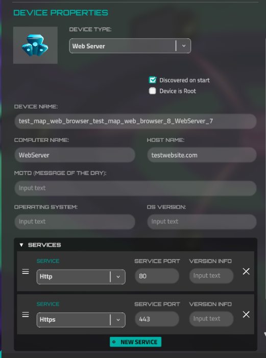
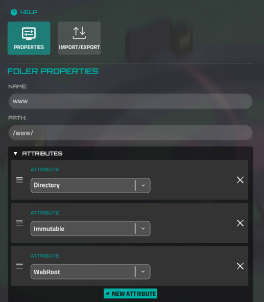
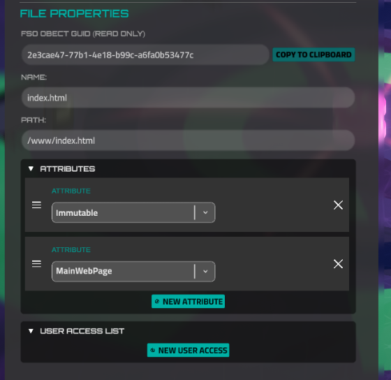
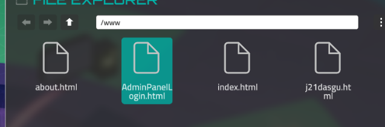
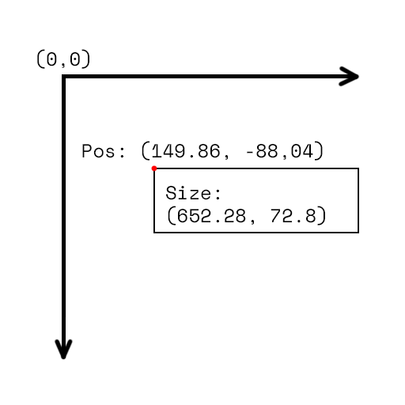

# Web Sites Creation

[Miniscript for Web Browser](web-sites-creation/miniscript-for-web-browser.md)

# Configure the Device

Websites are stored on a special device, which has ports HTTP and HTTPS opens a hostname (very likely).



All web pages should be placed in the folder, which has WebRoot attribute. This folder should be the only one on the device. Such folders won't be visible in the address of pages.



The start page, which will be open by default, when a user types "[http://hostname](http://hostname/)", should have MainWebPage attributes. Very often such pages have an "index.html" name.



Also, the letter case is important. "AdminPanleLogin.html" and "adminpanellogin.html" are different paths.



# The Page Structure

An HTML page can have any text content, however, it's expected to be an HTML page. The "curl" command will display and download any content of this data (metadata is an exception, more about it later). But the Web Browser - won't. Web browser requires the correct HTML frame for any page.

This is an example of such a frame:

```html
<noparse>
<html>
<head>
<title>Title</title>
</head>
<body>
<p>Content</p>
</body>
</noparse>
```

Pay attention to this "<noparse>" tag. It will be ignored by the Web Browser, we need it for curl. It's desirable to cover all HTML content with this tag to have a plain terminal output.

There is another "service" tag - "metadata". This tag is used by Web Browser only, it will be ignored by curl. We need it for tags, which should be displayed only by Web Browser. The frame with this tag will look like this:

```html
<noparse>
<html>
<head>
<title>Title</title>
</head>
<body>
<p>Content</p>
</body>
</noparse>
<metadata>

</metadata>
```

# The AbsoluteDiv Tag

In most cases "metadata" section is used as a storage for "absolutediv" tags. It's a fake HTML tag, which was developed only for the Web Browser. By this tag, you can describe any UI element, even input form. The essence of this tag is very similar to the "div" in real HTML pages.

There is a Unity project to create such pages visually, without editing the code: [https://github.com/haiku-inc/webbrowser-absolutediv](https://github.com/haiku-inc/webbrowser-absolutediv) . However, such pages can be developed in any text editor.

If you want to customize your HTML page for a Web Browser, first of all, you should create a background, which will overlay standard HTML content, which isn't placed in the "metadata" section.

```html
<absoluteDiv width="952" height="522" posX="0" posY="0" backColor="ADADADFF" isForm=False href="#"></absoluteDiv>
```

**width** - a numeric attribute, which contains the width of an element. The same is the "**height**" attribute. Pay attention to its values. They are "952" and "522", which is the size of the Web Browser page view.

**posX** and **posY** are the attributes, which define the indent from the left top corner. Here they are 0 because it's the settings for the background. Below later will be a figure that explains the coordinates of elements.

**backColor** is the attribute for background color. We use the HEX format with alpha. You can pick this color by any color picker, for instance - [https://fffuel.co/cccolor/](https://fffuel.co/cccolor/) . Pay attention to the last 2 symbols. It's alpha, which means transparency. Very often color pickers skip this part. If you don't need the background, set the transparent color, for instance - FFFFFF00

**isForm** defines, whether can a user type the values to this element. It means, is this element an input field. A separate section is devoted to this feature, so let's just leave it "False".

**href** is a link attribute. In most cases, it contains the address of another page. But here is only the "#" symbol. It's used even in real HTML pages to define a link, which doesn't have an address. We need this value for such background absolutedivs to prevent clicking on any links, which are placed in the original HTML page.

Now let's examine the Hello World caption from the example (the index.html).

```html
<absoluteDiv width="652,2886" height="72,8065" posX="149,86" posY="-88,04297" backColor="ADADAD00" fontSize="47,75" color="000000FF" fontStyle="regular" alignment="Center" isForm=False >Hello world!</absoluteDiv>
```

Return to the positioning. The value is the indent from the left top corner, but Y is **reversed**, which means a minus before its value. This is the figure explaining how positioning works:



**fontSize** is the pixel size of the text. Respectively, **color** is the color of the text. Set the color value the same as it was with the background color.

**fontStyle** is an attribute, which defines the font for this text. It has three possible states:

- bold - the Orbitron-Bold font will be used.
- mono - the SpaceMono-Bold font will be used.
- Any other value or missing the "fontStyle" attribute - the Orbitron-Regular will be used.

**alignment** - a text horizontal alignment. Four states are possible:

- Center
- Right
- Justified
- Left or missing attribute - Left text alignment will be used, it's a default value.

The value of the text is the **value of the tag**. It means the text between <absolutediv> opening and closing tags. Here it is "Hello World!". But it can be any text, empty value, or ASCII art. Also, this text can contain rich text tags - [https://docs.unity3d.com/Packages/com.unity.textmeshpro@4.0/manual/RichText.html](https://docs.unity3d.com/Packages/com.unity.textmeshpro@4.0/manual/RichText.html)

# The AbsoluteDiv links and forms

As it was said earlier, the **href** attribute is aimed at links. When it has a "#" value, it behaves like a link, however, this link doesn't have a real page linked to it. We need it to prevent clicking the links beneath this element. Also, you should avoid using IPs as the part of the link. It's because IPs are changed constantly, so you can't predict it. If you don't need any link behavior, just skip this attribute. Example:

```html
<absoluteDiv width="652,2886" height="57,38" posX="149,86" posY="-160,85" backColor="ADADAD00" fontSize="28,7" color="6073E5FF" alignment="Center" isForm=False href="http://testwebsite.com/about.html"><U>Go to the About page</U></absoluteDiv>
```

Sometimes we need to restrict access to some pages before a user reveals some values (for instance, credentials). Actually, we don't have a simulation of real-world authorization. However, we have a workaround. We can create a page with input fields for credentials and link absolutediv to the restricted page and wait until the user types some values. That's the implementation of such forms and login buttons from the example:

```html
<absoluteDiv width="245,3136" height="42,7083" posX="491" posY="-125" backColor="D4D4D4FF" fontSize="18" color="000000FF" alignment="Right" isForm=True id="FormLogin" ></absoluteDiv>
<absoluteDiv width="245,3136" height="42,7083" posX="491" posY="-178,2" backColor="D4D4D4FF" fontSize="18" color="000000FF" alignment="Right" isForm=True id="FormPassword" ></absoluteDiv>
<absoluteDiv width="204,22" height="42,7083" posX="373,89" posY="-267" backColor="B4A2A2FF" fontSize="18" color="000000FF" alignment="Center" formData="%7b%22data%22%3a%5b%7b%22formId%22%3a%22FormLogin%22%2c%22requiredFormValue%22%3a%22admin%22%7d%2c%7b%22formId%22%3a%22FormPassword%22%2c%22requiredFormValue%22%3a%22abc123%22%7d%5d%7d" isForm=False id="AbsoluteDiv (5)" href="http://testwebsite.com/j21dasgu.html">Login</absoluteDiv>
```

There are many things to pay attention. First of all, two elements have the **isForm**=True attribute. It means they aren't a text, they are an input form and a user can type here any value.

Second, there are defined and not automatically generated **id** attributes. We need it for forms because we need to find these forms and get their value to compare.

You may be scared by this strange **formData** value. It's an encoded JSON. The original value of this JSON is:

```json
{
	"data":
	[
		{
			"formId":"FormLogin",
			"requiredFormValue":"admin"
		},
		{
			"formId":"FormPassword",
			"requiredFormValue":"abc123"
		}
	]
}
```

It's an array of required data. You can notice some familiar values. Yes, the "formId" key contains that "id" attribute value, which was mentioned above. So, it's very easy to read. Here we set, that a user should type the "admin" value to the username form (it has FormLogin id) and "abc123" to the password form (FormPassword).

Form data must have an encoded JSON. You can do it via any URL-encoder like this: [https://www.urlencoder.org](https://www.urlencoder.org/)

But, what should happen after a user types the correct values? As you can guess, the user will be redirected to the link in the **href** value. But here is the tricky point. You should set the name of the page, which can't be guessed. Here it's "[http://testwebsite.com/j21dasgu.html](http://testwebsite.com/j21dasgu.html)", which is a real strong password.

# Valid HTML Tags

h1 – [https://www.w3schools.com/tags/tag_hn.asp](https://www.w3schools.com/tags/tag_hn.asp)

h2 – [https://www.w3schools.com/tags/tag_hn.asp](https://www.w3schools.com/tags/tag_hn.asp)

h3 – [https://www.w3schools.com/tags/tag_hn.asp](https://www.w3schools.com/tags/tag_hn.asp)

h4 – [https://www.w3schools.com/tags/tag_hn.asp](https://www.w3schools.com/tags/tag_hn.asp)

h5 – [https://www.w3schools.com/tags/tag_hn.asp](https://www.w3schools.com/tags/tag_hn.asp)

h6 – [https://www.w3schools.com/tags/tag_hn.asp](https://www.w3schools.com/tags/tag_hn.asp)p – [https://www.w3schools.com/tags/tag_p.asp](https://www.w3schools.com/tags/tag_p.asp)

strong – [https://www.w3schools.com/tags/tag_strong.asp](https://www.w3schools.com/tags/tag_strong.asp)

header –[https://www.w3schools.com/tags/tag_header.asp](https://www.w3schools.com/tags/tag_header.asp)

div – [https://www.w3schools.com/tags/tag_div.asp](https://www.w3schools.com/tags/tag_div.asp)

section – [https://www.w3schools.com/tags/tag_section.asp](https://www.w3schools.com/tags/tag_section.asp)

main – [https://www.w3schools.com/tags/tag_main.asp](https://www.w3schools.com/tags/tag_main.asp)

footer – [https://www.w3schools.com/tags/tag_footer.asp](https://www.w3schools.com/tags/tag_footer.asp)

nav – [https://www.w3schools.com/tags/tag_nav.asp](https://www.w3schools.com/tags/tag_nav.asp)

ul – [https://www.w3schools.com/tags/tag_.asp](https://www.w3schools.com/tags/tag_.asp)

li – only as container (div for example)

button – [https://www.w3schools.com/tags/tag_button.asp](https://www.w3schools.com/tags/tag_button.asp)

a – [https://www.w3schools.com/tags/tag_a.asp](https://www.w3schools.com/tags/tag_a.asp) navigation on “href” attribute is working

img – [https://www.w3schools.com/tags/tag_img.asp](https://www.w3schools.com/tags/tag_img.asp)

<aside>
💡 The following attributes are required for images: src, alt, width, height.
Ex: 

The image source must be a URL to a file with an image in base64string format.

Image can contain sub-elements.

</aside>

### Element Alignment and Margins

Margin

Format margin=”top|left|bottom|right”. Float style like “21.5”.

The order is important, each element must be listed. Size in pixels "width" and "height". Format float, size in pixels.

Align

Sub-elements align in element. Values: "left"; "right"; "center"; "bottom"; "up";

Can be combined like this: “center-left-top”.

This will be interpreted according to the following logic:

"center" – reset all and centered content

"left" – move content to left side of the container

"right" – move content to right side of the container

"bottom" – move content to bottom side of the container

"up" – move content to up side of the container