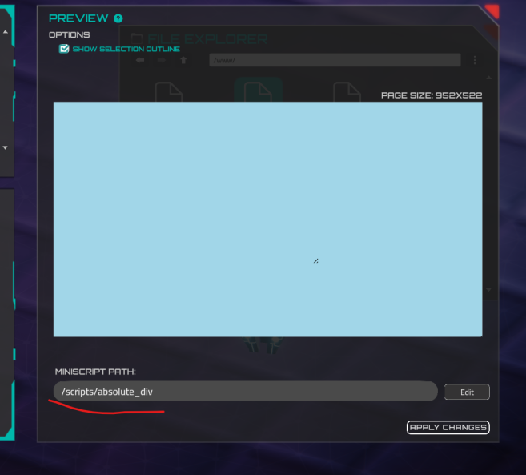
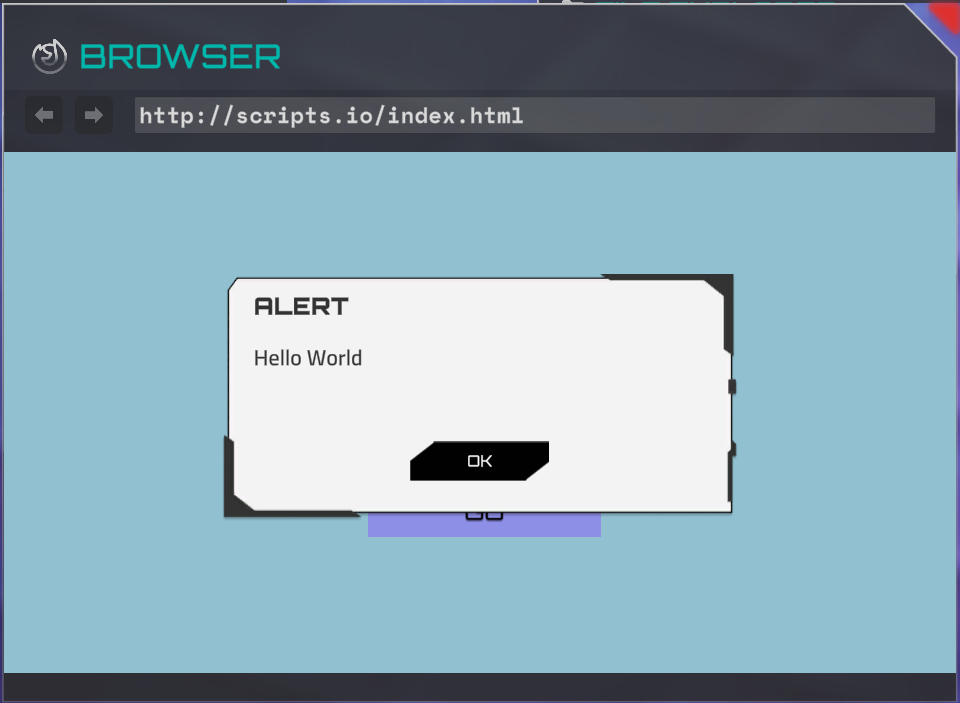

# Miniscript for Web Browser

The web browser can also run [Minicript](https://www.notion.so/Miniscript-Anvil-Scripting-Language-1724ecf8fd794900b0edaa8df834afca?pvs=21) code for web pages. Each web page created in the Web Page Editor in the Forge can have its own script. The main purpose of the script is to manipulate the `absoluteDiv` elements.

You can manually add the `<script>` tag to the `metadata` section in the Forge:

```lua
<script rel="/scripts/script1" />
```

However, the recommended way to set the script path is by using the Web Page Editor:



If the script is set, it will be launched when a page is opened. If the script is already running and another page is opened, the script will be automatically stopped. However, if the browser window is closed, the script **will not** be stopped in order to preserve the current page state in case the user opens the browser again.

# Miniscript Functions for Browser

There are a bunch of miniscript functions to change the content page and interact with user. These functions are for invocation **only in the scripts for the web browser**.

## browser_alert

The function displays text to the user. It has only one button (close the popup) and this button cannot be hidden. This function is not awaitable, so the next action will be performed immediately after the function is invoked, without waiting for the user to close the popup.

When the message is displayed, the user cannot navigate to another page or use the browser's navigation bar.

**Parameters**

| content | text or localization key for message body |
| --- | --- |
| *title* | *optional, text or localization key for window title* |
| *ok* | *optional, text or localization key for close button* |



## browser_alert_dialog

Awaitable version of an alert with dialog options (two options). This function waits for user input and returns 0 if the user clicks "Cancel" or 1 if the user clicks "OK." Additionally, the "OK" and "Cancel" buttons can be hidden.

**Parameters**

| content | text or localization key for message body |
| --- | --- |
| *title* | *optional, text or localization key for window title* |
| *ok* | *optional, text or localization key for OK (1) option. Set empty string to hide the button.* |
| *cancel* | *optional, text or localization key for CANCEL (0) option. Set empty string to hide the button.* |

**Example**

```lua
choice = browser_alert_dialog("make your choice", "CHOICE", "red", "blue")
choice_text = "red"
if choice == 0 then
    choice_text = "blue"
end if

browser_alert("User's choice is: " + choice_text)
```

## browser_alter_absolute_div

The function changes the properties of an existing absolute `div`. It takes three mandatory parameters: `id`, `attributeName`, and `value`.

```lua
browser_alter_absolute_div("id", "attributeName", "value")
```

The `id` parameter must be unique for each absolute div on the page. You can view or set it in the Web Page Editor here:


Here is a list of possible attribute names and their values. Please note that the *value* is **always** a string, so it should be enclosed in quotes, even if it is a number. An example is provided where needed:

| **attributeName** | **value** |
| --- | --- |
| posX | number, X position from left top corner of the page |
| posY | number, Y position from left top corner of the page, multiplied by -1 |
| width | number, width of the block |
| height | number, height of the block |
| isForm | is current div a form (ability to type a text). Possible values: 0 (not a form), 1 (is a form) |
| backColor | background color in a [hex](https://www.w3schools.com/html/html_colors_hex.asp#:~:text=A%20hexadecimal%20color%20is%20specified,the%20components%20of%20the%20color.) format, if alpha section is not set, the block will be absolutelly opaque. |
| color | text color in a [hex](https://www.w3schools.com/html/html_colors_hex.asp#:~:text=A%20hexadecimal%20color%20is%20specified,the%20components%20of%20the%20color.) format, if alpha section is not set, the block will be absolutelly opaque. |
| alignment | text alignment, possible values: `Left` , `Center` , `Right` , `Justified` , `Flush` , `Geometry` |
| fontSize | number |
| text | content of the div (raw text or localization key), can be [encoded](https://www.w3schools.com/tags/ref_urlencode.ASP)  |
| fontStyle | possible options: `Regular` , `Bold` , `Mono` |
| href | string, link address for the link or form button. Also can be # (block raycast option in the visual editor)  |
| imageFileId | string, image name in the network file storage |
| formData | Usually it’s username and password for login forms. It’s encoded json:
`{
  "data": 
  [
    {
      "formId": "input_username",
      "requiredFormValue": "admin"
    },
    {
      "formId": "input_password",
      "requiredFormValue": "123456"
    },
  ]
}`
But jsons contains invalid characters, so you have to use [encoded](https://www.urlencoder.org) version. Example:
`browser_alter_absolute_div("button_login", "formData", "%7B%0A%20%20%22data%22%3A%20%0A%20%20%5B%0A%20%20%20%20%7B%0A%20%20%20%20%20%20%22formId%22%3A%20%22input_username%22%2C%0A%20%20%20%20%20%20%22requiredFormValue%22%3A%20%22admin%22%0A%20%20%20%20%7D%2C%0A%20%20%20%20%7B%0A%20%20%20%20%20%20%22formId%22%3A%20%22input_password%22%2C%0A%20%20%20%20%20%20%22requiredFormValue%22%3A%20%22123456%22%0A%20%20%20%20%7D%2C%0A%20%20%5D%0A%7D")`  |

Please note that when you change the `text` property, [IP address substitution and device discover](https://www.notion.so/Service-commands-text-substitution-and-feedbacks-of-commands-9296cb9fadc44eff953923f212831242?pvs=21)y will be invoked automatically.

## browser_get_absolute_div

The function retrieves the value of a `div` property. If the property does not exist, it returns `null`. It always returns a string value, which you can convert using the `to_number` function or parse automatically.

```lua
browser_get_absolute_div("id", "attributeName")
```

**Possible attributes:**

| **attributeName** | **result** |
| --- | --- |
| posX | number, X position from left top corner of the page |
| posY | number, Y position from left top corner of the page, multiplied by -1 |
| width | number, width of the block |
| height | number, height of the block |
| isForm | is current div a form (ability to type a text). Possible values: 0 (not a form), 1 (is a form) |
| backColor | background color in a RGBA bytes format. Example: `255255255050` - this is white color with approximately 20 % alpha. You can [parse the string](https://www.notion.so/Miniscript-Anvil-Scripting-Language-1724ecf8fd794900b0edaa8df834afca?pvs=21) if you need. |
| color | text color in a RGBA bytes format. Example: `255255255050` - this is white color with approximately 20 % alpha. You can [parse the string](https://www.notion.so/Miniscript-Anvil-Scripting-Language-1724ecf8fd794900b0edaa8df834afca?pvs=21) if you need. |
| alignment | text alignment, possible values: `Left` , `Center` , `Right` , `Justified` , `Flush` , `Geometry` |
| fontSize | number |
| text | current content of the div (the text, that a user sees) |
| fontStyle | possible options: `Regular` , `Bold` , `Mono` |
| href | string, link address for the link or form button. Also can be # (block raycast option in the visual editor)  |

## browser_create_absolute_div

Creates a new absolute div with a unique ID. Returns 1 if the div was created, and 0 if it was not. Please note that the function will not create a div if another div with the same ID already exists.

```lua
browser_create_absolute_div("new_unique_id")
```

## browser_delete_absolute_div

Deletes the absolute div with the unique ID. Returns 1 if the deletion was successful, and 0 if it was not (i.e., if a div with such an ID was not found).

## browser_dispatch_successful_command

The function to send a message that can be handled by the story runner (steps or story Minicript).

```lua
browser_dispatch_successful_command("command", "device_name", "argument")
```

**Parameters**

| command | string, command name |
| --- | --- |
| device_name | *optional, device name* |
| argument | *optional, argument* |

In preview mode, you will see the sent message immediately after calling this function in the debug console. However, there is one drawback: you can only send a single argument, while handling user actions supports an array of arguments.

## browser_get_fake_cookie_value

Get the value from global storage, which allows you to share data between sites. The data is preserved during mission gameplay. The behavior in the Forge scene differs from the real mission behavior, so you should test it in the mission preview. 
If the value isn't set yet, it returns `null`.

```lua
browser_get_fake_cookie_value("previous_user_choice")
```

## browser_set_fake_cookie_value

Sets the value in the global data storage. The data is preserved during mission gameplay. The behavior in the Forge scene differs from the real mission behavior, so you should test it in the mission preview.

```lua
browser_set_fake_cookie_value("previous_user_choice", "A")
```

## browser_get_url

Get detailed, structured information about the current page address. It returns a map with the following fields:

```lua
address = browser_get_url()
println(address.url) //the original URL of the page, as shown in the address bar
println(address.protocol) //http or https, for instance
println(address.host) //domain name (site.com)
println(address.port)
println(address.path) //the path to the current page (/index.html)

for parameter in address.query //array with get parameters (?param1=a&param2=b)
  println(parameter) 
end for
```

## browser_open_url

Opens the URL in the in-game web browser. Please note that this function will stop the currently running script and close any open alerts.

```lua
browser_open_url("https://scripts.io/2.html")
```

## browser_was_button_click

Returns 1 if a user clicks on the absolute div. Works only if the `href` (link) value is set to `#` (*Block Raycast* checkbox in the visual web editor) and it is not a form. The value is reset to 0 after it is called.

**Example**

```lua
choice = 0
while 1

if browser_was_button_click("button_choice_1") then
  choice = 1
  break
end if

if browser_was_button_click("button_choice_2") then
  choice = 2
  break
end if

if browser_was_button_click("button_choice_3") then
  choice = 3
  break
end if

wait(0.1)
end while

browser_alert("User choice is: " + choice)
```

## browser_clear_all_fake_cookies

Clears all values stored via `browser_set_fake_cookie_value`. After calling this function, all subsequent calls to `browser_get_fake_cookie_value` will return `null` until new values are set.

```lua
browser_clear_all_fake_cookies()
```

## browser_get_form_value

Gets the user input (string) from the absolute div that is set as an input form. 

**Example**

```lua
input = ""
while 1

if browser_was_button_click("button_submit") == 1 then
  input = browser_get_form_value("input_field")
  browser_alert("User input: " + input)
end if

wait(0.1)
end while
```